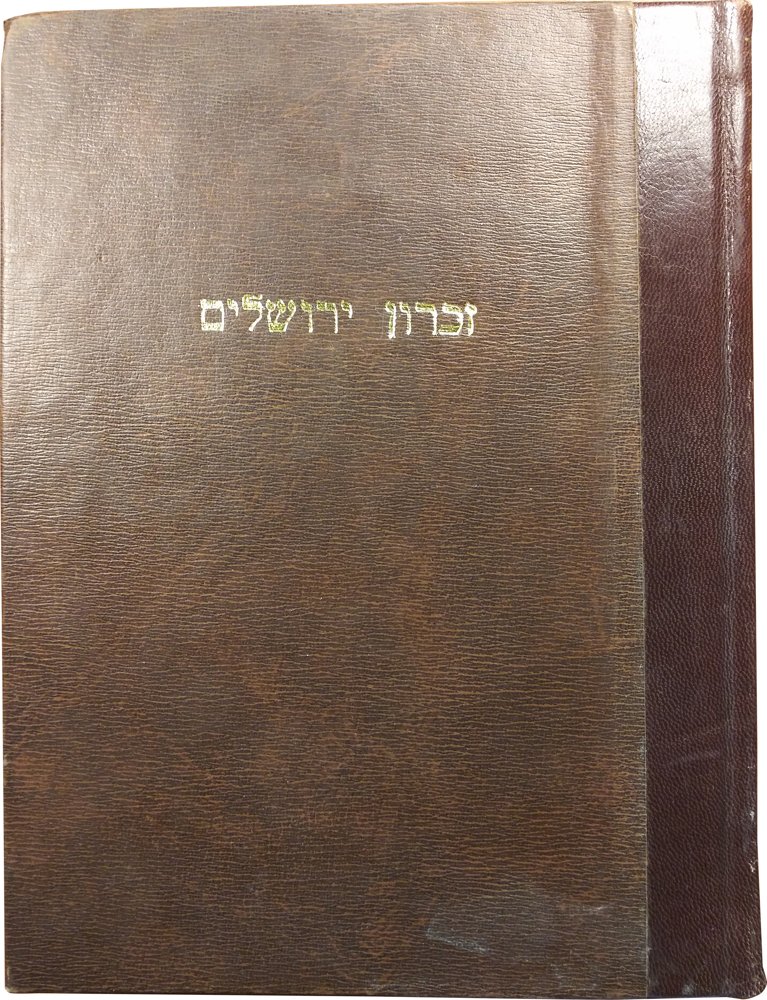
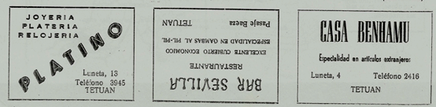

## Introduction

The study of Jewish life in modern Islamic contexts during the 2018-19 Fellowship year at the Katz Center delved into the meaning of modernity in North Africa, the Levant, the Arabian Peninsula, as well as Central and South Asia. In so doing, the Fellows broke new ground by looking beyond the more familiar paradigms of modern and contemporary Jewish history in European, American, and Israeli contexts.   

The goals for the year were to bridge linguistic, geographic, social, and methodological boundaries, to connect the study of the intellectual with the study of the everyday, and to encourage attention to new sources and approaches.  In this year’s web exhibition, we feature a selection of contributions from the Fellowship program’s international cohort who brought a range of disciplinary backgrounds and regional expertise to the topic. Each explores complex relationships between Jews and their Muslim neighbors, or with members of other non-Muslim or minority communities in the Islamic world. Research projects include ones focused on journalism and film, literature, gender relations, economic behavior, cultural expression, and religious life as these developed across diverse Islamic contexts.

## Exhibit

### Photographing contemporary Turkish Jewry

Esra Almas

Laurence Salzmann’s photographs do not simply record the Jewish past. They capture Jewish lives, communities and their everyday rituals, which are infinitely difficult to document. His photographs are not about the spectacular aspects of the metropolis. Nor are they about monuments; they are about the moment, about movement - about life.

Cemetery: The present, with the past, runs much deeper, Salzmann’s photographs of Jewish relics seem to say. This closeup of a Jewish tombstone in Ortakoy cemetery where Hebrew letters meet Ottoman ornamentation, with the Bosporus bridge, as the background, is an elegant attestation. One can hear the roar of traffic: hordes of cars crisscrossing Europe and Asia.

MOURNING: _La Meza de Guevo_. In _La Meza de Guevo_, Salzmann takes us to the mourning ceremony for the mother of the acclaimed photographer Izet Keribar. We see two brothers sitting by the table in mourning costumes. We hear the kaddish. We smell the anise that oozes from Raki. We share the pain.

Salzmann, a native Philadelphian, donated his life's work to the Penn Libraries in 2018.  The Laurence and Ayşe Gürsan Salzmann Collection, from which these two images are drawn, consists of over twenty discrete projects which span over fifty years and four continents, is distinguished by his exquisite aesthetic and unique anthropological field-work.  These two photographs belong to a body of material he published as _Anyos Munchos i Buenos_, co-authored with Ayşe Gürsan-Salzmann (Blue Flower/Photo Review,1990).

### Gene Schramm, Judeo-Baghdadi: A Descriptive Analysis of the Colloquial Arabic of the Jews of Baghdad

Nancy E. Berg

The only copies—one typescript, one microfilm—of this work are both here in the library at the Katz Center. The study is the first of its kind, predating Haim Blanc’s _Communal Dialects in Baghdad_ (1964), and _Ha-Aravit Ha-Yehudit shel Baghdad_ by Yaakov Mansour (1975-1983; a condensed version was published in English translation in 1991 as The Jewish Baghdadi Dialect). The latest - and quite possibly last  - in this list is Assaf Bar-Moshe's _The Arabic Dialect of the Jews of Baghdad :Phonology, Morphology, and Texts_ (2019).

While this year marked the first time the Katz Center took up the study of Sephardi and Mizrachi Jewry, Schramm’s dissertation written under the aegis of Dropsie College, the Katz Center’s first incarnation, suggests a wonderful continuity. So too the very subject touches on the core of some of the liveliest discussions this year, about the nature and distinctiveness of the language. Is Judeo-Arabic a distinct language, thus reflecting the degree to which Jews of Arab lands held themselves apart from their neighbors, or is it a dialect, separated mostly by pronunciation and selected vocabulary?

Schramm’s dissertation is classically philological, covering the phonemics, morphology, and syntax of the vernacular spoken by Baghdadi Jews. His data comes from fieldwork: three months spent in Israel in 1952 interviewing immigrants from Iraq. The study itself would likely appeal only to linguists until the last chapter in which two short texts are recorded, transliterated, notated, and rendered into English. The stories they tell—one about an exhumed rabbi and the other, a purloined parrot—bring life to the language, revealing as much about relations between Baghdadi Jews and their Muslim neighbors as they do about its linguistic attributes.

### Bulgarian Ketubah, Ruse 1831

Dina Danon

This _ketubah_, or marriage contract, comes from Rusçuk, a port city on the Danube in the Ottoman Balkans. Dating from 1831, the _ketubah_ was drawn up only a few decades after the Sephardi community of Rusçuk, now Ruse in Bulgaria, was established. The _ketubah_ records the marriage of Aron, son of Moshe Merkado, and Bilia (Behorah), daughter of Haim Daniel de Leon Parisiado. The two arches, which bear both Islamic and Italianate motifs, contain standard _ketubah_ language as well as the specifics of the bride’s dowry. At the bottom left we find an itemized trousseau in Judeo-Spanish detailing the numerous garments, textiles, and household items Bilia was to bring to her new home.

As one of only two known _ketubbot_ from Rusçuk, the source sheds light on the growth of the Sephardi community in the city and its position at a crossroads between East and West.  No less significant are the implications the document has for our understanding of marriage in the eastern Sephardi diaspora and the expectations and transactions that undergirded it before the profound political, cultural, and social transformations of the late nineteenth century.      

### Eliyahu Bekhor Hazan’s Zikhron Yerushalayim

Keren Dotan

_Zikhron Yerushalayim_ is a play written by rabbi Eliyahu Bekhor Hazan in 1874. Hazan, who was born in Izmir in 1845, was raised and educated in Eretz-Yisrael/Ottoman Palestine, and in the 1870s was sent as a _ShaDaR_ to Algeria, Tunisia, and Tripoli. When he was offered a position in Tripoli, he asked to travel briefly to Jerusalem to make some final arrangements. On his way, he stopped in Livorno, Italy, and printed his first book at the printing house of the famous _mekubal_ Eliyahu Benamozegh. This was his only known work of prose (although he did publish short reports in Hebrew newspapers). Later, in 1888, he became the rabbi of Alexandria, where he served until his death, and published a long line of halakhic texts, the most famous of which is _Ta'alumot Lev_.

Structured as a symposium, _Zikhron Yerushalayim_ brings a polyphony of perspectives and opinions among the Jews in Tunis, out of which stems the need for a “pan-Jewish” convention, as eventually takes place in the second part of the text. This imaginary convention gathers representatives from all Jewish factions and diasporas (an Ashkenazi, an Italian, a “Talmudic”, etc.) in an attempt to settle timely halakhic, philosophical, and cultural concerns of the Jewish people. The opening page (in the third photo) reveals the author’s implicit prophetic position as a resident of the Holy land, who also traveled through the enlightened countries, and can thus acknowledge the crisis of the Jewish people, formulated in the biblical words: “The earth is violently broken, the earth is split open, the earth is shaken exceedingly” (Isaiah 24:19).

### Sefer Zivhe Tsedek of R. 'Abdullah Somekh and the Baghdadi Jewish printing house of R. Shlomo Bekhor Hutsin

Annie Greene

Sefer Zivhe Tsedek, authored by Rabbi 'Abdullah Somekh, contains halakhic rulings, commentaries on Shulhan ‘arukh  Yoreh De'ah, and halakhic responsa to queries from Jewish communities in Ottoman Iraq, Qajar Persia, and the Baghdadi diaspora communities in India and China. Rabbi 'Abdullah Somekh (1813-1889) was an Ottoman Baghdadi rabbi, rosh yeshiva (head of the Jewish religious academy), and halakhic scholar whose death and burial caused a municipal scandal in Baghdad. This particular edition of Sefer Zivhe Tsedek was printed posthumously in the Baghdadi printing house of Rabbi Shlomo Bekhor Hutsin in 1898 or 1899. Rabbi Hutsin (1843-1893) opened the third Hebrew language printing house in Baghdad in 1867 and printed books of Torah, science, and history in Hebrew and Judeo-Arabic in his press. His son Yehoshua continued printing books at this press, like Rabbi 'Abdullah Somekh's Zivhe Tsedek.

### Judeo-Turkish Liturgical Poetry

Hadar Feldman Samet

CAJS Rare Ms. 434, purchased at Kestenbaum and Company Auction, was originally from the library of Hebrew College, near Boston.

The manuscript is provisionally called a “Collection of Judeo-Turkish Piyyutim”, a title which only partly reveals the content of this manuscript. Among the 112 pages, about half consist of Turkish language poems written down in Hebrew script by two different scribes and not sequentially bound; the rest of the material, as documented in the catalog, includes Hebrew and Arabic texts in Hebrew scripts from 19th-20th centuries Morocco and Yemen. Each of the seven sections of this unique manuscript, and the fact that they are all bound together, offer  interesting sources for investigating popular religious practices as well as the study of the materiality of manuscripts of Jews in modern Islamic contexts. Focusing on the dominant part of the manuscript composed in Judeo-Turkish also provides a rare opportunity to rethink the relationship between Turkish language and Jewish culture in the Ottoman empire.

### South Asian Hebrew-Marathi liturgies

Sifra Lentin

**fig. 1:**

Joseph Ezekial Rajpurkar (1834-1905) translated this volume of daily (Siddur) prayers from its original Hebrew into Marathi, the language of his community -- the Bene Israel of India. This Jewish community is believed to be one of the ten Lost Tribes of the Kingdom of Israel. They arrived on the west coast of the Indian subcontinent sometime before the fall of the Second Temple in 70 C.E. Rajpurkar was motivated in his academic pursuits by a unique confluence of Bene Israel, Baghdadi Jewish and Christian influences.

He belonged to the few Bene Israel families devoted to the field of education at a time when many families looked to military service as a career. His father was superintendent of schools for the Free Church Mission (Anglican) in Bombay and Kolaba District (in the mainland just south of Bombay), that worked actively among the Bene Israel. Rajpurkar’s own school and college education proceeded under the tutelage of outstanding Anglican missionaries, which included the Rev. John Wilson, known for the keen interest he took in the education of the Bene Israel. Rev. Wilson wrote the foundational 'Rudiments of Hebrew Grammar in Marathi' (Bombay, 1831) to enable the Bene Israel to read the Old Testament.

As a product of an Anglican missionary education, a good working knowledge of Hebrew, and interactions with the orthodox Bombay Baghdadi Jews as headmaster of the David Sassoon Benevolent Institution for 40 years, Rajpurkar realized the discrepancies between the Christian interpretation and the Jewish one of certain passages of the Old Testament. He was determined to master Hebrew in order to study the original Hebrew liturgy himself.

This Siddur is one of twenty books (not all translations) that he published during his lifetime. Rajpurkar was also appointed in 1871 as Examiner of Hebrew at the University of Bombay.

This Siddur is a second edition. The first edition was published in 1889 during Rajpurkar's lifetime.

**fig. 2:**

This Marathi translation of the Pesah service for the first two nights of Passover, by Hyams Ezekiel Penkar, follows a rich mid-19th century tradition among the Bene Israel community of India of publishing translations of Hebrew liturgy in the spoken and written language of the community. The Bene Israel from the western Indian state of Maharashtra are considered, along with the Malabar Jews from the south-western Indian state of Kerala, as the oldest Jewish communities on the subcontinent.

The first Hebrew-Marathi Haggadah was published in Bombay as early as 1846 by a combined effort of a Cochin Jew, two Bene Israel and a Baghdadi Jew. Most Bene Israel translators were recipients of Anglican missionary school education, which gave them a foundation in Hebrew.

### Eliezar Farhi and the Tunisian Jewish Publishing Renaissance

Sarah Frances Levin

Pictured here are the title page, preface, and an interior page of Sefer Bereshit \\\[The Book of Genesis\\\], published by Al-Nasr Press \\\[Eagle Press\\\], Tunis, 1906, and “Arabicized from the Hebrew language into the language of the Barbary.” “Language of the Barbary” (_“Lughat al-Barbari”_) is one of the colloquial terms Tunisian Jewish speakers of Arabic used to distinguish their vernacular from those of other North African and Middle Eastern countries, as well as from Standard Arabic.

The translator and founder/owner of the press, Rabbi Eliezar (Lazarro) Farhi (1851-1930), was one of the foremost pioneers of a Tunisian Jewish publishing renaissance that started at the end of the 19th century. A strong believer in the didactic potential of publishing, Farhi explains in his preface (pictured), “We decided to translate \\\[the Torah and the Prophets\\\] into the Barbary language so that any reader can understand them. We have … given \\\[the book of Genesis\\\] a low price, so that it might be available to all.” This was, however, to be the only book of Torah translation he published, making it somewhat of an exception, given that the bulk of Farhi’s prolific publishing projects were translations from Arabic popular and folk literature, such as the _siyar sha‘biyya_ (lit. “folk biographies,” a corpus of Arabic folk epics), which he also considered to serve didactic purposes. Other publishing projects included journals he founded and stories he wrote in the form of parables. By publishing in vernacular Arabic written in Hebrew characters (as most readers did not have facility in either Arabic or Latin scripts) rather than in Hebrew or Standard Arabic (the languages of the lettered elite), Farhi led the trend to democratize the Jewish reading public. Furthermore, by publishing such works, particularly during the early decades of French colonization, Farhi showed that one could be modern—that is, participate fully in the institutions and norms of one’s time—without following a European definition or model of modernity.

Acknowledgment to Noam Sienna and Rachel Schine for their insights that contributed to this caption.

### Fraught Histories: Revue de l'histoire juive en Égypte

Yoram Meital

During the first half of the twentieth century, Jews living in Egypt flourished, growing to as many as 80,000 people who were well-integrated into all aspects of the general society. In this framework, _La Societe d'études historiques juives d'Égypte_ (_Society for the Historical Study of the Jews of Egypt_) was established in 1925.  The Society began publishing a scholarly journal in 1947 entitled _Revue de l'histoire juive en Égypte_ (Review of Jewish History in Egypt). René Cattaui, the leader of the Sephardic Jews of Cairo and president of the Society, played a key role in both of these projects.  In the preface to the journal’s first issue, he opined that the _Revue_ aimed to present a valid historical knowledge of all Jewish movements and groups in Egypt “from their first appearance as the ancient sons of Israel era to the modern times.” The journal sought to cover a range of topics, including political, economic, social, cultural and religious history, and to point out “the strong connection of the Jews to the glorious history of the Nile Valley, which has its roots dating back thousands of years.” The inaugural volume included nine articles written by renowned scholars (including, S. D. Goitein, B. Maisler, M. Schwabe, S. Yeivin, and M. Kamil.) Their studies appeared in English and French, followed by abstracts in Arabic. The first volume was printed on the eve of the momentous events that led to the first war in the Arab-Israeli conflict. It was the first and only issue published. The _Revue_’s demise can be seen as a prelude to the fate of the Jewish community in Egypt in the decades to come.

### The upside-down advertisement: ambiguity toward change in Jewish lifestyle (Tetuan Morocco, 1956)

Aviad Moreno

Throughout the first half of the 20th century the demographic gap between Jews and non-Jews in the Moroccan city of Tetuan dramatically increased. In 1913 about 4,000 Jews lived among approximately 11,000 Muslims and 3,000 Christian Europeans. By the year 1950, a similar number of Jews lived among 30,000 European and about 47,000 Muslims. The momentous demographic shift transformed moral codes of behaviours, among many other forms of change in Jewish local lifestyle.

An unexpected indication is the demand for non-kosher foods, as appeared inside the communal periodical _Or-Luz_. It was an advertisement for “Bar Sevilla,” local to Tetuan, clearly stated that it specializes in prawns. The fact that the editors had agreed to publicize the restaurant, or that Bar Sevilla’s owners thought to appeal to Jewish audience through _Or-Luz_, implies that among local Jews in Tetuan, the custom of eating non-Kosher food outside of their homes was probably not a rare occurrence. The advertisement seems to have been met with ambiguity among Luz’s editors, as evidenced by their repeated decision to publish it upside-down. Apparently it is not a misprint, since the practice repeated itself in other issues. 1

### Exploring Moroccan Jewish Sociolinguistic Identities

Yigal S. Nizri

A blend of historiography, hagiography, chronicle, and ethnography, the Hebrew book Ner Ha-ma'arav: _Toledot Yisra’el be-Maroko_ ("Light of the West: A History of Jews in Morocco"), issued by Abraham Moses Luntz at his printing press in Jerusalem in 1911, helped to illuminate new ways of thinking historically about Maghribi (North African) Jewish history. The author, Ya’akov Moshe Toledano (1880-1960) was an Ottoman Palestinian-born Moroccan rabbinic scholar, historian, legislator and public figure.  In the introduction to his book he refers to himself as a "Man of Tiberius”; he also served as Chief Rabbi in cities like Tangier, Cairo, and Tel Aviv, and was actively engaged with European and North American Jewish intellectual movements of his time. 

Toledano’s book mainly offers a primary source for exploring Jewish  sociolinguistic identities in late nineteenth-century Morocco, and specifically, how the concept of "Moroccan Jewry” was shaped linguistically. Unlike the book as a whole, the final chapter contains ethnographic observations about "the characteristics of Moroccan Jews, their 'ways of being' and habits." Toledano provides us with a full description of the languages used by Jews in the Maghreb in the early twentieth century: "Their spoken language in north-western Morocco is Spanish with a Portuguese accent and Arabic, and in south Morocco, it is Arabic and Shilhit (Berber). The Arabic they speak to each other is blended with many Spanish as well as Hebrew words. The Moroccan Arabic differs from the Arabic of Eastern Jews in many of its words, expressions, and sayings, and an Eastern Jew would not be able to speak with a Maghribi Jew and hardly understand him. Moroccan Jews have a strange and unique pronunciation in Hebrew. Their accent dramatically differs from the articulation of Turkish Jews, and it is more similar to the dialect of the Jews of Palestine..." 

The uniqueness of this description, in which Toledano uses language as a primary taxonomical device for clarifying the place of spoken Hebrew ("Moroccan Jews have a strange and unique pronunciation in Hebrew") lies in the autobiographical stance of the author, whose diasporic-Maghribi formation positioned him both within and outside the community he described.

### An Ottoman Hebrew Musical Testimony from Hebron (Ms. CAJS 436)

Edwin Seroussi

Payytanim, whether authors of religious poems (piyyutim; sing. piyyut) or their performers, maintained throughout the Islamic lands manuscript notebooks with the poetical repertoire they sang at synagogues as well as at community and family celebrations. At times, these manuscripts also included written musical terminology that functioned as an aide-mémoire for the singer. This terminology comprised names of Turkish or Arabic musical modes and occasionally rhythmic cycles as well as first lines of foreign songs whose melody applied to the piyyut following such indication. The word lahan (“tune”) usually preceded these melodic codes, meaning, “sing the following piyyut to the tune of this song.”

Although Hebrew religious poetry appeared in print since the mid-sixteenth century, the supply of such rare printed books never satisfied the demand. Payytanim therefore copied for their private use poems from printed sources or from other manuscripts while also adding at times their own new poems or poems transmitted to them orally. In the course of time, these manuscripts passed from members of one generation to another, each generation adding more songs in the empty spaces left on the manuscript or inserting more pages to them.

Manuscript CAJS 436 is a magnificent exemplar of this type of poetico-musical notebooks found in the Ottoman realm. It belongs to a batch of manuscript collections of piyyutim acquired by the CAJS’s library in recent years. The names of musical modes reflecting the Turkish practice of the seventeenth and eighteenth centuries attest to the Ottoman pedigree of this manuscript. As customary in these type of collections, the basic repertoire consists of poems by Rabbi Israel Najara (c. 1550-1625) copied from his collections "Zemirot Israel" (Safed, 1587; Salonica, 1599/1600; Venice, 1600) and the still unedited "She’erit Israel." Poems by later Ottoman poets, such as Najara’s disciple Avtalyon ben Mordecai, expand the repertoire. The manuscript opens with _makam Rast_, as customary in most collections of this genre. This _makam_ is also the most prominent in the collection in terms of the number of songs included under its rubric.

As common in these manuscripts, which since their original compilation passed through the hands of many payytanim and manuscript dealers, the pages of CAJS Ms. 436 are disordered and paginations are multiple. The compiler, Refael Hiyya Zeevi (fol. 113a in the most recent pagination) was a scion of one of the renowned Sephardic rabbinical families of Hebron. Although the name “Refael Hiyya” does not appear among the prominent members of this Hebronite family, we can surmise that he is at least connected to (if not the same person as) Rabbi Hiyya Zeevi (d. 1775). In 1773, Rabbi Hiyya Zeevi signed, together with other prominent rabbis of Hebron, a letter sent to Rabbi Eliyahu Hatzarfati of Morocco. The emissary handling the letter was Rabbi Amram ben Diwan, who eventually became a venerated saint in Morocco. In the letter, the Hebron rabbis described the difficult situation of the Jews city (Avraham Yaari, Shluchei Eretz Israel ledorotam, Jerusalem 1951, p. 585).

The manuscript belonged to Yom Tov Meyuhas (fol. 13b, 123b, 125b), whose identity is also not easy to pinpoint for several members of this prominent Jerusalemite Sephardic family carried this name, usually preceded by another one, such as Yossef or Shmuel.

The page in our exhibition shows the title of the section in makam Dugâh. I selected this page because the kabbalist Rabbi Menachem di Lonzano (Shtei yadot, Venice 1618, fol. 142a) mentions this Turkish makam specifically as having a transformative power on listeners.

Two other details are worth mentioning in this very preliminary assessment of Ms. 436, the introductions to the makamlar (Turkish pl. of makam) and the constant renewal of song repertoire. Since the time of Najara, the titles of makam sections open with the formula “petihah le-qol havarat…” as in fol. 52a (original pagination), “petihah le-qol havarat Saba” meaning “opening to the tone \\\[lit. ‘voice of the syllable’\\\] of \\\[makam\\\] Saba.” In fol. 29a we read, however, a less common formulation, “naghm havarat Husseyni.” The use of the Arabic term naghm exposes the more Arabized context in which the compilers of this manuscript operated.

In fol. 46a we read “pizmonim she-ba’u mi-haleb” namely “songs that came from Aleppo,” an indication of the wide circulation of piyyutim among payytanim throughout the Middle East. In this case, this testimony hints specifically to the gradual transfer of the prestigious Aleppo Hebrew singing tradition to Ottoman Palestine during the nineteenth century. In another instance (fol. 88b), the compiler/later owner announces that this section includes “newer songs” (pizmonim mehudashim), an evidence of the constant regeneration of the religious Hebrew song repertoire in the Ottoman sphere. These new songs are labeled pizmonim, literally a song with refrain, to indicate their lighter, more popular register of style. The song “Yah eli eli yah eli shelah go’ali” (fol. 47b, “My God, send my redeemer”), whose opening/refrain resonates with typical non-sense Arabic syllables for singing (such as ya leil, ya leil, ya ‘eini), is an example of this popular style. Scores of such popular pizmonim found in rare manuscripts such as CAJS Ms. 436 did not survive the passing of time and remained silent testimonies of older local musical practices, in our case those of the Sephardic community of Ottoman Hebron.

### The _B’nai B’rith_ Minutes from The Jamie Lehmann Memorial Collection

Alon Tam

These are images of the cover and first page, handwritten in French, of the “Minutes of Cairo Lodge No. 687, B’nei B’rit, Cairo 1911-1912.” The _B’nei B’rit_ is one of the world’s oldest Jewish service organizations, which was established in 1843 in a Jewish coffeehouse in New York City, and its lodges in Egypt were among the first outside the United States. It was modelled after fraternities such as the _Free Masons_, which were popular in the 19th century; women’s lodges of the _B’nei B’rit_ were established in Cairo and Alexandria already in 1939. In Cairo, Lodge 687 was a Sephardi one, established in 1911 after an older lodge, called Magen David, was closed down. An Ashkenazi lodge, called Maimonides, was established in Cairo in 1887. The membership of these Jewish fraternities was made up of the rising commercial and professional middle class in Egypt. They were preoccupied with extensive charity work and community building, as well as with reforming and modernizing the existing Jewish communal organizations, often in opposition to what they saw as a traditional, conservative, and elitist leadership. The _B’nei B’rit_ lodges were also concerned with Jewish cultural revival, advocating for Jewish causes in Egypt and around the world, and contending with the rise of Zionism. The minutes from the meetings of the _B’nei B’rit_ lodges are, therefore, crucial for understanding the social, organizational, and political history of the Jewish community in Egypt in the 20th century.

The minutes of meetings from both lodge 687, and from the Maimonides lodge (for the years 1924-1928), are both part of Penn’s newly acquired microfilm copy of _The Jamie Lehmann Memorial Collection: Records of the Jewish Community of Cairo, 1886-1961_ at Yeshiva University Libraries. This extensive, albeit fragmented and incomplete, collection consists of account books, by-laws, case files, certificates, correspondence, legal documents, minutes, photographs and reports from various institutions of the Sephardic Jewish community in Cairo, and to a lesser extent, of the Ashkenazi community there as well. The most important institutions featured in this collection are the Jewish Community Council, the Chief Rabbinate, the various charity organizations, and the _B'nai B'rith_ lodges. This makes the Lehmann Collection the most extensive and important archival source that is freely accessible to researchers today about the post-Geniza social and political history of the Jewish community in Egypt.

### Hayim Habshush’s Vision of Yemen

Alan Verskin

Hayyim Habshush was a prominent nineteenth-century Jewish scholar from Sanaa, Yemen. He is best known for authoring _A Vision of Yemen_, a book which both chronicles his travels across his country with the French orientalist Joseph Halevy in 1870 and describes the social and political life of the people they encounter, who are mostly Jews but also Muslims. Habshush was a pillar of the Sanaa Jewish community, with an abiding interest in those outside of it. He also maintained an interest in 19th-century European Jewish intellectual debates, and advocated strongly against mysticism and messianic movements among Yemeni Jews. A voracious reader, Habshush would reportedly station himself near the synagogue bookshelf, the better to sneak books to stave off boredom during services. Occasionally, he would even bring Islamic books with him to synagogue to the consternation of the congregation. In this photograph Habshush, dressed in his traveling clothes, poses with a copy of _Ha-Magid_, a European Jewish newspaper.

At left, author’s photograph of original photograph in Habshush family collection.

### Love in Yemen: Arabic Love Songs of Yemenite Jewish Women

Mark Wagner

Nissim Gamlieli was a Jew from a remote area of Yemen’s hinterlands where a lot of Jews lived in small isolated villages.  He became the librarian for Camp Hashid, a refugee camp jointly run by the British government in Aden and the Jewish Agency for the thousands of Jewish refugees who streamed into British Aden from the Yemeni interior in hopes of emigrating to Palestine.  In Israel he worked as a schoolteacher and published rich studies based on documents and interviews of Jews from his region, many of whom live in Ramla.

Gamlieli’s _Love in Yemen: Yemenite Popular Songs—Women’s Songs_, first published in 1974 and reprinted three more times, based upon the author’s interviews with women and men from his region, is a treasure trove of information on popular song and women’s experiences in rural Yemen.  Since Jewish women were largely excluded from the world of traditional Jewish learning, the book also tells us a lot about the lives of Muslim women, their private lives, relationships between the sexes, and other taboo topics.

## Selected Bibliography

*   **Esra Almas.** “Disoriented in Istanbul: A Reading of Its Fogscapes Across the Twentieth Century.” _Culture Theory and Critique,_ 2016.
    
*   **Esra Almas.** “Framing My Name In Red: Reading a Masterpiece.” In _Global Perspectives on Orhan Pamuk,_ edited by M. Afridi and D. Buyze. Palgrave Macmillan, 2012.
    
*   **Orit Bashkin.** _Impossible Exodus: Iraqi Jews in Israel._ Stanford University Press, 2017.
    
*   **Orit Bashkin.** _New Babylonians: A History of Jews in Modern Iraq._ Stanford University Press, 2012.
    
*   **Nancy E. Berg.** “Jews Among Muslims: Culinary Contexts.” In _Global Jewish Foodways: A History,_ edited by Hasia R. Diner and Simone Cinotto. University of Nebraska Press, 2018.
    
*   **Nancy E. Berg and Naomi Sokoloff (editors).** _What We Talk About When We Talk About Hebrew._ University of Washington Press, 2018.
    
*   **Chen Bram.** _Immigration and Culture: Youth from the Caucasus Between Labeling and Dialogue._ Hebrew; Mofet, forthcoming.
    
*   **Chen Bram and Alouph Hareven.** _Human Dignity or Humiliation? The Tension of Human Dignity in Israel._ Hebrew; The Van Leer Jerusalem Institute and Hakibbutz Hameuchad, 2000.
    
*   **Julia Phillips Cohen.** _Becoming Ottomans: Sephardi Jews and Imperial Citizenship in the Modern Era._ Oxford University Press, 2016.
    
*   **Julia Phillips Cohen.** _Sephardi Lives: A Documentary History, 1700–1950._ Stanford University Press, 2014.
    
*   **Dina Danon.** _The Jews of Ottoman Izmir: A Modern History._ Stanford University Press, forthcoming.
    
*   **Dina Danon.** “Sephardi Jewry.” In _Oxford Bibliographies in Jewish Studies,_ edited by D. Biale. Oxford University Press, 2014.
    
*   **Keren Dotan.** “Writing Modernity from the East: Secularism, Tradition, and Modernism in Yitzhaq Shami.” _Mi-kan,_ Hebrew, 2017.
    
*   **Keren Dotan and Chen Strauss (editors).** _Critical Essays on Yehoshua Kenaz—The Beauty of the Defeated._ Hebrew; Am Oved and Heksherim Institute of Ben Gurion University, 2016.
    
*   **Yuval Evri.** “Translation Without Original: The Question of Ownership over Text and Territory in the Translation of Biblical Stories from the Palestinian Oral Tradition to Hebrew Literature.” In _An Arabic-Hebrew Literary Space,_ edited by H. Hever and M. Kayyal. Hebrew; Van Leer Institute Press and Hakibbutz Hameuchad, 2016.
    
*   **Yuval Evri.** “Iraqi Homeland in Hebrew: On Nationalism and Ethnic Identities in the Novel ‘The Other One’ by Shimon Ballas.” _Theory and Criticism,_ 2009.
    
*   **Hadar Feldman Samet.** “Ottoman Songs in Sabbatian Manuscripts: A Cross-Cultural Perspective on the Inner Sources of the Ma’aminim.” _Jewish Quarterly Review,_ forthcoming.
    
*   **Annie Greene.** “James Grehan, Twilight of the Saints: Everyday Religion in Ottoman Syria and Palestine.” _Journal of Religion,_ 2017.
    
*   **Benjamin Hary.** _Sacred Texts in Judeo-Arabic: The Tradition of Šarḥ in Egyptian Judeo-Arabic._ Brill, forthcoming.
    
*   **Benjamin Hary.** _Multiglossia in Judeo-Arabic: With an Edition, Translation, and Grammatical Study of the Cairene Purim Scroll._ Brill, 1992.
    
*   **Alma Rachel Heckman.** “Jewish Radicals of Morocco: Case Study for a New Historiography.” _Jewish Social Studies,_ forthcoming.
    
*   **Kerstin Hünefeld.** “The Imām Is Responsible for Me before God! The Dimension of Protection (Dhimma) Granted by Imām Yaḥyā to the Jews of Yemen.” _Mittuv Yosef,_ Yosef Tobi Jubilee Volume, Hebrew, University of Haifa, 2011.
    
*   **Ethan B. Katz.** _The Burdens of Brotherhood: Jews and Muslims from North Africa to France._ Harvard University Press, 2015.
    
*   **Ethan B. Katz and Ari Joskowicz (editors).** _Secularism in Question: Jews and Judaism in Modern Times, Jewish Culture and Contexts._ University of Pennsylvania Press, 2015.
    
*   **Sifra Lentin.** _Bombay’s International Linkages (1660–1960)._ Gateway House, forthcoming.
    
*   **Sarah Levin.** “Wit, Ruse, Rivalry, and Other Keys to Coexistence: Reflections of Jewish-Muslim Relations in Berber Oral Traditions.” In _North African Mosaic: A Cultural Reappraisal of Ethnic and Religious Minorities,_ edited by N. Boudraa and J. Krause. Cambridge Scholars Publishing, 2007.
    
*   **Lital Levy.** _The Jewish Nahda: An Arab-Jewish Intellectual History._ Stanford University Press, forthcoming.
    
*   **Lital Levy.** _Poetic Trespass: Writing Between Hebrew and Arabic in Israel/Palestine._ Princeton University Press, 2014.
    
*   **Yoram Meital.** _Revolutionary Justice: Special Courts and the Formation of Republican Egypt._ Oxford University Press, 2016.
    
*   **Yoram Meital.** _Peace in Tatters: Israel, Palestine, and the Middle East._ Lynne Rienner Publishers, 2006.
    
*   **Aviad Moreno.** _Europe from Morocco: The Minutes of the Leadership of Tangier’s Jewish Community (the Junta), 1860–1864._ Hebrew; Ben Tzvi Institute, 2015.
    
*   **Yigal S. Nizri and Orit Ouaknine-Yekutieli.** “’My Heart Is in the Maghrib’: Aspects of Cultural Revival of the Moroccan Diaspora in Israel.” _Hespéris Tamuda,_ 2016.
    
*   **Joseph Sassoon.** _Anatomy of Authoritarianism in the Arab Republics._ Cambridge University Press, 2016.
    
*   **Joseph Sassoon.** _Saddam Hussein’s Ba’th Party: Inside an Authoritarian Regime._ Cambridge University Press, 2012.
    
*   **Edwin Seroussi, Joan Goodnick Westenholz, and Yossi Maurey.** _Music in Antiquity: The Near East and the Mediterranean._ De Gruyter and Hebrew University Magnes Press, 2014.
    
*   **Edwin Seroussi.** “Singing Modernity: Synagogue Music in Nineteenth- and Early Twentieth-Century Italy.” In _Acculturation and Its Discontents: The Italian Jewish Experience Between Inclusion and Exclusion,_ edited by D. Myers, M. Ciavolella, P. Reill, and G. Symcox. University of Toronto Press, 2008.
    
*   **Heather J. Sharkey.** _A History of Muslims, Christians, and Jews in the Middle East._ Cambridge University Press, 2017.
    
*   **Heather J. Sharkey.** _American Evangelicals in Egypt: Missionary Encounters in an Age of Empire._ Princeton University Press, 2008.
    
*   **Reuven Snir.** _Modern Arabic Literature: A Theoretical Framework._ Edinburgh University Press, 2017.
    
*   **Deborah Starr.** “Chalom and ‘Abdu Get Married: Jewishness and Egyptianness in the Films of Togo Mizrahi.” _Jewish Quarterly Review,_ vol. 107, no. 2 (2017).
    
*   **Alon Tam.** _Cairo’s Coffeehouses in the Late Nineteenth- and Early Twentieth-Centuries: An Urban and Socio-Political History._ Ph.D. thesis: University of Pennsylvania, 2018.
    
*   **Alan Verskin.** _A Vision of Yemen: The Travels of a European Orientalist and His Native Guide._ Stanford University Press, 2019.
    
*   **Alan Verskin.** _Islamic Law and the Crisis of the Reconquista: The Debate on the Status of Muslim Communities in Christendom._ Brill, 2015.
    
*   **Mark Wagner.** _Jews and Islamic Law in Early 20th-Century Yemen._ Indiana University Press, 2015.
    
*   **Mark Wagner.** _Like Joseph in Beauty: Yemeni Vernacular Poetry and Arab-Jewish Symbiosis._ Brill Studies in Middle Eastern Literatures, 2009.
    

## Contributors

*   Esra Almas - Istanbul Sehir University / Albert J. Wood Fellowship
    
*   Nancy E. Berg - Washington University St. Louis / Dalck & Rose Feith Family Fellowship
    
*   Dina Danon - SUNY, Binghamton / Charles W. & Sally Rothfeld Fellowship
    
*   Keren Dotan - Open University of Israel / Charles W. & Sally Rothfeld Fellowship
    
*   Hadar Feldman Samet - Hebrew University of Jerusalem / Jody Ellant and Howard Reiter Family Fellowship
    
*   Annie Greene - University of Chicago
    
*   Sifra Lentin - Mumbai History Fellow at Gateway House: Indian Council on Global Relations
    
*   Sarah Frances Levin - University of California, Berkeley / Ruth Meltzer Fellowship
    
*   Yoram Meital - Ben Gurion University of the Negev / Ellie and Herbert D. Katz Distinguished Fellowship
    
*   Aviad Moreno - Ben Gurion University of the Negev / Ruth Meltzer Fellowship
    
*   Yigal S. Nizri - University of Toronto / Professor Samuel Z. Klausner and Professor Roberta G. Sands Fellowship
    
*   Edwin Seroussi - Hebrew University of Jerusalem / Primo Levi Fellowship
    
*   Alon Tam - University of Pennsylvania
    
*   Alan Verskin - University of Rhode Island / Louis Apfelbaum and Hortense Braunstein Apfelbaum Fellowship
    
*   Mark Wagner - Louisiana State University / Ruth Meltzer Fellowship
    

#### Special thanks

Special thanks to all of our contributors, and above all to Leslie Vallhonrat, the Penn Libraries' peerless Web Unit manager for designing this web exhibit and for meticulously reviewing every detail. This web exhibition was made possible by the help of Bruce Nielsen and Josef Gulka at the Library at the Katz Center, as well as by Eri Mizukane at the Kislak Center for Special Collections, Rare Books and Manuscript and Michael Overgard and the staff at the Schoenberg Center for Text and Image (SCETI) for their time and unflagging efforts coordinating the production of digital images for this exhibit.This year's exhibition is especially indebted to Zhiyu Zhou who has programmed the new website interface to handle a number of customized features.