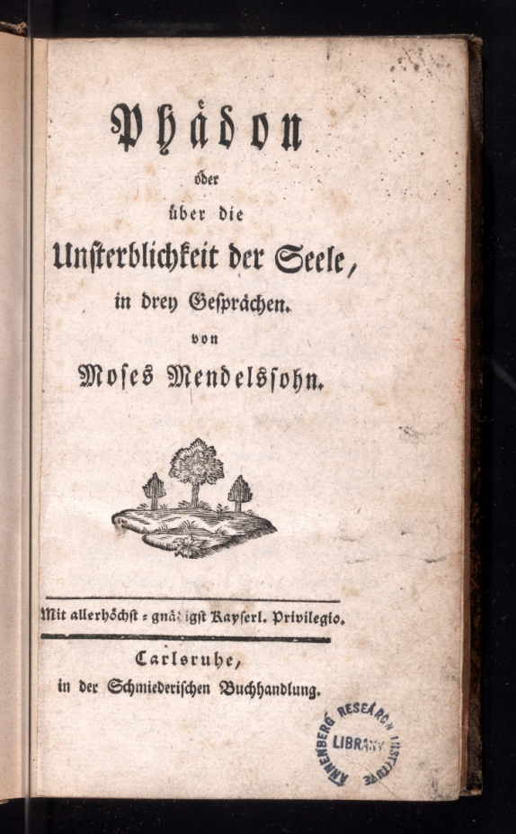

## Introduction

Book production is a business as well as a craft, a trade and an art form. Since the invention of moveable type in the fifteenth century, Jews as well as non-Jews have been engaged in the printing and sale of a surprisingly diverse array of editions of Judaica. This exhibition offers a small sampling of that vast panoply of creativity, based on the University of Pennsylvania’s distinguished library collections at the Center for Advanced Judaic Studies and at the Walter and Lenore Annenberg Rare Book and Manuscript Library. The materials selected highlight not only the production but also the consumption side of the business of the Jewish book: who bought and sold printed Judaica. In this exhibit, you will see in particular how these precious books came to be part of Penn’s library collections. Each item label explains from whom books were purchased or who donated specific treasures, and otherwise documents how Penn continues to develop one of world’s largest and most important Judaica collections.

Arthur Kiron

Arthur Kiron, exhibition curator; Andrea Gottschalk, exhibition designer.

## Exhibit

### Printer

The earliest printed books in the west, such as the Gutenberg Bible, were printed in Latin letters during the mid-15th century. By 1469, the first books printed in the Hebrew alphabet were issuing from Jewish-owned presses in Rome. Craftsmen and women -- among the first generation of Hebrew printers notably was a woman named Estellina Conat -- took pride and pleasure in what they called in Hebrew “a holy craft.” By the end of the era of incunabula (the years before 1501 known as the “cradle of printing”), approximately 140 books printed in Hebrew had appeared. Notably, when Jewish printers adopted this new technology of communication they did not limit their efforts to printing works of a strictly religious character. In addition to traditional Biblical, liturgical and talmudic texts and commentaries were philosophical and ethical treatises, legal codes, lexicographical tools, calendars and astronomical tables, illustrated fables, as well as works of grammar, rhetoric, history, and poetry. This taste for the humanities did not always meet with approval. A poetic narrative by Imanuel ben Solomon of Rome, for example, printed in the Italian city of Brescia by Solomon Soncino in 1490, subsequently was put under a ban by some rabbinic authorities for its erotic content. Twice printed by 1535, a new edition would not appear for another two hundred sixty years.

The first printing presses in any alphabet were established in North Africa and the Ottoman Empire by Jewish refugees from the Spanish Expulsion Decree of 1492. During the sixteenth century, as Jews fled across the Mediterranean in search of safe haven, some also took their Hebrew type with them. Though temporarily disrupted, the production and purchase of Hebrew books did not diminish. By the end of the 16th century, the number of Hebrew editions in circulation grew to nearly 2,700. At the same time, the first families of Jewish printers began to face stiff competition from large printing firms, some of the most famous of which, such as Bomberg, Bragadini, Giustiniani, and De Gara, were owned and controlled by Christians. Indeed, the market for Hebrew books was not restricted to Jewish readers but also attracted Christian scholars of Hebrew literature, or Christian Hebraists as they are called.

#### **A. In the Cradle of Printing: Incunabula**

The business of early Hebrew printing was a family affair. Estellina Conat, Abraham’s wife, is the first woman known to have worked as a Hebrew printer. The beautiful, rounded Hebrew typography cut by Abraham Conat to print this work of Jewish philosophy was modeled on the letter shapes characteristic of Italian Jewish scribes.

fig. 1: The Soncino family was the most famous and prolific of all early Jewish printing families. This particular edition, a medieval ethical treatise, visually conveys the technological transition from manuscript to printed communication and the dispersion of Jewish printers during this era. The main text is printed by Joshua Soncino in unvocalized square Hebrew letters, while the commentary to the text is printed in semi-cursive letter shapes, based on a Sephardic scribal hand. The handwritten commentary, meanwhile, reflects a semi-cursive Italianate Hebrew (unidentified) scribal hand. Joshua Soncino was the first to print a Hebrew Bible with Masoretic vocalization and the first to print a tractate of the Talmud (_Berakhot_ or “Blessings”).

fig. 2: Though woodblock, rather than moveable type, found here are the earliest specimens of Hebrew type to appear in a Christian book printed in the era of incunabula.

fig. 3: Though woodblock, rather than moveable type, found here are the earliest specimens of Hebrew type to appear in a Christian book printed in the era of incunabula.

#### **B. The Dispersion of Hebrew Printers during the 16th and 17th Centuries**

Image of Bookseller packing books to transport in a barrel. See Taubler, Bibliopola vol. 2, p. 21.

fig. 1: Imanuel of Rome’s poetic narrative, which contains sections deemed unacceptably erotic by rabbinic authorities, is the first printed Hebrew book to be banned by Jews themselves. This second edition, printed in 1535 by Eliezer Soncino, whose family had re-established their business in Istanbul ( Constantinople or “Kushtantina” as it states in Hebrew on the title page), is the last edition of this work to appear until 1796, when it was re-published under the sway of the Jewish Enlightenment movement (haskalah).

fig. 2: This printer was named Duarte Pinhel by the New Christian family of Portuguese Conversos into which he was born. When he arrived to Ferrara , he returned to Judaism and changed his name to Abraham Usque. His printer’s mark, an astrolabe with a streamer, inscribed with a Hebrew quotation from Psalm 130, verse 5: **קִוִּיתִי יְהוָה קִוְּתָה נַפְשִׁי וְלִדְבָרוֹ הוֹחָלְתִּי׃**  \["I wait for the LORD, my soul doth wait, and in His word do I hope.”\] has been adopted as the logo for Penn’s Judaica collection as a symbol that combines particularism and universalism.

fig. 3: The most important Christian printer of Hebrew books during the sixteenth-century was Daniel Bomberg. His editions of the Hebrew Bible with commentaries, liturgical works, and the Talmud, such as this rare printing of "Talmud Bavli 'Avodah Zarah" (the Babylonian Talmud tractate on idol worship), are prized for their high quality of paper, fine typography and distinctive glossed formatting which has been adopted and preserved by Jewish printers down to this day. Bomberg's edition of the Babylonian Talmud, forty-four tractates bound in twelve volumes and issued in Venice between 1520 and 1523, was the first complete set ever to appear in print. During the same period, his printing house also produced the first complete edition of the extant remains of the Talmud Yerushalmi ("Jerusalem Talmud").

#### **C. Printing New Perspectives**

Rembrandt. Portrait of Menasseh ben Israel.

fig. 1: Imanuel of Rome’s poetic narrative, which contains sections deemed unacceptably erotic by rabbinic authorities, is the first printed Hebrew book to be banned by Jews themselves. This second edition, printed in 1535 by Eliezer Soncino, whose family had re-established their business in Istanbul ( Constantinople or “Kushtantina” as it states in Hebrew on the title page), is the last edition of this work to appear until 1796, when it was re-published under the sway of the Jewish Enlightenment movement (haskalah).

fig. 2: This printer was named Duarte Pinhel by the New Christian family of Portuguese Conversos into which he was born. When he arrived to Ferrara , he returned to Judaism and changed his name to Abraham Usque. His printer’s mark, an astrolabe with a streamer, inscribed with a Hebrew quotation from Psalm 130, verse 5: **קִוִּיתִי יְהוָה קִוְּתָה נַפְשִׁי וְלִדְבָרוֹ הוֹחָלְתִּי׃**  \["I wait for the LORD, my soul doth wait, and in His word do I hope.”\] has been adopted as the logo for Penn’s Judaica collection as a symbol that combines particularism and universalism.

#### **D. Humanistic and Enlightened Jewish Printing**

fig. 1: In the middle of the seventeenth century and approximately one hundred years later, two works appeared, printed by non-Jews in Italian and German respectively, composed by two of the leading rabbinic leaders of their times, Simone Luzzatto and Moses Mendelssohn. Each took up the philosopher Plato’s account of the death of Socrates and his arguments about the existence of an afterlife. This first edition of the Venetian rabbi Luzzatto, though less well-known than Mendelssohn’s work, is no less beautifully produced. It features woodcut initial letters and an engraved head-piece depicting an insect emerging from its shell.

fig. 2: Mendelssohn’s _Phaedon,_ for which he became known as the “Jewish Socrates,” was sold out within four months of its first printing. It was originally published in German and printed in Gothic letters by a non-Jewish bookseller named Nicolai, with the imprimatur of the ruling authorities. It was frequently reprinted and also translated into several languages, including Danish, Dutch, French, Italian and Russian.

### Publisher

“Publisher: a person or a company in business to issue for sale to the public through booksellers books, periodicals, music, maps, etc..” 

> As the business of the Jewish book evolved during the last five centuries, so did the role of the printer. Specialization gradually separated the craft of printing from the business of publishing. Vernacular publishing continued to widen the potential audience of readers of Jewish books beyond the limited constituencies of literate Jews and Christian scholars of Hebrew. Networks of commerce and communication, kinship and community emerged that bound together Jewish communities as well as non-Jewish readers from the Atlantic basin to the Indian Ocean. 
> 
> During the late eighteenth and nineteenth-centuries, the publisher-editor came to the fore with the rise of Jewish serial and subscription publishing. Atlantic port Jews began publishing English-language periodicals and books during the 1840s as a means to advance an enlightened, observant form of Judaism, identified in large part with Sephardic rather than Ashkenazic religious culture and history. By the mid-nineteenth century, the number of Jewish editions had grown into the tens and hundreds of thousands. At the same time, the world Jewish population surged for the first time into the millions. The number of documented subscribers just to books published in Hebrew is known to have been well over 350,000. Meanwhile, the potential reading public for Jewish books published in vernacular languages was enlarged by mass literacy, a consequence of public education and other kinds of enlightened reform programs.

#### **A. The Beginnings of Serialized Jewish Publishing**

fig. 1: The physician and scholar Isaac Lampronti, the first “encyclopedist” of the Jewish people, is also noteworthy for having attempted to publish the first periodical in Hebrew, entitled _Reshit Bikure Katsir_. Lampronti’s idea was to provide a forum for discussion of Jewish legal and ritual questions. His serialized publication contained studies by his students at the Talmud Torah (a Jewish educational institution) in Ferrara. Due to controversies raised in its pages about the appropriateness of local customs connected with the priestly blessing, financial support was withdrawn and the periodical ceased publication after only three issues.

fig. 2: Among the beacons of Jewish enlightenment in late 18th century Germany, known today as the “Haskalah,” was _ha-Me’asef_ (“The Gleaner”), the earliest successful periodical published in Hebrew. Its publication was announced April 13, 1783 in a prospectus called Nahal ha-Besór. The editors and publishers, such as Isaac Euchel, Joel Loewe and Aaron Wolfssohn were _maskilim_, the intellectual exponents of the _Haskalah_. _Ha-Me’asef_ began publication in Koenigsberg in 1784 and then relocated to Berlin.

#### **B. Enlightened Jewish Publishing in the early 19th century**

fig. 1: While the first _haskalah_ publications were printed in Hebrew characters, one of the distinctive features of nineteenth-century enlightened Jewish publishing was the employment of vernacular languages and alphabets. In Germany, the editors of _Sulamit_, David Fraenkel and Joseph Wolf, introduced German-language periodical publishing, printed in Gothic characters “for the advancement of Culture and Humanism among the Jewish Nation (“… zur Beförderung, der Kultur und Humanität unter den Israeliten.").

fig. 2: By the 1820s, a new center of enlightened Jewish publishing was emerging in Vienna , the capital of the Austro-Hungarian empire, which included areas of Northern Italy and its Adriatic port cities, such as Trieste. Evidence of the hybrid and profitable nature of Jewish religious publishing during this time is the fact that Vienna’s most important printer-publisher of Jewish religious works, including prayer books, and the periodical _Bikure ha-itim_ (“The First Fruits of the Times”), was a Christian named Anton von Schmid.

#### **C. Victorian Jewish Publishing in the Atlantic World**

fig. 1: The _Voice of Jacob_ was the first Anglo-Jewish newspaper. Published in London , beginning on the eve of the Jewish New Year in 1841, its title undoubtedly refers to the first name of its principle editor, Jacob Franklin. The _Voice of Jacob_ was distributed across England; for example, in London, Liverpool, Manchester, Birmingham, Bristol, Cheltenham, Plymouth, Dover, Portsmouth, Canterbury, to Edinburgh, Scotland, to the West Indian islands of St. Thomas, Curacao, and Barbados, to the U.S. port cities of Charleston, South Carolina and Philadelphia, to Wellington, New Zealand, as well as to Corfu, Odessa, Paris, and Smyrna.

fig. 2: Isaac Leeser is regarded as the most important Jewish publisher-editor in antebellum America. His _Occident_, published here in Philadelphia , was the first monthly Jewish periodical in the United States and the most successful of the three Atlantic Jewish periodicals displayed here. Leeser personally handled and/or supervised all aspects of the publication, including editing, advertising, and distribution. The printing of the periodical was carried out by C. Sherman, but Leeser himself sometimes set the type. Significantly, the _Occident_'s readership (like that of the _Voice of Jacob_ and the _First Fruits_) was not limited to Jews. Letters from Christian ministers often graced its pages.

fig. 3: The cover of this rare first issue features a bi-lingual title with the Hebrew left un-transliterated. The second word in the title phrase \[“_Bikure ha-yam_”\] or “first fruits of the sea” undoubtedly referred to their Caribbean-based newspaper, but the initial word “_bikure_” (first fruits \[of\]) perhaps also alludes to the enlightened Jewish journal _Bikure ha-‘itim_ published in Vienna from 1820-31. The editors’ decision to translate the word (_yam_) figuratively as “west” (like Leeser’s _Occident_) instead of literally as “sea” indicates that they conceived of their island press in the hemispheric context of the Atlantic littoral, and not in the local or regional terms of the Caribbean.

fig. 4: The Hebrew name (ha-Me’asef) of this weekly English-language Jewish periodical, the first of its kind to be published in the American Far West, echoes the title of the first _haskalah_ Hebrew periodical by the same (Hebrew) name. Eckman, an itinerant rabbi born in Prussian Posen had ministered to Jewish congregations in Richmond , VA , Charleston , SC , and Mobile , AL before settling in San Francisco. He served as the editor and publisher of the _Weekly Gleaner_, for which he solicits subscribers in this rare pre-publication circular.

fig. 5: Featured in this famously illustrated (non-Jewish) monthly are depictions of scenes of Jewish rituals and festival customs. As with Bernard Picart’s 17th century engravings of Jewish ceremonies, this monthly issue is designed to appeal to non-Jewish audiences. Trumble tries here both to peak his American readership’s curiosity and to explain American Jewish life in a positive fashion to them once he has their attention.

### Peddler

 

The emergence of such a large market created new kinds of business for the Judaica book trade as a whole. Marketing books, through advertising, advanced subscriptions, through the mail, by cart, and on foot by peddlers and door-to-door salesmen, increased the circulation of books and periodicals. Rare books became sought after luxury goods and signs of refinement, in addition to sources of knowledge and information. Auction houses served as one of the means by which precious items, and entire libraries, would change hands. Book dealers became experts in their own right, not only of the market for such books and the prices people were willing to pay, but of the books themselves.

Bookseller catalogs, often replete with valuable descriptions explaining significance, condition, rarity, and price helped the novice and the expert alike navigate the specialized world of the Judaica book trade. Some booksellers took pride in producing catalogs with beautiful graphic designs. These sales catalogs did not merely list books for sale, but could be viewed as collector’s items in themselves. They combined scholarly descriptions of Judaica with a new-found aesthetic appreciation for the art as well as for the business of the Jewish book trade.

#### **Section A.**

fig. 1: Perhaps no literary figure came to occupy a more familiar place in the imagination of Ashkenazic Jewry in the second half of the 19th century then Mendele Mokher Sefarim or Mendele the Bookpeddler. Sh. Y. Abramovitsh, who is known by the name of his invented character Mendele, is considered one of the founders of modern Yiddish literature. The critic Dan Miron emphasizes that Mendele was not a pseudonym and not only a system of literary devices. The traveling bookpeddler symbolized the principle of freedom of the “insider-outsider” who was able to come and go as he pleased and for whom “traveling is a way of life.” The reality of life for itinerant peddlers however was far different. Surviving memoirs describe a life of loneliness, fear and uncertainty filled with obstacles and travails as peddlers moved from town to town trying to eke out a living.

fig. 2: This extremely scarce “Catalogo” of Jewish religious and Spanish language editions, reprinted in bibliophilic facsimile, is the earliest extant Judaica bookseller’s catalog. Notably, it was printed in Roman rather than Hebrew letters by the printing house of Menasseh ben Israel and is designed to appeal to Iberian Conversos who returned to Judaism. The prices are given in Dutch florins (the name of the currency officially changed to guilders after 1816).

#### **Section B.**

fig. 1: Almanacs were a popular and necessary guide for merchants traveling between different countries. This particular one, published in Turin by the “Oriental Press” is mainly intended for the use of Jewish traders moving back and forth between the Ottoman empire and Catholic Italy. The entire Jewish calendar cycle is provided along with Muslim holidays and the dates of the “fiere principali” or principal market fairs in Christian Europe and especially in Italy.

fig. 2: American booksellers famously employed “book dummies,” or “canvass books” to attract advance subscriptions to proposed publications. Colorful sample pages meant to appeal to the potential reader/subscriber would highlight the contents, using multiple fonts, boldface, strategic capitalization, and color illustrations. The _Jewish Encyclopedia_, the first ever made in the English-language, was “prepared by more than Six Hundred Scholars and Specialists from All Parts of the World.” Funk and Wagnalls Company, which took on the $750,000 cost to produce this twelve volume edition, emphasizes its “150,000 subjects,” “2,500 illustrations, Many of them full-page plates in color.”

fig. 3: This catalog, produced by the Joachimsthal auction house, documents the extraordinary two-week sale of the Lehren/De Lima banking families’ Hebraica collections of 4,288 books. The preparation of such a catalog is known to have taken more than a year. This copy features handwritten notes on interleaved sheets of paper recording the hammer-prices (i.e., when the auctioneer’s hammer ends the bidding) and the names of the successful bidders.

fig. 4: This remarkable prayer book, printed and distributed by the Belforte Press of Livorno Italy , contains the ownership stamp of the Musleah family of Calcutta. The Belforte press was the major supplier of prayer books to the Jewish communities of North Africa , the Levant and India.

**Bookseller Catalogs**

fig. 1

fig. 2

fig. 3

fig. 4

fig. 5

fig. 6

fig. 7

fig. 8

fig. 9

This sample belongs to a collection of pre-WWII bookseller catalog recently sold to Penn by Dan Wyman Books, located in Springfield , Massachusetts. The last item in this group is the Kestenbaum and Company Auction Catalog of the Library of the late Rabbi and Professor Abraham J. Karp, which is displayed with its auction “paddle” used for bidding. The Penn Library received a unique donation from Dr. Deborah Karp of her husband’s collection of the bookseller catalogs which he used to build his own magnificent collection.

### Artist

During the nineteenth century, the claim that Jews lacked aesthetic sensibilities and an artistic tradition began to take hold. Ironically, those who would see the “people of the book” exclusively as creatures of the letter, rather than the spirit, failed to notice the exquisite artistic traditions physically recorded in Jewish books, including beautifully shaped Hebrew typography. From illuminated medieval manuscripts to illustrated printed books, Jewish book arts have featured and continue to offer the clearest visual evidence of Jewish artistic creativity. Needless to say, the most spectacular artistic works sold were sought after not only for their content but for their beauty. Today, a new kind of art-form, facsimile reproductions of unique works of Jewish book art, make it possible for many to see and study what would otherwise exist only in the hands of a few.

fig. 1: This edition of the Passover Haggadah, the rabbinic narration of the ancient Israelite Exodus from slavery in Egypt to freedom in the promised Land of Israel , was printed in Amsterdam in 1695. It is the first Hebrew book illustrated by copper engraving and is also regarded as the first Hebrew book to contain a printed Hebrew map. The illustrator, Abraham bar Jacob, was a convert to Judaism from Christianity, a relatively rare occurrence in 17th century Germany.

fig. 2: Among early eighteenth-century engravers and book illustrators, Bernard Picart stands out as perhaps the most illustrious. His depictions of scenes of Jewish ritual life in Amsterdam were meant to introduce non-Jewish readers to the world of Judaism and its seemingly bizarre practices, such as circumsicion. Picart’s work forms part of a larger phenomenon of what some scholars regard as an early form of ethnographic literature produced by Christians in the context of the discovery of non-Christian peoples in the New World and living amongst them.

fig. 3: Depicted here by woodcut illustration made by Jews are ritual scenes accompanied by the appropriate benedictions in Hebrew and Spanish for such occasions as Sabbath candle-lighting, the sighting of a new moon, the baking of unleavened bread for Passover and the blowing of the ram’s horn to welcome the Jewish New Year.

fig. 4: This daily prayer book is encased in a beautiful silver binding contemporary with the publication of the book in Venice in 1793. Depicted on both the front and rear sides of the binding is the coat-of-arms of a prominent Italian Jewish family named Morpurgo. The image is a whale swallowing a man, clearly alluding to the Biblical story of Jonah. While the binding was beautifully crafted, the printing was not. On the title page of this edition the Hebrew word "hapalah" ( הפלה - abortion) is printed instead of the appropriate word "tefilah" ( תפילה - prayer).

fig. 5: The fabulously illustrated bilingualYiddish-Hebrew periodical is recognized as the first journal of Jewish art. Its art editor, Rachel Wischnitzer, a pioneer in the field of modern Jewish art history, highlights through the vehicle of its covers the way that traditional Jewish motifs could be employed to reinvent medieval Jewish manuscript traditions as a modern magazine of arts and letters.

fig. 6: One of the most lavishly illuminated and lavishly decorated examples of renaissance Jewish manuscript production, this facsimile edition reproduces in precise detail every aspect of the original, including the scribal method of ruling known as “pricking”, the uneven cut of the pages, stains and holes found on the original parchment, and the texture of the gold leaf.

### Survivor

Heinrich Heine: “Wherever they burn books they will also, in the end, burn human beings.” _Almansor: A Tragedy_ (1823).

Jewish books in our possession today have survived centuries of mass confiscations, conflagrations, censorship and expurgation, as well as the sometimes gradual, imperceptible destruction that occurs as a consequence of frequent use. In the twentieth-century, the Jewish book trade suffered the fate of being caught up in the horrors of two world wars. Already during the inter-war period of the 1920s many Hebrew and Yiddish authors, translators and publishers were forced to relocate, in part under the impact of inflation (which caused the reduction or out right loss of publishing subventions) from the major centers of Central and Eastern European Jewish publishing to Mandate Palestine and North America. Most of the population however did not leave in time, and by 1945 Jews would suffer catastrophic losses during the Holocaust. Despite the efforts to annihilate them, a remnant would survive to tell their stories in print through memoirs and memorial (yizkor) books. One of the most poignant symbols of their survival was the publication of a complete set of the Talmud printed in the American Occupation Zone in Munich in 1948. Printed on the reverse of the title page is the following dedication:

> “This edition of the Talmud is dedicated to the United States Army. This army played a major role in the rescue of the Jewish people from total annihilation, and after the defeat of Hitler bore the major burden of sustaining the DPs \[displaced persons\] of the Jewish faith. This special edition of the Talmud published in the very land where, but a short time ago, everything Jewish and of Jewish inspiration was anathema, will remain a symbol of the indestructrability of the Torah. The Jewish DPs will never forget the generous impulses and the unprecedented humanitarianism of the American forces to whom they owe so much.”

#### **Section A**

fig. 1: The ownership markings on this edition of _The Jewish Wars_ by Josephus Flavius document the book’s fate from the 16th century, through the Holocaust, to the present day: "Ex libris Joannis Christophori Freij Zellensis Auronianz"; Library stamp from the “Nazi Reichsinstitut für Geschichte des n\[?\]lands Bibliothek”; bookplate of the Jewish Cultural Reconstruction; bookplate of the Dropsie College for Hebrew and Cognate Learning; ownership stamp of the Annenberg Research Institute.

fig. 2: In the aftermath of the Holocaust, survivors compiled historical documents, photographs, letters, and reminiscences about their destroyed Jewish communities to serve as commemorative memorial or “Yizkor” books. This Yizkor Book remembers Jewish life in the town of Yedwabne before the war. The town gained notoriety recently when an historian, Jan Gross, argued that its Jewish population had been murdered by their own Polish neighbors, and not by the Nazis.

fig. 3: The tractate “Blessings” from the “SURVIVOR TALMUD”, published in 1948 in Munich-Heidelberg located in the American Zone in post-war Germany by the American Rabbinical Assembly, with the assistance of American Armed Forces, and dedicated to the U.S. Army. There were 700 sets printed and distributed world-wide.

## Selected Bibliography

*   **Amichay-Michlin, Dania.** _Ahavat I.S.H.: Avraham Yosef Shtibel \[Love of (Man): A.J. Stybel\]._ (Jerusalem: Mossad Bialik, 2000).
    
*   **Avrin, Leila.** _Scribes, Script and Books: The Book Arts from Antiquity to the Renaissance._ esp. pp. 101–139 (“The Hebrew Book”). (Chicago: American Library Association; London: The British Library, 1991).
    
*   **Beit-Arie, Malachi.** _The Makings of the Medieval Hebrew Book: Studies in Palaeography and Codicology._ (Jerusalem: Magnes Press, Hebrew University, 1993).
    
*   **Beit-Arie, Malachi.** _Hebrew Manuscripts of East and West: Towards a Comparative Codicology. The Panizzi Lectures._ (London: The British Library, 1992).
    
*   **Beit-Arie, Malachi.** _How Hebrew Manuscripts are Made._ In _A Sign and a Witness: 2,000 Years of Hebrew Books and Illuminated Manuscripts._ Edited by Leonard Gold, pp. 35–46. (New York: New York Public Library; Oxford: Oxford University Press, 1988).
    
*   **Beit-Arie, Malachi.** _Hebrew Codicology: Tentative Typology of Technical Practices Employed in Hebrew Dated Medieval Manuscripts._ (Jerusalem: Israel Academy of Sciences and Humanities, 1981).
    
*   **Benayahu, Meir.** _Haskamah u-reshut bi-defuse Venetsiyah: ha-sefer ha-‘Ivri me’t hava’to li-defus ve-‘d tseto le-‘or._ (Jerusalem: Mekhon Ben-Tsevi, 731 \[1971\]).
    
*   **Berlin, Charles and Bloch, Joshua.** _Hebrew Printing and Bibliography._ Selected and with a preface by Charles Berlin. (New York: New York Public Library; Ktav, 1976).
    
*   **Burnett, Stephen G.** _Christian Hebrew Printing in the Sixteenth Century: Printers, Humanism, and the Impact of the Reformation._ (Salamanca: Universidad Pontificia de Salamanca, 2000).
    
*   **Chartier, Roger.** _The Order of Books: Readers, Authors, and Libraries in Europe Between the Fourteenth and Eighteenth Centuries._ Translated by Lydia G. Cochrane. (Stanford, CA: Stanford University Press, 1994).
    
*   **Chartier, Roger.** _Forms and Meanings: Texts, Performances, and Audiences: From Codex to Computer._ (Philadelphia: University of Pennsylvania Press, 1995).
    
*   **Cohen, Evelyn M.** _The Decoration of Medieval Hebrew Manuscripts._ In _A Sign and a Witness: 2,000 Years of Hebrew Books and Illuminated Manuscripts._ Edited by Leonard Singer Gold, pp. 47–60. (New York: New York Public Library; Oxford University Press, 1988).
    
*   **Darnton, Robert.** _What is the History of Books?_ In _Daedalus,_ vol. 111, no. 3 (Summer 1982), pp. 65–83.
    
*   **Eisenstein, Elizabeth.** _The Printing Press as an Agent of Change._ 2 vols. (Cambridge, England: Cambridge University Press, 1979).
    
*   **Farrington, Lynne (Curator).** _“Agents Wanted:” Subscription Publishing in America._ University of Pennsylvania Web-exhibit: [web.archive.org](http://web.archive.org).
    
*   **Febvre, Lucien and Martin, Henri-Jean.** _The Coming of the Book: The Impact of Printing, 1450–1800._ Translated from the French by David Gerard. (London: Verso, 1997).
    
*   **Finkelstein, David and McCleery, Alistair.** _An Introduction to Book History._ (New York: Routledge, 2005).
    
*   **Fontaine, Laurence.** _\[Histoire du colporteur en Europe\] History of Pedlars in Europe._ Translated by Vicki Whittaker. (Durham: Duke University Press, 1996).
    
*   **Freimann, Aron.** _A Gazetteer of Hebrew Printing._ Foreword by Joshua Bloch. (New York: The New York Public Library, 1946).
    
*   **Gaskell, Philip.** _A New Introduction to Bibliography._ (New York and Oxford University Press, 1972).
    
*   **Gold, Leonard (Editor).** _A Sign and a Witness: 2,000 Years of Hebrew Books and Illuminated Manuscripts._ (New York: New York Public Library; Oxford: Oxford University Press, 1988).
    
*   **Grafton, Anthony (Editor).** _How Revolutionary was the Print Revolution?_ In _American Historical Review,_ vol. 107, no. 1 (February 2002), pp. 84–128.
    
*   **Habermann, Abraham Meir.** _Perakim be-toldot ha-madpisim ha-‘ivrim ve-‘inyene sefarim \[Studies in the History of Hebrew Printers and Books\]._ (Jerusalem: Rubin Mass, 1978).
    
*   **Heller, Marvin.** _Printing the Talmud: A History of the Earliest Printed Editions of the Talmud._ (Brooklyn, NY: Im Ha-sefer, 1992).
    
*   **Heller, Marvin J.** _The Sixteenth Century Hebrew Book: An Abridged Thesaurus._ 2 vols. (Leiden: E.J. Brill, 2004).
    
*   **Heller, Marvin J.** _Studies in the Making of the Early Hebrew Book._ (Leiden: E.J. Brill, 2007).
    
*   **Hill, Brad Sabin.** _Valmadonna Trust Library: Hebraica (Saec. X ad saec. XVI) Manuscripts and Early Printed Books._ Catalogue by Brad Sabin Hill. (London: Valmadonna Trust Library, 1989).
    
*   **Hunter, Dard.** _Paper Making Through Eighteen Centuries._ (New York: William Edwin Rudge, 1930).
    
*   **Johns, Adrian.** _The Nature of the Book: Print and Knowledge in the Making._ (Chicago and London: University of Chicago Press, 1998).
    
*   **Kiron, Arthur.** _La Casa Editrice Belforte e l’Arte della Stampa._ (Livorno: Salomone Belforte & Co., 2005).
    
*   **Kiron, Arthur.** _An Atlantic Jewish Republic of Letters?_ In _Jewish History,_ vol. 20, nos. 1–2 (2006), pp. 171–211.
    
*   **Lerner (Goldberg), Heidi.** _The Work of Dr. Moshe Spitzer: Leader in Modern Hebrew Printing and Publishing._ (Jerusalem: The Hebrew University of Jerusalem, 1982).
    
*   **Manguel, Alberto.** _A History of Reading._ (New York: Penguin, 1996).
    
*   **Martin, Henri-Jean.** _The History and Power of Writing._ Translated from the French by Lydia G. Cochrane. (Chicago: University of Chicago Press, 1995).
    
*   **Marx, Moses.** _History and Annals of Hebrew Printing (1501–1600)._ (Cincinnati: Hebrew Union College, 1989).
    
*   **Mintz, Sharon Liberman.** _A Selected Bibliography of the Hebrew Book._ In _A Sign and a Witness: 2,000 Years of Hebrew Books and Illuminated Manuscripts,_ pp. 177–197. (New York: New York Public Library; Oxford University Press, 1988).