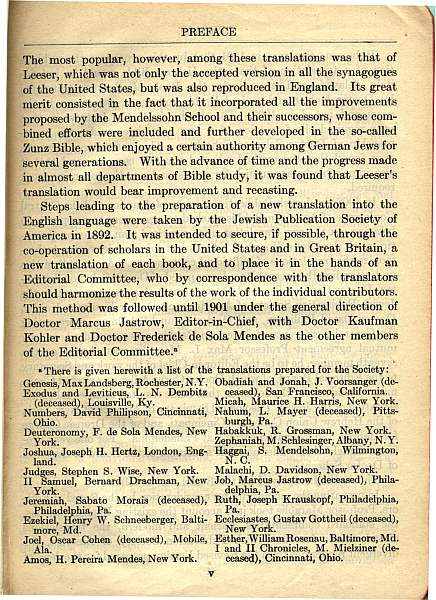
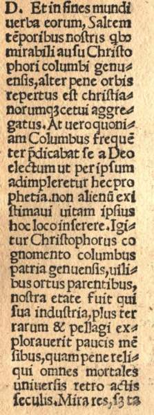

The fall of 2003 marked the 100th anniversary of the publication of the first major English-language dictionary of rabbinic literature: A Dictionary of the Targumim, the Talmud Babli, and Yerushalmi, and the Midrashic Literature … With an Index of Scriptural Quotations, compiled by Marcus Jastrow, a Philadelphia rabbi and a University of Pennsylvania honorary Doctor of Literature. Jastrow dedicated his dictionary to his wife Bertha Wolfsohn, with whom he had seven children, including their son Morris Jastrow, one of the founders of Religious Studies in the United States, professor of ancient Semitic languages and Penn’s University Librarian from 1898 until his death in 1921. Marcus Jastrow died in Germantown, Pennsylvania on October 13, 1903. This exhibit at Penn fittingly celebrates the anniversary of Jastrow’s dictionary and honors the centenary of its creator for his contributions to the distinguished tradition of rabbinic learning and lexicography.

Arthur Kiron, Curator of Judaica Collections

Seth Jerchower, Public Services Librarian, Center for Advanced Judaic Studies Library.

## Introduction

How do we know what words mean? What makes a definition authoritative? The modern dictionary (1) – its carefully derived etymologies (2), its hierarchically enumerated primary and secondary meanings, and its abundant literary citations of scattered historical usage – has been painstakingly compiled over the course of many centuries to respond to if not altogether answer these questions. What is known has been formatted with singular purpose and exquisite attention to detail. What is unknown or uncertain has been conscientiously omitted or else retained with a qualifying question mark. The end product of each lexical compilation, the dictionary entry, amounts to an encoded art form of presentation, concision and scholarly precision. The exact meaning of words has a book of its own: the dictionary.

This exhibit surveys a special field of dictionary-making called rabbinic lexicography (3). Rabbinic lexicography as a sub-species of dictionary-making refers to a roughly one thousand year-old corpus of literature that treats the Aramaic paraphrases of the Hebrew Bible known as Targum (4), as well as a sea of Jewish lore and legal expositions called Midrash (5) and Talmud (6). Rabbinic lexicography in a general sense can refer to successive generations of scholars, Jews and non-Jews, who have tried to understand and interpret the lexicon of post-Biblical Jewish learning. Their efforts have been complicated by the occurrence in rabbinic literature of a variety of unfamiliar loan words (e.g., from Greek, Latin, Persian, Arabic, and even Akkadian) and by the fact that Biblical and post-Biblical Hebrew and Aramaic writings were often copied without vowels (neḳudot) and accents (te’amim). Consequently, even one careless breath could alter the meaning of a sacred word. Over time, inconsistencies arose between written (ḳetiv) and spoken (ḳeri) reading traditions and among various textual witnesses; the uncertain meaning of exotic words also became increasingly problematic. To redress this situation, rabbinic scholars created new tools of exegesis (7).

The effort to extricate the words of rabbis from their literary contexts, re-arrange them alphabetically as discrete terms, define their meanings historically, and refine their modes of visual presentation evolved over many centuries. From targumic paraphrases and glossed rabbinic pages to the modern rabbinic dictionary entry, rabbinic lexicography has a complex history. It also forms a significant if often overlooked chapter in the general history of scholarship. As Solomon Schechter, a scholar of rabbinics, once put it: “dictionaries belong to that class of literature which is mostly studied but rarely quoted.”

### Glossary

(1) Dictionary. < ad. med. L. dictiōnārium or dictiōnārius (sc. liber) lit. ‘ a repertory of dictiōnēs, phrases or words’ (see DICTION) in F. dictionnaire (R. Estienne 1539), It. dizionario, Sp. diccionario.\] 1. a. a book dealing with the individual words of a language (or certain specified classes of them), so as to set forth their orthography, pronunciation, signification, and use, their synonyms, derivation, and history, or at least some of these facts: for convenience of reference, the words are arranged in some stated order, now, in most languages, alphabetical.

(2) Etymology. > a. OF. ethimologie, mod.F. etymologie, ad. L. etymologia, a. Gr. ΄ετυμολογία, f. ΄ετυμολόγος: see ETYMOLOGE \] 1. a. The process of tracing out and describing the elements of a word with their modifications of form and sense.

(3) Lexicography. >f. Gr. λεξικο-LEXICON + - γραφία-GRAPHY.\] 1. a. The writing or compilation of a lexicon or dictionary; ‘the art or practice of writing dictionaries’\].

(4) Targum. > a. Chaldee \[Aramaic\] targūm interpretation, f. targēm to interpret. Each of several Aramaic translations, interpretations, or paraphrases of the various divisions of the Old Testament, made after the Babylonian captivity, at first preserved by oral transmission, and committed to writing from about 100 A.D. onwards;

(5) Midrash. > a. post-biblical Hebrew midrāš homiletic commentary on Scripture (in biblical Hebrew ‘study, exposition’) < Hebrew dāraš to seek, study, expound. 1. a. A Rabbinic homiletic commentary on a text from the Hebrew Scriptures, characterized by non-literal interpretation and legendary illustration. Also: the mode of exegesis characteristic of such a commentary;

(6) Talmud. > a. late Heb. tal′mūd instruction (c 130 C.E.), f. lā′mad to instruct, teach. So med.L., F., Ger., etc. talmud. From its primary sense of ‘teaching, instruction, learning’, the word was applied to the teaching or instruction contained in a biblical text, and to the body of traditional learning possessed by a particular Rabbi; but it came to be applied distinctively to the discussion, explanation, and illustration of the body of traditional law contained in the Mishnah, and so to the concrete collection of this teaching. The term was originally applied to the Gemara, of which two recensions exist, known respectively as the Jerusalem (or Palestinian) and the Babylonian Talmud; to the latter of which the name is in strictest use confined.

(7) Exegesis. > a. Gr.’ εξήγησις, f. ’ εξηγέε σθαι to interpret, f. ’ εξ- (see εχ- prefix²) + ‘ ηγέε σθαιto guide, lead. Cf. F. exégèse.\] 1. Explanation, exposition (of a sentence, word, etc.); esp. the interpretation of Scripture or a Scriptural passage. b. An explanatory note, a gloss\].

Source: Oxford English Dictionary. Online version: [http://dictionary.oed.com](http://dictionary.oed.com) , containing the complete text of the 20-volume Second Edition, first published in 1989, with its 3-volume Additions Series, published in 1993 (vols. 1 and 2) and 1997 (vol. 3).

## Life & Legacy of Marcus Jastrow

MARCUS MORDECAI JASTROW was born on June 5, 1829 in the town of Rogasen, in the Grand Duchy of Posen (Gro�herzogtum Posen), an autonomous Prussian client state in eastern Prussia (Westpreussen), into a poly-lingual environment. He grew up in a Yiddish-speaking family, in a German-speaking province, in what formerly had been part of the Kingdom of Poland before its three partitions between 1772 and 1795. Initially home-schooled in Hebrew and rabbinic studies, Jastrow graduated from a Prussian Gymnasium (high school) in the provincial capital of Posen in 1852. He then left for Berlin, the cosmopolitan center of Prussian culture, where he attended Berlin University while also being tutored in traditional rabbinics. Jastrow next pursued graduate studies at the University of Halle and was awarded a Ph.D. in 1855, at the age of twenty-six.  Two years later his rabbinical ordination (originally conferred in 1853 by Rabbi Moses Feilchenfeld), was confirmed and signed by Rabbi Wolf Landau, of Dresden. In 1858, on the eve of his thirtieth birthday, Jastrow moved to Warsaw to serve as a religious leader.

Now living in Poland’s capital, Jastrow devoted himself to the mastery of the Polish language.  He also identified with and was active in the Polish independence movement. His involvement led to his arrest, imprisonment and eventual exile back to Prussia. In 1863, his decree of expulsion was revoked and Jastrow anticipated returning to his pulpit in Warsaw. With the outbreak of the Polish revolution that same year, however, his Prussian passport was abruptly canceled. Forced to earn a living elsewhere, Jastrow remained in Germany where he became the district rabbi of Worms. In 1866, at the age of thirty-seven, he accepted an invitation from Philadelphia to cross the Atlantic Ocean to become the officiating rabbi of that city’s Congregation Rodeph Shalom.

Jastrow introduced a new type of religious leadership and learning to America, one heavily influenced by the academic model of the German university, the spirit and methods of historical-critical inquiry, and the religious reform of Jewish theology and ritual observance. As David Werner Amram, a scholar of early Hebrew printing and friend, put it in a memorial address “[Jastrow’s] thought was a blend of Talmudism, classicism, and modernism.”  Jastrow’s arrival meant that familiarity with the best of European scholarship would now enter the mainstream of American Jewish cultural life. Indeed, Jastrow’s three major scholarly contributions – his English-Aramaic rabbinic dictionary, his role in the creation of the first English-language Jewish Encyclopedia, his contribution to the first Jewish critical translation into English of the Hebrew Bible – as well as the scholarship of his son Morris, all bear witness to this revolutionary cultural and intellectual transfer.

### The Jastrow Dictionary

Marcus Jastrow published the first edition of his dictionary in two volumes over the course of the last seventeen, illness-plagued years of his life.  A prefatory note dated July 1886 printed in the first volume details the plan for the complete future edition. But this single volume, covering only the first half of the Hebrew alphabet, was published, as is evident from the title page, in 1895. It may be the case that fascicles of the dictionary appeared prior to 1895 as installments of a work in progress. The complete two-volume set, however, would not appear until 1903, shortly before Jastrow’s death. In his preface to the 1903 edition, Jastrow acknowledged his scholarly debts, most notably to Jacob Levy, Alexander Kohut and to other major figures of 19th century German-Jewish scholarship. Unmentioned is the fact that the format of the Jastrow dictionary entry ultimately derives not from Jewish sources, however, but from a seventeenth-century Christian Hebraist lexicographer, Johannes Buxtorf.

### Section 2

![fig. 1: The second, “authorisited” \[sic!\], edition of the Jastrow dictionary was published in 1926 in one volume. Subsequent re-printings appeared in both two and one volume editions ( eg., 1943, 1950, 1967 in two volumes; 1971, 1985, 1996 in one volume). The 1926 edition, meanwhile, introduced a Hebrew title page opposite the English-only original, as well as two new publishers, Shapiro Vallentine & Co., in London and Choreb in New York and Berlin , attesting in part to the wider distribution and popularity of the work. The essential format of the Jastrow dictionary entry remained unchanged.](../../../assets/TheMeaningofWords/Jastrow_03.jpg)
fig. 1: The second, “authorisited” \[sic!\], edition of the Jastrow dictionary was published in 1926 in one volume. Subsequent re-printings appeared in both two and one volume editions ( eg., 1943, 1950, 1967 in two volumes; 1971, 1985, 1996 in one volume). The 1926 edition, meanwhile, introduced a Hebrew title page opposite the English-only original, as well as two new publishers, Shapiro Vallentine & Co., in London and Choreb in New York and Berlin , attesting in part to the wider distribution and popularity of the work. The essential format of the Jastrow dictionary entry remained unchanged.

![fig. 2: Among the greatest monuments to modern Jewish scholarship is the first English-language Jewish Encyclopedia, published simultaneously in New York and London between 1901 and 1906. Marcus Jastrow served on the encyclopedia’s editorial board and supervised its “Department of Talmud”; his son Morris Jastrow, Jr., also was a member of the editorial board, overseeing the “Department of Bible.” Displayed here is the title page of the decorated deluxe edition printed in 1910, specially prepared as a family gift.](../../../assets/TheMeaningofWords/Jastrow_04_01.jpg)
fig. 2: Among the greatest monuments to modern Jewish scholarship is the first English-language Jewish Encyclopedia, published simultaneously in New York and London between 1901 and 1906. Marcus Jastrow served on the encyclopedia’s editorial board and supervised its “Department of Talmud”; his son Morris Jastrow, Jr., also was a member of the editorial board, overseeing the “Department of Bible.” Displayed here is the title page of the decorated deluxe edition printed in 1910, specially prepared as a family gift.

### Section 3

This new translation of the Hebrew Bible was designed to provide the best modern Jewish critical Bible scholarship to an English-speaking audience and to revise previous English translations that reflected christological understandings of controversial passages.  So, for example, the contested word _‘almah_ in Isaiah 7:14 is translated as “young woman” rather than the pre-figurative “virgin.”  As the preface to the 1917 edition shows, Marcus Jastrow served on the original editorial committee and prepared a translation of the Book of Job for the Jewish Publication Society of America during the first stage of the project.  

### Section 4
![fig. 1: Morris Jastrow, Professor of Semitic Languages and Librarian of the University of Pennsylvania from 1898 to 1919, authored numerous works on Biblical and Ancient Near Eastern Studies and helped pioneer the critical study of religion in the American university setting. Jastrow’s new translation of the Book of Job, published in 1920, is dedicated to Edgar Fahs Smith, Provost of the University of Pennsylvania and a professor of Chemistry. Curiously, Jastrow makes no mention of his father’s efforts twenty years earlier to translate the same Biblical book.](../../../assets/TheMeaningofWords/Jastrow_06-01.jpg)
fig. 1: Morris Jastrow, Professor of Semitic Languages and Librarian of the University of Pennsylvania from 1898 to 1919, authored numerous works on Biblical and Ancient Near Eastern Studies and helped pioneer the critical study of religion in the American university setting. Jastrow’s new translation of the Book of Job, published in 1920, is dedicated to Edgar Fahs Smith, Provost of the University of Pennsylvania and a professor of Chemistry. Curiously, Jastrow makes no mention of his father’s efforts twenty years earlier to translate the same Biblical book.

### Section 5
![fig. 1: Aside from his teaching, research and administrative responsibilities at Penn, Morris Jastrow also served as the co-editor, with Richard J. H. Gottheil, Columbia University ’s first professor of Jewish Studies, of a “Semitic Studies Series.” Published in this series is a glossary of words found in ancient inscriptions recovered from the extraordinary Royal Library established by Ashurbanapal, ruler of Assyria, during the 7th century B.C.E.. In his introduction to this volume, Morris Jastrow explains the lexicographical design of the glossary – how, for example, it directs the reader from each entry to the line and column number in which the word appears in the original text. Similarly, Jastrow explains that the list of ideographs displayed here (these original signs do not appear in the glossary) is arranged numerically: each number corresponds to superscripted numbers assigned to ideographs in the body of the hand-copied texts.](../../../assets/TheMeaningofWords/Jastrow_07.jpg)
fig. 1: Aside from his teaching, research and administrative responsibilities at Penn, Morris Jastrow also served as the co-editor, with Richard J. H. Gottheil, Columbia University ’s first professor of Jewish Studies, of a “Semitic Studies Series.” Published in this series is a glossary of words found in ancient inscriptions recovered from the extraordinary Royal Library established by Ashurbanapal, ruler of Assyria, during the 7th century B.C.E.. In his introduction to this volume, Morris Jastrow explains the lexicographical design of the glossary – how, for example, it directs the reader from each entry to the line and column number in which the word appears in the original text. Similarly, Jastrow explains that the list of ideographs displayed here (these original signs do not appear in the glossary) is arranged numerically: each number corresponds to superscripted numbers assigned to ideographs in the body of the hand-copied texts.

## Advent of Rabbinic Lexicography

A systematic approach to Hebrew lexicography appears to begin sometime in the 8th century C.E. These efforts were by no means unprecedented. The Hebrew Bible itself contains traditions about the origins of specific Hebrew words and names. Early rabbinic literature—Mishnah, Tosefta, Gemarah, and Midrash—often employs etymological and grammatical interpretations of individual words as a means to achieve exegetical ends. For the Jews, the Hebrew consonants of the Bible embodied the fundamental elements of creation whose order—the Aleph-Bet (alphabet)—was designed by God. In the 7th century, a corpus devoted to the textual stabilization and authoritative transmission of the divine letters of the Hebrew Bible, the Masorah (from the Hebrew מסר, masar “to transmit, hand down”), began to appear. The Masoretes (the scholars who tried to determine the written text of the Hebrew Bible) intensively studied the formation and frequency of occurrence of the words of their received sacred writings. Jewish masoretic activity grew during the same period that Islamic scholars of Arabic and Christian scholars of Syriac (Christian Aramaic) began to investigate and classify their own respective languages. From the 7th-9th centuries, thus, the idea of the dictionary emerges as a systematic classification of the biblical lexicon into an organized inventory for consultation.

During the time of the masoretes, two sects of Judaism were consolidating. Rabbanite Jews followed the text of the Bible (Torah she-bi-khtav, the written tradition) and recognized the authority of orally transmitted traditions of interpretation (Torah she-be-‘al peh) by rabbis whose teachings were eventually collected and written down in two different recensions of what was called Talmud. About 760 C.E., the heads of the Jewish Academies in Babylonia elected Hananiah ben David exilarch, the head of Babylonian diasporic Jewry. Hananiah, however, was second in the line of succession. His older brother Anan ben David, first in line, rebelled against the academies and the proponents of the Talmud, and delclared himself anti-exilarch. Anan rejected the legitimacy of the rabbanite traditions of interpretation and instead claimed the Bible, not the rabbis and their schools, as the authoritative voice of tradition. Anan’s followers were known as Karaites (from the Hebrew קרא ḳara —“ to call out or read,” i.e., the Bible). Both Karaites and Rabbanites believed in the sacred authority of the Hebrew Bible and both sects perpetuated the masoretic tradition. Rabbanites, however, possessed an additional, and immense, literary corpus repudiated by the Karaites. The Geonim (the heads of the rabbanite academies of Babylonia) Sa‘adiah ben Joseph al-Fayyumi (882-942), and Ḥai ben Sherira (939–1038) composed the first rabbinic lexicons in the 9th and 10th centuries. Much of the evidence for this period’s activity, some of which is on display here, is known today from the recovery of medieval texts stored—disposed of—in the attic of one synagogue in Fustat, the old city of Cairo. This remarkable storehold (genizah) of fragmentary documents is known as the Cairo Genizah.

### Section 1

fig. 1: This Genizah fragment is from a commentary on a piyyut, or liturgical poem, in which thirteen difficult and rare words are used. The commentator provides definitions in Arabic (the vernacular of Jews living under medieval Islam) and compares their meanings with Hebrew biblical citations.

fig. 2: This fragment is part of a bilingual glossary of the Bible, similar to the Kitāb Jāmi al-Alfās (“Book of a collection of words”) compiled by the Moroccan Karaite David ben Abraham al-Fasi (“one from the city of Fez”) in the second half of the 10th century. Alfasi draws on both Karaite and Rabbanite authors. While he directly cites the Karaites by their proper names, al-Fasi refers only indirectly to rabbinic sources, citing the rabbis not by name, but by their places of origin.
![fig. 3: The Jewish translations of the Hebrew Bible into Aramaic, or Targum, served dual purposes: they provided a relatively equivalent paraphrase of the text in the contemporary Jewish (non-Hebrew) vernacular, and they simultaneously explained and elucidated the meaning of the text to the common reader. Targum functioned, in brief, as much as a commentary as a translation. The Arabic tafsir had the same tasks. Its root (فسر F-S-R) IS the same as that of the Hebrew Pesher (פשר P-Š-R), which in the Hebrew of the Dead Sea Scrolls refers to a short running commentary that also serves as an explanation. The tafsir in this fragment contains definitions of words and terms that rarely occur in the Mishnah, and therefore can only represent an early form of rabbinic lexicographic interpretation.](../../../assets/TheMeaningofWords/imag3.jpeg)
fig. 3: The Jewish translations of the Hebrew Bible into Aramaic, or Targum, served dual purposes: they provided a relatively equivalent paraphrase of the text in the contemporary Jewish (non-Hebrew) vernacular, and they simultaneously explained and elucidated the meaning of the text to the common reader. Targum functioned, in brief, as much as a commentary as a translation. The Arabic tafsir had the same tasks. Its root (فسر F-S-R) IS the same as that of the Hebrew Pesher (פשר P-Š-R), which in the Hebrew of the Dead Sea Scrolls refers to a short running commentary that also serves as an explanation. The tafsir in this fragment contains definitions of words and terms that rarely occur in the Mishnah, and therefore can only represent an early form of rabbinic lexicographic interpretation.
![fig. 4: Sa‘adiah (Fayum, Egypt 882-Sura, Persia 942), served as Gaon (“leader”) of the rabbinic academy of Sura from 928 until his death, and was the first Jew called upon from outside Babylonia/Persia to serve in that capacity. One of the great rabbinic authorities of all time, whose vast knowledge encompassed Greek and Arabic scholarship, he was also one of the earliest rabbinic lexicographers—certainly the earliest whose works have survived to the present day (an earlier Gaon, Tsemah ben Paltoi \[872-890\] is also known to have prepared a dictionary, but nothing of the work has survived). Sa‘adiah was active in the dual role of translator and commentator. His dictionary, the ’Egron, literally “collection \[of words\]”, is his earliest known work, composed when the author was twenty. It contains Biblical Hebrew terms as well as obscure and difficult words found in rabbinic literature. The work is arranged in alphabetical order according to root (i.e., the base stem of the word), which Sa‘adiah believed could consist of one to five consonants.](../../../assets/TheMeaningofWords/image5.jpeg)
fig. 4: Sa‘adiah (Fayum, Egypt 882-Sura, Persia 942), served as Gaon (“leader”) of the rabbinic academy of Sura from 928 until his death, and was the first Jew called upon from outside Babylonia/Persia to serve in that capacity. One of the great rabbinic authorities of all time, whose vast knowledge encompassed Greek and Arabic scholarship, he was also one of the earliest rabbinic lexicographers—certainly the earliest whose works have survived to the present day (an earlier Gaon, Tsemah ben Paltoi \[872-890\] is also known to have prepared a dictionary, but nothing of the work has survived). Sa‘adiah was active in the dual role of translator and commentator. His dictionary, the ’Egron, literally “collection \[of words\]”, is his earliest known work, composed when the author was twenty. It contains Biblical Hebrew terms as well as obscure and difficult words found in rabbinic literature. The work is arranged in alphabetical order according to root (i.e., the base stem of the word), which Sa‘adiah believed could consist of one to five consonants.
![fig. 5: Sa‘adiah’s works traveled far and quickly. Within his own lifetime his Egron reached the eastern shores of Al-Andalus—Islamic Spain. Ḥasdai ibn Shaprut (915-ca. 990), one of the most influential and powerful Jewish figures of his generation, was then serving as a high official to the court of Andalusian Cordova. Among his circle was Menaḥem ibn Saruq (ca. Tolosa 910-Cordova ca. 970). Ibn Saruq’s lexicon, entitled Maḥberet (“notebook”), was modeled after Sa‘adiah’s Egron, classifying words according to their consonantal root. However, unlike the Egron, the Maḥberet concentrates only on biblical Hebrew and Aramaic (“Chaldaic”), albeit according to rabbinic interpretation. On display is the first printed edition of Menaḥem’s lexicon. Prior to its publication the Maḥberet was known only through citations by medieval commentators such as Rashi.](../../../assets/TheMeaningofWords/Jastrow_12.jpg)
fig. 5: Sa‘adiah’s works traveled far and quickly. Within his own lifetime his Egron reached the eastern shores of Al-Andalus—Islamic Spain. Ḥasdai ibn Shaprut (915-ca. 990), one of the most influential and powerful Jewish figures of his generation, was then serving as a high official to the court of Andalusian Cordova. Among his circle was Menaḥem ibn Saruq (ca. Tolosa 910-Cordova ca. 970). Ibn Saruq’s lexicon, entitled Maḥberet (“notebook”), was modeled after Sa‘adiah’s Egron, classifying words according to their consonantal root. However, unlike the Egron, the Maḥberet concentrates only on biblical Hebrew and Aramaic (“Chaldaic”), albeit according to rabbinic interpretation. On display is the first printed edition of Menaḥem’s lexicon. Prior to its publication the Maḥberet was known only through citations by medieval commentators such as Rashi.

### Section 2
![fig. 1: Although Menaḥem occasionally questioned Sa‘adiah’s Egron, he did not contest Sa‘adiah’s authority or method of grammatical analysis. Menaḥem closely adhered to the theory delineated by Sa‘adia in his grammar—the Fasih lughah al-'Ibraniyin (“Treatise on the language of the Hebrews”, written in Arabic) that Hebrew words may be based on roots consisting of 1 to 5 consonants. A bitter challenge to the theory held by Menaḥem and Sa‘adiah came from one of Menaḥem’s own successors, Dunash ben Labrat. Dunash, originally from Fez but residing in Cordova, in accord with the theories of Arabic grammarians, maintained that Hebrew words must be derived from three radical consonants i. e., root system. The Genizah fragment on display is from a proponent of the school of Dunash.](../../../assets/TheMeaningofWords/im4ge.jpeg)
fig. 1: Although Menaḥem occasionally questioned Sa‘adiah’s Egron, he did not contest Sa‘adiah’s authority or method of grammatical analysis. Menaḥem closely adhered to the theory delineated by Sa‘adia in his grammar—the Fasih lughah al-'Ibraniyin (“Treatise on the language of the Hebrews”, written in Arabic) that Hebrew words may be based on roots consisting of 1 to 5 consonants. A bitter challenge to the theory held by Menaḥem and Sa‘adiah came from one of Menaḥem’s own successors, Dunash ben Labrat. Dunash, originally from Fez but residing in Cordova, in accord with the theories of Arabic grammarians, maintained that Hebrew words must be derived from three radical consonants i. e., root system. The Genizah fragment on display is from a proponent of the school of Dunash.
![fig. 2: Both of these works, again seen in their first printed editions, took Dunash’s three consonant root theory into account against the realities of Hebrew words, that many did appear to be based on one to five roots, as Sa‘adiah had first claimed. Judah ben David Ḥayyuj (ca. 945-ca. 1000) reconciled this with the theory that the Hebrew roots were classified as either strong, that is, consisting clearly of three consonants, or weak, in which at least one consonant appears to be missing. Ibn Janah (ca. 990-ca. 1050 = “Rabbi Yonah”) elaborated this theory into the form of the the first Hebrew dictionary to be known as “the book of roots”. Notably, this first edition of Ḥayyuj’s treatise was edited by Jastrow.](../../../assets/TheMeaningofWords/Jastrow_14.jpg)
fig. 2: Both of these works, again seen in their first printed editions, took Dunash’s three consonant root theory into account against the realities of Hebrew words, that many did appear to be based on one to five roots, as Sa‘adiah had first claimed. Judah ben David Ḥayyuj (ca. 945-ca. 1000) reconciled this with the theory that the Hebrew roots were classified as either strong, that is, consisting clearly of three consonants, or weak, in which at least one consonant appears to be missing. Ibn Janah (ca. 990-ca. 1050 = “Rabbi Yonah”) elaborated this theory into the form of the the first Hebrew dictionary to be known as “the book of roots”. Notably, this first edition of Ḥayyuj’s treatise was edited by Jastrow.

## Consolidation of Rabbinic Lexicogrpahy

The period of the 11th-early 13th centuries is the golden age of rabbinic lexicography.  Three major contributions emerge:  the exegesis of the _Rishonim_ (the intellectual and religious successors of the Geonim), the _‘Arukh_, of Nathan ben Jehiel of Rome, and the _Sefer ha-Shorashim_ of David Kimḥi of Narbonne.    Rabbinic exegesis reaches a zenith of accomplishment stretching from Spain to the Rhineland.  First among these rabbis is Solomon ben Isaac of Troyes, better known by his acronym _Rashi_ (1040-1105). Rashi was a student of the head of the German academy in Mainz, Rabbenu Gershom (c. 960-1028). His commentaries to both the Bible and the Talmud remain as the fundamental key to the _peshat_, that is, “plain, basic meaning” of these texts.  Rashi’s contribution to rabbinic lexicography assumes the form of glosses, which include translations in old French (Rashi’s vernacular) of difficult and rare words throughout the Bible and Talmud. Rashi’s commentaries transmit the best known and most widely diffused of this glossary tradition. For the Bible, the masoretes  had already identified most of these rare and obscure words. Rashi, then and since the most important commentator, was one of a number of glossers active throughout France, Provence, Spain, and Italy to offer a traditional word-by-word translation and explanation of the biblical Hebrew text.

In 1102 Nathan ben Jehiel of Rome (1035-ca. 1110) completed his magnum opus, the _‘Arukh_ (“thesaurus”). From an ancient family of Roman Jewish scholars (Anaw), Nathan’s peregrinations would bring him to Sicily, Narbonne, Pavia, and Bari, and finally back to Rome before 1070.  Nathan was exposed to the last generation of Babylonian scholarship, the school of Cordoba, and Franco-Ashkenaz exegesis. The _‘Arukh_ would mark the most comprehensive lexicon of rabbinic Hebrew, encompassing the entire rabbinic literary corpus.  It has since stood as the rabbinic Hebrew dictionary _par excellence_:  not merely a dictionary, Nathan provides ample citations for his hundreds of sources, not an insignificant number of which are otherwise unknown.

What Nathan did for the talmudic corpus, David Kimḥi (1160-ca. 1235) would do for the biblical corpus. The scion of the family, Joseph ben Isaac Kimḥi (1105-ca. 1170), a follower of Ibn Janah, was forced out Muslim Spain during the Almohades persecutions of 1146. Joseph settled in Narbonne, in Christian Provençe. Both he and his older son Moses (d. ca. 1190) defined the same system of verbal constructions and conjugations in use today. Joseph’s younger son David was raised under Moses’ mentorship. His grammar, the _Sefer Mikhlol_, a masterful reconciliation of the contrasting schools of Menaḥem and Dunash, became the definitive rabbinic grammar of biblical Hebrew. The second part of the _Mikhlol_ took its name from Ibn Janah’s dictionary: the _Sefer ha-Shorashim_, or “Book of Roots. ”

Eight books, at most, were produced by the first Hebrew printing press, active in Rome from ca. 1469-1472.  Among the six Hebrew imprints definitely produced in Rome at this time, were Rashi’s _Commentary to the Pentateuch_, Nathan ben Jehiel’s _‘Arukh_ , and the _Sefer ha-Shorashim_ by David Kimḥi.

### The ‘Arukh of Nathan ben Jehiel

fig. 1:This fragment from the Cairo Genizah, shows the entries for אוב, אובא — _’uv, uva’ tamya’_—Hebrew and Aramaic terms found in the Bible, Targum and Gemara, which Jastrow translates into English as “ghost, necromancer”. The fragment is from a codex that was copied in the Near East within less than a century of the _‘Arukh’s_ composition and bears witness to the rapid and wide diffusion of Nathan ben Jehiel’s rabbinic dictionary.

### Section 2

fig. 1: After the first Rome edition of the _‘Arukh_ (between 1469-1472), this is the second complete edition, printed by Gershon Soncino of the distinguished family of Hebrew printers.  An edition had been printed in Constantinople in 1511, but it was an abridged version, not complete.
![fig. 2: A censored page in the 1552 edition of the ‘Arukh, under the root heading תרף (taref “to be impure”), in which Nathan comments on the “impurity of other gods”, which the censors interpreted as an attack on Christianity.  This form of censorship occurred in the late 16th and 17th centuries in and around the Papal States. Any book that was not authorized for publication or outright banned by the Office of the Inquisition was subject to confiscation by the civil authority.  Censors would then examine the book for passages considered contradictory or offensive to Christianity, and obliterate them by pen stroke.  The censors of Hebrew books, some of whom were Jewish converts to Christianity, signed their names at the end of the book, stating that the they had thoroughly examined the work.](../../../assets/TheMeaningofWords/Jastrow_20_02.jpg)  
fig. 2: A censored page in the 1552 edition of the _‘Arukh,_ under the root heading תרף (taref “to be impure”), in which Nathan comments on the “impurity of other gods”, which the censors interpreted as an attack on Christianity.  This form of censorship occurred in the late 16th and 17th centuries in and around the Papal States. Any book that was not authorized for publication or outright banned by the Office of the Inquisition was subject to confiscation by the civil authority.  Censors would then examine the book for passages considered contradictory or offensive to Christianity, and obliterate them by pen stroke.  The censors of Hebrew books, some of whom were Jewish converts to Christianity, signed their names at the end of the book, stating that the they had thoroughly examined the work.
### Section 3

![fig. 1: This is one of the earliest known copies of Kimḥi’s “Dictionary of Roots”, copied in Spain in the last quarter of the 13th century.  The entry shown here is for the triliteral root עלם (_‘alam_).  Among its various constructions is the feminine noun form _‘almah_.  The word’s meaning is still among the most debated between Christians and Jews, and Kimḥi’s definition of _ha-‘almah_, citing Isaiah 7:13:  “Therefore the Lord Himself shall give you a sign: behold, _the young woman_ shall conceive, and bear a son, and shall call his name Immanuel.” This same “young woman”, however, was translated in Christian Bibles as “_virgin_”, and prefigured in the Old Testament as basis for the dogma of the virgin birth in the New Testament.  Kimḥi contended that this was a mistranslation, citing abundant examples elsewhere in the Hebrew Bible to demonstrate that the word _betulah_, not _‘alma_ is the term used for virgin.](../../../assets/TheMeaningofWords/Jastrow_21_01.jpg)
fig. 1: This is one of the earliest known copies of Kimḥi’s “Dictionary of Roots”, copied in Spain in the last quarter of the 13th century.  The entry shown here is for the triliteral root עלם (_‘alam_).  Among its various constructions is the feminine noun form _‘almah_.  The word’s meaning is still among the most debated between Christians and Jews, and Kimḥi’s definition of _ha-‘almah_, citing Isaiah 7:13:  “Therefore the Lord Himself shall give you a sign: behold, _the young woman_ shall conceive, and bear a son, and shall call his name Immanuel.” This same “young woman”, however, was translated in Christian Bibles as “_virgin_”, and prefigured in the Old Testament as basis for the dogma of the virgin birth in the New Testament.  Kimḥi contended that this was a mistranslation, citing abundant examples elsewhere in the Hebrew Bible to demonstrate that the word _betulah_, not _‘alma_ is the term used for virgin.

### Section 4

![fig. 1: Soon after the Rome Hebrew printing press began in Rome, other Hebrew presses were established in Reggio di Calabria, Piove di Sacco, Mantua, and possibly Spain.  No part of the Hebrew Bible was printed until 1477.  This Hebrew Psalter, probably printed in Bologna, with David Kimḥi’s commentary, is the first printed edition of any section of the Bible.  Kimḥi’s commentary, arranged interlinearly, is set off from the biblical text by the size and style of the typeface. The edition remained un-vocalized, since producers of Hebrew type had not yet developed a method of printing vowel and accent points.](../../../assets/TheMeaningofWords/Jastrow_20_a.jpg)
fig. 1: Soon after the Rome Hebrew printing press began in Rome, other Hebrew presses were established in Reggio di Calabria, Piove di Sacco, Mantua, and possibly Spain.  No part of the Hebrew Bible was printed until 1477.  This Hebrew Psalter, probably printed in Bologna, with David Kimḥi’s commentary, is the first printed edition of any section of the Bible.  Kimḥi’s commentary, arranged interlinearly, is set off from the biblical text by the size and style of the typeface. The edition remained un-vocalized, since producers of Hebrew type had not yet developed a method of printing vowel and accent points.

Appearing here is Psalm 22 verse 32, which reads: “They shall come and shall declare His righteousness unto a people that shall be born, that He hath done it.” Kimḥi begins his comment to this verse: “The uncircumcised \[therefore neither Jew nor Muslim\] have interpreted this Psalm as telling of all the evils that Israel did unto Jesus.” What follows is a vehement polemic against Christianity.

### Section 5

By 1487 the entire Hebrew Bible had been published and the peculiar format, in which the rabbinic commentary—printed in reduced Sephardic semi-cursive characters—is surrounded or “framed” by the Hebrew biblical text (in Italo-Ashkenazic square characters) on which it comments. It was first introduced into Hebrew printing in Ferrara, in Abraham ben Hayim’s May 1477 first edition of Job with commentary by Gersonides. The frame format quickly became associated with Hebrew printing, although it was probably borrowed from the format used in Christian manuscripts of the Latin Bible accompanied by the two commentaries called the Glossa ordinaria (“arranged commentaries”).

Numerous presses were active in this period prior to the Spanish Expulsion, and extended throughout the Italian and the Iberian peninsulas. Hebrew printing flourished from 1486 until 1492 in Naples, then under Spanish Catholic rule, where two Jewish families of printers, the Soncinos and the Gunzenhausers, both of German origin, competed with each other.

### Section 6 

![fig. 1:The polyglot, or “multi-language” Bible allowed Christian scholars to compare scriptures  in their traditional languages. This Psalter, in Hebrew, Latin, Greek, Arabic, and Aramaic, was the first  polyglot edition of any part of the Bible to be published (the Complutensian _Biblia polyglotta_, began in 1514, would not be completed until 1517, and the Inquisition barred its sale until at least 1521).  It is well known for its description of Christopher Columbus’ discovery of and journeys to the New World, incorporated as a gloss on the verse “Their line is gone out through all the earth, and their words to the end of the world” in Psalm 19, verse 5.](../../../assets/TheMeaningofWords/BS1419_A2_1516_1r-Genoa_Psalter_fp.jpg)
fig. 1:The polyglot, or “multi-language” Bible allowed Christian scholars to compare scriptures  in their traditional languages. This Psalter, in Hebrew, Latin, Greek, Arabic, and Aramaic, was the first  polyglot edition of any part of the Bible to be published (the Complutensian _Biblia polyglotta_, began in 1514, would not be completed until 1517, and the Inquisition barred its sale until at least 1521).  It is well known for its description of Christopher Columbus’ discovery of and journeys to the New World, incorporated as a gloss on the verse “Their line is gone out through all the earth, and their words to the end of the world” in Psalm 19, verse 5.  

fig. 2: “And their words to the end of the world.” In our days a wonderous event occurred, in which a Christopher Columbus of Genoa discovered the other end of the world, and gathered it unto Christendom. Indeed, Columbus himself would often describe himself as chosen by God to fulfill this very prophecy. Therefore, in our own time did the Genoese Columbus of humble origin, by his own labor set out to explore the lands and islands of the world ...

fig. 4: The Psalter's editor, Agostino Giustiniani, bishop of Nebbio (1470-1536), compiled its running commentary from a number of sources, both Christian and Jewish.  In this spread of two leaves, covering the end of Psalm 22 verse 32, Giustiniani cites Kimḥi’s Hebrew commentary as evidence of Jewish animosity against Christians (“contra christianos scripsit”).

## Renaissance Rabbinic Glosses & Dictionaries
The invention of the printing press and development of moveable type is one of the innovations through which the Middle Ages passes into the Renaissance.  Printing brings with it new ways of producing, diffusing, and reading information. Hebrew printing begins in Italy about 1469, about fourteen years after Gutenberg’s fourty-two line Bible, printed in Mainz.   If Obadiah, Menasseh, and Benjamin of Rome based their choices of titles along notions of supply and demand, then their production of both Kimḥi’s _Sefer ha-Shorashim_ and Nathan ben Jehiel’s _‘Arukh_ may tell us something of the importance of these works, and the position of and interest in rabbinic lexicography at that time.

Printing allowed for an increase in new lexicographic works, from the mundane _Makre dardeke_ (Naples, 1488), a dictionary of biblical Hebrew modeled after the _Shorashim,_ replete with citations as well as Judeo-Italian and Judeo-Arabic glosses provided for the youngest of students, to Elijah Levita’s _Masoret ha-masoret_ (Venice: Bomberg, 1538), the monumental achievement of masoretic activity.   Printing also shows how Jewish demography, as well as lexicographic activity, was shifting:   from the Iberian and Italian penisulas to the Venetian Republic, Constantinople, Basel, Prague, Amsterdam. Despite the turmoils, segregations, and caprices of tolleration to which Jews were subject, amidst Reformation and Counter-reformation, new Jewish works on rabbinic lexicography emerged.

### Section 1
![fig. 1: This is Daniel Bomberg’s famous second edition of the _Mikraot gedolot,_ the Great _Rabbinic_ Bible.   The term _rabbinic_ was applied to indicate the edition’s high degree of scholarly utility and authority, not least in the accuracy of its masoretic apparatus, which brought the Hebrew biblical lexicon to a never before seen level of accuracy and uniformity.   Through its inclusion of the Hebrew text, the Aramaic Targum, and multiple commentaries, all conveniently arranged around the centrality (physically as well as doctrinally) of the Hebrew original text.](../../../assets/TheMeaningofWords/Jastrow_25.jpg)
fig. 1: This is Daniel Bomberg’s famous second edition of the _Mikraot gedolot,_ the Great _Rabbinic_ Bible.   The term _rabbinic_ was applied to indicate the edition’s high degree of scholarly utility and authority, not least in the accuracy of its masoretic apparatus, which brought the Hebrew biblical lexicon to a never before seen level of accuracy and uniformity.   Through its inclusion of the Hebrew text, the Aramaic Targum, and multiple commentaries, all conveniently arranged around the centrality (physically as well as doctrinally) of the Hebrew original text.

The authority of this edition is due in large part to the revision of Tunisian Jacob ben Hayim ibn Adonijah (ca. 1470-ca. 1538) of the 1517 edition. This new edition was thoroughly recorrected and vastly more complete than the 1517.   However, David Kimḥi’s commentary on Psalms, which appeared in the 1517 edition, is notably absent, replaced by those of Rashi and Abraham ibn Ezra.   By 1524 Kimḥi’s commentary was perceived as blatantly anti-Christian, and therefore too controversial to print.
### Section 2

fig. 1: Early Hebrew printing formatted the fruits of medieval rabbinic lexicography.  Rashi provided glosses in old French to explain the meaning of obscure and difficult terms.  In the text of the Gemara to the tractate _‘Avodah Zara‘,_ page 8b, the word _inakh_ appears, a reference to a type of stone.  In his commentary, highlighted in the far left column, Rashi explains to his readers, in his own French vernacular, that the stone is the _ḳarbonḳla,_ the carbuncle, or onyx.

Bomberg’s Second Rabbinic Bible became the standard against which all future editions would measure themselves.  What Bomberg did for the Hebrew Bible, he also achieved for the Talmud.  He printed the first complete edition of the Babylonian Talmud (1520-1522), as well as the _editio princeps_ (the absolute first printed edition) of the Jerusalem Talmud (1526). This complete version won such favor among its Jewish readership that its pagination became standardized, and is nearly identical with the editions in use today.
### Section 3

Elijah Levita (1468 or 9-1549, also known as Elijah Bahur) is regarded as the single most important Jewish grammarian of his time.  This reputation could have rested alone on his exhaustive Masoretic works and activity with Daniel Bomberg’s press.  In 1509 he was living in Padua, but warfare drove him and his family from the city. Taking refuge in Rome, Levita and his family were hosted by Aegidius of Viterbo, Cardinal and general of the Augustine order, in exchange for Hebrew lessons.  He was admired by Jews and Christians alike: King Francis I offered Levita the position of professor of Hebrew at the University of Paris, which he declined, being unwilling to settle in a city forbidden to his coreligionists. He declined also invitations from several cardinals, bishops, and princes to accept a Hebrew professorship in Christian colleges.

fig. 1 & 2: Levita’s _Sefer meturgeman_ is the first dictionary dedicated to the Aramaic of the Targum.

fig. 3: The _Sefer ha-Tishbi,_ based on the _‘Arukh,_ was first published in 1541 in Isny, in collaboration with the German scholar and printer Paul Fagius. It contains 712 words used in the Talmud, with explanations in German and a Latin translation by Fagius.
### Section 4

The lexicographer Moses ben Josef Pigo (d. 1576, Adrianople) was a member of a family of rabbis spread throughout northern Italy and Turkey.  His dictionary focuses on the terminology used in the narrative and non-legal portions of the Talmud known as _Aggadah_ (“narration”). The first two editions, on display here, were printed, respectively, in Constantinople 1552, and Prague 1663.   Jewish cultural activities, including lexicography and printing, were profoundly affected by the events—expulsions, ghetto, Inquisition—of the 16th century, and follow the same paths of migration and shift.

### Section 5

De Pomis (1525-ca. 1593), a native of Umbria, was a member of the same Anaw family as Nathan ben Jehiel.   He studied medicine at the University of Perugia, and where he was graduated in   1551 as “Artium et Medicinae Doctor.” A physician, he was in the employ of Niccolò Orsini as well as that of the Sforza family.   He wrote a number of Latin and Italian medical treatises, and published an Italian translation of Ecclesiastes.

Dedicated to Pope Sixtus V, this Hebrew and Aramaic dictionary, modeled after the _‘Arukh,_ was replete with definitions in both Latin and Italian.   It is the earliest known work by a Jew to use the word “italiano” as a language name.
### Section 6
![fig. 1: The _Galut Yehudah,_ or “Diaspora of Judah”, which underscores Leone Judah Modena’s particular experience as an Italian Jew, contains two lexicographical works.   The first is a glossary of the Bible, in which Modena follows, and transmits with only relative updating of the Judeo-Italian tradition of glossing difficult Hebrew words with their Italian equivalent. This is the same practice and method employed by both Rashi and Kimḥi in their commentaries. Modena’s glossary is arranged in order of book and verse and was clearly intended as a didactic tool.](../../../assets/TheMeaningofWords/Jastrow_31b_01.jpg)
fig. 1: The _Galut Yehudah,_ or “Diaspora of Judah”, which underscores Leone Judah Modena’s particular experience as an Italian Jew, contains two lexicographical works.   The first is a glossary of the Bible, in which Modena follows, and transmits with only relative updating of the Judeo-Italian tradition of glossing difficult Hebrew words with their Italian equivalent. This is the same practice and method employed by both Rashi and Kimḥi in their commentaries. Modena’s glossary is arranged in order of book and verse and was clearly intended as a didactic tool.

fig. 2: The second part contains a generic Hebrew-Italian dictionary, arranged in alphabetical order and reflecting the active use of Hebrew among 17th century Italian Jewry.   The book is written in Italian, and while the biblical words are printed in Hebrew characters, the glosses appear in Roman characters, and the book is to be read from left to right.

![fig. 3: Prefacing the second dedicatory are two poems by Modena, intertwined in alternating Hebrew and Italian lines. The lines sound the same whether read in italian from left to right, or in hebrew from right to left and   the lines make sense when read in either language: the poems, elegies, respectively begin _Kinah she-mor: ’oy meh keppas ’otser bo, and Chi nasce, muor. Oimè che passo acerbo._ Regarding this poem, Modena wrote: “Rabbi Moses della Rocca left us and went to Cyprus, where he was married.  And while he was still in his youthful prime, he was called to the heavenly academy. When the bad news reached me, I wrote elegies for him, in particular one octet [which makes sense in both] Hebrew and Italian. It is entitled "Kinah Shemor", and it is printed in my book _Midbar Yehuda._ I was then thirteen years of age. All the poets saw it and praised it; to this day it is a marvel to both Christian and Jewish sages.”](../../../assets/TheMeaningofWords/Jastrow_32_02.jpg)
fig. 3: Prefacing the second dedicatory are two poems by Modena, intertwined in alternating Hebrew and Italian lines. The lines sound the same whether read in italian from left to right, or in hebrew from right to left and   the lines make sense when read in either language: the poems, elegies, respectively begin _Kinah she-mor: ’oy meh keppas ’otser bo, and Chi nasce, muor. Oimè che passo acerbo._ Regarding this poem, Modena wrote: “Rabbi Moses della Rocca left us and went to Cyprus, where he was married.  And while he was still in his youthful prime, he was called to the heavenly academy. When the bad news reached me, I wrote elegies for him, in particular one octet [which makes sense in both] Hebrew and Italian. It is entitled "Kinah Shemor", and it is printed in my book _Midbar Yehuda._ I was then thirteen years of age. All the poets saw it and praised it; to this day it is a marvel to both Christian and Jewish sages.”

## Early Modern Christian Rabbinic Lexicography
The study of Hebrew gained rapid and fervent popularity among Christian scholars from the 16th to the 18th century.  The Christian Hebraists undertook studies of the classical Jewish literature, biblical and rabbinic, in their attempt at arriving at the _Hebraica Veritas_:  the truth of Christianity as seen through the original literature of the Jews.  The scholarship could aim to understand, demystify, defend, or even vilify Judaism, as well as to elucidate or distort rabbinic literature

Christian Hebraism was responsible for the production and publication of more than seventy works of rabbinic lexicography.  Many of the innovations came through direct contacts between Christian and Jewish scholars, and a vast network of scholarship that encompassed all of Europe. All were ultimately dependent on the _‘Arukh_ of Nathan ben Jehiel and the _Shorashim_ of Kimḥi.
### Section 1

Jewish Hebrew speakers remaining in Spain after the Expulsion, Ximénez comissioned several Jewish converts to Christianity to translate the Hebrew Bible into Latin and assist in the editing of the Hebrew text.  Among these were: Alfonso, son of Juan de Zamora, baptized in 1506 and professor of Hebrew at Salamanca; Paul Nuñez Coronel (d. 1534), originally instructed for the rabbinate, baptized prior to1492, and also professor of Hebrew at the University of Salamanca; Diego López de Zúñiga (d. 1530). In addition to his work as translator and editor, Alfonso compiled this alphabetically arranged Hebrew-Latin dictionary, appended as volume 6 to the polyglot.
### Section 2

Pagnini, whose initial formation began under the tutelage of Girolamo Savonarola in Florence, is an emblematic figure of Renaissance Christian Hebraism in Italy. His commentaries, grammars and translations were hailed by Christians and Jews alike, and his erudition.  His industry so impressed Pope Leo X that he assumed the expenses of Pagnini's _Veteris et__Novi Testamenti nova translatio_ (Lyons, 1527). The _Thesaurus linguae sanctae_ is Pagnini's translation of and exposition on Kimḥi’s _Sefer ha-shorashim_.
### Section 3

The collaboration of Sebastian Münster and Johann Froben left a permanent mark on Christian Hebraism, transplanting its center to Basel.  Born in Germany, Münster studied with Elijah Levita and translated his works into Latin, adding to the fame and reputation of the Venetian Levita.  Johann Froben’s family, proprietors of the press at the University of Basel had begun printing in Hebrew in 1516, in a beautiful and characteristic Ashkenazic typface. On display are Münster’s translation of Kimhi’s Shorashim and Nathan ben Jehiel’s ‘Arukh. By the time of their printings, and in part thanks to Münster and Froben, these works became  canonical to the practice of rabbinic lexicography by Christian Hebraists.
### Section 4
Philippe d'Aquin was born Mardochée Cresque in the city of Carpentras in southern France.  His family had long resided in the Comtat Venaissin, where Jews had been permitted to settle from the time of the Avignon Papacy.  While in the central Italian city of Aquino—the native city of Thomas Aquinus—he converted to Christianity and assumed the name Philippe. In 1610 he went to Paris, where he was appointed professor of Hebrew by Louis XIII.  Among other works, he published both Latin and Italian translations of Pirke Avot, a treatise on Hebrew roots (_Primigenae Voces, seu Radices Breves Linguae Sanctae_) , and participated in the production of the Paris _Biblia poliglotta_ (1629-1645), the “Third Great Polyglot”, a French endeavor to update Plantin’s polyglot Bible (Antwerp, 1575, the “Second Great Polyglot”, successor to Completensian Bible.

Fig. 1: The _Ma’arikh ha-Ma’arekhot_ (“Dictionary of Dictionaries” a play on the title _‘Arukh_) was issued in Paris in 1629, and is another Latin translation of Nathan ben Jehiel’s chief work.
### Section 5

Johann Buxtorf, considered the principal founder of rabbinical study among Christian scholars, was born Christmas day, 1564, at Kamen, Westphalia. He studied at Marburg and afterward at Herborn, where Johann Piscator persuaded him to study Hebrew. He continued his studies at Basel in 1584 and graduated as doctor of philosophy in 1590.  The following year he was appointed professor of Hebrew at the University of Basel, a position he continued to fill until his death there on September 13, 1629.  Buxtorf's work as a lexicographer began with the _Epitome Radicum Hebraicarum et Chaldaicarum_ (Basel, 1607), afterward published in numerous. As especially important was his _Concordance_, based upon the older work of Isaac Nathan ben Kalonymus (14th-15th century) and published after Buxtorf’s death by his son, Johann Buxtorf the younger (Basel, 1599-1664). Buxtorf began work on his _Lexicon chaldaicum, talmudicum et rabbinicum_ in 1609; it was also completed by his son in 1639, after nine years of indefatigable labor. This lexicon became an indispensable guide to specialists, and was published as late as 1866.

## Specialized Christian Hebraist Rabbinic Lexicons
 
Christian Hebraic activity extended to all areas of Jewish learning, and developed, sometimes in tandem with Jewish authors, new approaches to analyzing and working with rabbinic literature.  Some of the great efforts are in the nascent period of comparative philology.  Assessing the lexicon of the Talmud, scholars realize that many of the words in rabbinic Hebrew and Aramaic derive from other languages, such as Greek, Latin, and Persian, and derive from earlier contacts between Jewish and non-Jewish cultures.  Early comparative Semitic dictionaries are another development, in which Hebrew, Aramaic, Syriac, Arabic, and Ethiopic are identified as members of a larger family of languages.

The expansion of the polyglot Bible, culminating in England in 1657 with the publication of Bryan Walton’s nine-language edition, spawns the development of multi-lingual dictionaries, concentrating less on the genealogy of words, but more on their cross-cultural usage.  Finally, aids such as dictionaries of abbreviations and guides to Hebrew letter writing are developed as aids for the Christian scholar working in the field of rabbinic literature.
### Section 1

Just as Buxtorf’s _Bibliotheca Rabbinica_—containing about 324 rabbinical writings arranged according to the Hebrew alphabet—was the first serious endeavor toward a compilation of a Jewish bibliography, so the _De Abbreviaturis Hebraicis_ furnished the basis for a knowledge of Hebrew rabbinic abbreviations.
### Section 2
![Fig. 1: David Cohen de Lara (ca. 1600-1674), was _Haham_ (chief Rabbi), of the Sefardic Hamburg Jewish Community, as well as lexicographer. His _‘Ir David_, dedicated to Johannes Silvius de Tulingen, Swedish ambassador to Germany, is a lexicon of the non-Hebrew and non-Aramaic loanwords found in rabbinic literature; it is really a prodromus to his greater _Keter Kehunah = Lexikon Thalmudico-Rabbinicum_, the leading work in this field, next to the _‘Arukh_ and Buxtorf's _Lexicon Rabbinicum_. This work, on which he was engaged for forty years, shows de Lara’s familiarity with the Greek and Roman classics as well as with the Church Fathers and the Christian philologists.  De Lara corresponded with different Christian scholars, among whom Johann Buxtorf the younger, who thought highly of him and his work.](../../../assets/TheMeaningofWords/Jastrow_42_0.jpg)
![Fig. 2: David Cohen de Lara (ca. 1600-1674), was _Haham_ (chief Rabbi), of the Sefardic Hamburg Jewish Community, as well as lexicographer. His _‘Ir David_, dedicated to Johannes Silvius de Tulingen, Swedish ambassador to Germany, is a lexicon of the non-Hebrew and non-Aramaic loanwords found in rabbinic literature; it is really a prodromus to his greater _Keter Kehunah = Lexikon Thalmudico-Rabbinicum_, the leading work in this field, next to the _‘Arukh_ and Buxtorf's _Lexicon Rabbinicum_. This work, on which he was engaged for forty years, shows de Lara’s familiarity with the Greek and Roman classics as well as with the Church Fathers and the Christian philologists.  De Lara corresponded with different Christian scholars, among whom Johann Buxtorf the younger, who thought highly of him and his work.](../../../assets/TheMeaningofWords/Jastrow_42_01_0.jpg)
Fig. 1 & Fig. 2: David Cohen de Lara (ca. 1600-1674), was _Haham_ (chief Rabbi), of the Sefardic Hamburg Jewish Community, as well as lexicographer. His _‘Ir David_, dedicated to Johannes Silvius de Tulingen, Swedish ambassador to Germany, is a lexicon of the non-Hebrew and non-Aramaic loanwords found in rabbinic literature; it is really a prodromus to his greater _Keter Kehunah = Lexikon Thalmudico-Rabbinicum_, the leading work in this field, next to the _‘Arukh_ and Buxtorf's _Lexicon Rabbinicum_. This work, on which he was engaged for forty years, shows de Lara’s familiarity with the Greek and Roman classics as well as with the Church Fathers and the Christian philologists.  De Lara corresponded with different Christian scholars, among whom Johann Buxtorf the younger, who thought highly of him and his work.

Fig. 3: Edmund Castell (1606-1685) was professor of Arabic at Cambridge. The _Lexicon Heptaglotton_ (the “seven language” dictionary) Castell claimed to have spent eighteen years, from sixteen to eighteen hours a day on this work, and cost him £12,000. He was unable to find subscribers to this work, however, and in 1667 was condemned to debtors’ prison.
### Section 3

Embedded deep in the magnum opus of Wolf (Wernigerode 1683-Hamburg 1739) are two lists of Hebrew lexicographers, Jewish and Christian respectively. As Wolf himself points out in his footnote, the work had been taken from a history of Hebrew lexicons that he had submitted for his doctoral dissertation (_Rath Sifrai Shirshaim, sive Historia lexicorum Hebraicorum_, Wittenberg: 1705).
### Section 4

Buxtorf's Institutio Epistolaris Hebraica, although not a dictionary per se, was printed to guide Christian Hebraists in the then contemporary rabbinic epistolary styles. The work contains over one hundred letters, partly supplied with vowels, translations into Latin, and furnished with explanations of select words. Many letters were taken from the earlier epistolary guides, such as the Megillat Sefer (Venice, 1552), Iggarot Shelomim (Augsburg, 1603), and the Ma‘ayan Ganim (Venice, 1553).  However, some of the letters reflect Buxtorf’s own correspondence with rabbis of his time.

## Early Modern Jewish Rabbinic Lexicography
Jews of the 17th and 18th centuries were generally less active in the field of lexicography.  The authority of the _‘Arukh_ and the _Shorashim_ had undergone a kind of canonization, due to their comprehensiveness and availability.  Furthermore, it was not easy to propose new works:  new endeavors encountered the dual problems of commercial demand and the obstacle of civil, Christian, and Jewish censorship. Therefore, what one rabbinic court approved in Italy, others elsewhere in Europe or North Africa might very well reject, and with rejection, the disinterest of the publisher.

Nonetheless, some innovations did appear. Jews such as David Cohen de Lara and Benjamin Mussafia began examining non-Jewish components of the rabbinic lexicon, and new types of reference works were developed, among them talmudic encyclopedias, the first Hebrew thesaurus, catalogues of Jewish literature, and biobibliographic listings of Jewish authors and their works. Most of these, however, were printed in Amsterdam, Hamburg, and Livorno, the western European cities where Jews and their activities were least restricted.
### Section 1

Mussafia may have been a _converso_, a Christian of Jewish origin who left Spain and returned to his Jewish heritage.  Little is known about his origin:  he may have been born in Spain around 1606, and in his Latin works went by the name _Dionysius_. He was Physician in ordinary to King Christian IV of Denmark until the latter’s death in 1648.  Mussafia then went to Amsterdam, where he became a member of the college of rabbis, until his death in 1675. In his new edition of the _‘Arukh_, he explains the Greek and Latin words and also contributed much to the knowledge of the customs and conditions of Jewish life. In the preface to this work, he states that he had been collecting his material since his early youth. Many of these additions to the _‘Arukh_, based on the lexicon of Buxtorf, although they contain much original matter, have been retained as a component part of the later editions, and are specially indicated by Kohut in his _Aruch Completum_.
### Section 2

Fig. 1:The Physician and Rabbi Isaac Lampronti (Ferrara, 1679-1756) spent much of his life compiling this encyclopedia to the Talmud and talmudic literature. When, towards the end of his life, he decided to publish the work, he needed to seek not only civil and ecclesiastic approbations, but rabbinic as well. Most of the work would not be published until well after his death. On display here are the lengthy approbations in Latin and Hebrew that precede the work.
![Fig. 2:Known by his name’s acronym, _Ḥida_ (“riddle”), Azulai (Jerusalem 1724-Livorno 1807) was a chief authority in the areas of Jewish law and mysticism, and recognized from throughout Palestine, North Africa, Italy, France and Holland for his knowledge and piety.  As a bibliographer, his _Shem ha-gedolim_, an alphabetized list of Jewish authors and their works, is noted for a breadth of comprehensiveness previously unattained.  At the same time, he was well rooted in age-old traditions of teaching.  His editions of the Hebrew Bible, printed shortly before his death, contain vernacular glosses in the margins that continued the medieval glossary tradition. On display is his gloss on the Hebrew word _‘almah_ in Isaiah 7, 13. The circle above the Hebrew word indicates that a gloss appears in the margin, in this case by the Italian _la giovine_, that is, young woman.](../../../assets/TheMeaningofWords/Jastrow_49_01_0.jpg)
![Fig. 3:Known by his name’s acronym, _Ḥida_ (“riddle”), Azulai (Jerusalem 1724-Livorno 1807) was a chief authority in the areas of Jewish law and mysticism, and recognized from throughout Palestine, North Africa, Italy, France and Holland for his knowledge and piety.  As a bibliographer, his _Shem ha-gedolim_, an alphabetized list of Jewish authors and their works, is noted for a breadth of comprehensiveness previously unattained.  At the same time, he was well rooted in age-old traditions of teaching.  His editions of the Hebrew Bible, printed shortly before his death, contain vernacular glosses in the margins that continued the medieval glossary tradition. On display is his gloss on the Hebrew word _‘almah_ in Isaiah 7, 13. The circle above the Hebrew word indicates that a gloss appears in the margin, in this case by the Italian _la giovine_, that is, young woman.](../../../assets/TheMeaningofWords/azulai-comp.jpg)
![Fig. 4:Known by his name’s acronym, _Ḥida_ (“riddle”), Azulai (Jerusalem 1724-Livorno 1807) was a chief authority in the areas of Jewish law and mysticism, and recognized from throughout Palestine, North Africa, Italy, France and Holland for his knowledge and piety.  As a bibliographer, his _Shem ha-gedolim_, an alphabetized list of Jewish authors and their works, is noted for a breadth of comprehensiveness previously unattained.  At the same time, he was well rooted in age-old traditions of teaching.  His editions of the Hebrew Bible, printed shortly before his death, contain vernacular glosses in the margins that continued the medieval glossary tradition. On display is his gloss on the Hebrew word _‘almah_ in Isaiah 7, 13. The circle above the Hebrew word indicates that a gloss appears in the margin, in this case by the Italian _la giovine_, that is, young woman.](../../../assets/TheMeaningofWords/Jastrow_50_01thumb_0.jpg)
Fig. 2, Fig. 3, Fig. 4:Known by his name’s acronym, _Ḥida_ (“riddle”), Azulai (Jerusalem 1724-Livorno 1807) was a chief authority in the areas of Jewish law and mysticism, and recognized from throughout Palestine, North Africa, Italy, France and Holland for his knowledge and piety.  As a bibliographer, his _Shem ha-gedolim_, an alphabetized list of Jewish authors and their works, is noted for a breadth of comprehensiveness previously unattained.  At the same time, he was well rooted in age-old traditions of teaching.  His editions of the Hebrew Bible, printed shortly before his death, contain vernacular glosses in the margins that continued the medieval glossary tradition. On display is his gloss on the Hebrew word _‘almah_ in Isaiah 7, 13. The circle above the Hebrew word indicates that a gloss appears in the margin, in this case by the Italian _la giovine_, that is, young woman.
### Section 3

Heilprin (1660-Minsk ca. 1746), a descendent of the Jewish mystic Solomon Luria, maintained a lineage that related him directly not only to Rashi but to one of the rabbis of the Talmud. He served as Chief Rabbi of Minsk from 1711 until his death. On display is his dictionary, the first Hebrew thesaurus, containing synonyms and antonyms as they occur throughout the Bible, Talmud, and other rabbinic and mystical works.

## Rabbinic Lexicography & Wissenschaft des Judentums
The 19th century introduced revolutionary new approaches to the scientific study of the Jewish past.  Rabbinic lexicography was a key area of research profoundly affected by new methods of comparative linguistic analysis and by controversial efforts to differentiate the chronological strata of religious literature. The general spirit of the age was reflected in the founding in Berlin in 1819 of a Society (_Verein_) to promote what would come to be known as the _Wissenschaft des Judentums_ (“Science of Judaism”).  In the first and only volume of the Society’s journal, the programmatic study of Judaism proclaimed there is animated by a clear desire to belong to the mainstream of modern research; new historical criteria would be required for the study and evaluation of the history and literature of the Jews; new periodizations would be introduced to delineate the way the Jewish experience changed over time. Despite its apologetic impulses and practical communal concerns, the goal of the movement was to create an objective, scientific understanding of the Jewish past on par with the non-Jewish histories that characterized their time. This new science of Judaism rapidly spread across Europe and entered the curricula of institutions of higher Jewish learning like the _Jüdisch-Theologisches Seminar,_ established in Breslau in 1854.  Many of the leading contributers to this generation of rabbinic lexicography were trained at Breslau , or at other new types of rabbinical seminaries and German universities.
### Section 1
Zunz, widely acclaimed as one of the founding figures of the _Wissenschaft des Judentums,_ served as editor of its first journal, _Zeitschrift für die Wissenschaft des Judentums,_ started in Berlin in 1822. Zunz’s historical studies of the language and customs of the Jewish religion are credited by Marcus Jastrow in the preface to his dictionary as being one of the important Jewish scholarly resources he drew upon in the course of his lexicographical labors.

### Section 2
In the same year that the Society for Culture and Science of the Jews was established in Berlin , the printer and lexicographer Moses Landau began publishing his rabbinic dictionary in Prague. Landau served as the head of the Prague Jewish community and was well-versed in secular German as well as rabbinical literature. Though its Hebrew title echoes the Jewish lexicographical traditions of Nathan and Mussafia, Landau’s “Wörterbuch” clearly is imbued with the historical spirit of his own time and in fact was criticized by traditional rabbis for its innovations. Notably, Berlin includes German translations of rabbinic terms and examines topics and evidence from philology, archaeology, nature and art.   The difficult and self-conscious nature of the undertaking, which took sixteen years to complete, is evident from a rhymed poem found at the beginning of Part Three that begs the reader’s forbearance for the slow pace of the dictionary’s completion.

### Section 3
![Fig. 1: Abraham Geiger was among the most outspoken and controversial leaders of the nineteenth-century Jewish reform movement. Geiger’s grammar and glossary of the rabbinic Hebrew of the Mishnah was the first critical-historical study of the written language of the rabbis. Geiger argued that the _Tannaim_ (rabbis that lived after the destruction in 70 c.e. of the second Temple in Jerusalem) spoke Aramaic, not Hebrew. Geiger believed that rabbinic Hebrew literature, far from reflecting a daily vernacular, bore witness to an artificial construct of “Hebraized Aramaic” employed by rabbis to cohere the Jews as a people and to counter the threat of linguistic assimilation.   Subsequently, Geiger’s critics, such as M.H. Segal, determined continuities between Biblical and early rabbinic Hebrew.   Recent archaeological discoveries of letters of Bar Kokhba (the leader of the Jewish revolt from 132 to 135 c.e. against Roman rule over Judea) have demonstrated the vernacular character of Hebrew in Palestine in the time of the early rabbis.](../../../assets/TheMeaningofWords/Geiger-Abraham.jpg)
Fig. 1: Abraham Geiger was among the most outspoken and controversial leaders of the nineteenth-century Jewish reform movement. Geiger’s grammar and glossary of the rabbinic Hebrew of the Mishnah was the first critical-historical study of the written language of the rabbis. Geiger argued that the _Tannaim_ (rabbis that lived after the destruction in 70 c.e. of the second Temple in Jerusalem) spoke Aramaic, not Hebrew. Geiger believed that rabbinic Hebrew literature, far from reflecting a daily vernacular, bore witness to an artificial construct of “Hebraized Aramaic” employed by rabbis to cohere the Jews as a people and to counter the threat of linguistic assimilation.   Subsequently, Geiger’s critics, such as M.H. Segal, determined continuities between Biblical and early rabbinic Hebrew.   Recent archaeological discoveries of letters of Bar Kokhba (the leader of the Jewish revolt from 132 to 135 c.e. against Roman rule over Judea) have demonstrated the vernacular character of Hebrew in Palestine in the time of the early rabbis.
![Fig. 2: Isaiah ben Judah Loeb Berlin completed this glossed and annotated commentary on Natan ben Yehiel’s “’Arukh” in the eighteenth century under the influence of Jewish enlightenment (_haskalah_) currents; its first printing, however, happened posthumously in the nineteenth century. Part one of the Hungarian-born Berlin’s commentary was published in Breslau in1830; part two, published in Vienna in 1859, contains the scholarly additions of Samuel David Luzzatto, the head of the Rabbinical College in Padua and a sharp critic of Geiger and others who regarded Mishnaic (Tannaitic) Hebrew as an artificial language. Luzzatto, orthodox in outlook and committed to critical research, argued that Mishnaic Hebrew was a living language; he also recognized the common linguistic origins of Hebrew and Aramaic and thus preferred analyzing Hebrew word formations in light of Aramaic evidence, rather than for example by comparison with Arabic (an approach taken by many Christian Hebraist lexicographers).](../../../assets/TheMeaningofWords/Jastrow_56.jpg)
Fig. 2: Isaiah ben Judah Loeb Berlin completed this glossed and annotated commentary on Natan ben Yehiel’s “’Arukh” in the eighteenth century under the influence of Jewish enlightenment (_haskalah_) currents; its first printing, however, happened posthumously in the nineteenth century. Part one of the Hungarian-born Berlin’s commentary was published in Breslau in1830; part two, published in Vienna in 1859, contains the scholarly additions of Samuel David Luzzatto, the head of the Rabbinical College in Padua and a sharp critic of Geiger and others who regarded Mishnaic (Tannaitic) Hebrew as an artificial language. Luzzatto, orthodox in outlook and committed to critical research, argued that Mishnaic Hebrew was a living language; he also recognized the common linguistic origins of Hebrew and Aramaic and thus preferred analyzing Hebrew word formations in light of Aramaic evidence, rather than for example by comparison with Arabic (an approach taken by many Christian Hebraist lexicographers).
### Section 4

Solomon Judah Leib Rapoport (also known by his acronym ShIR) became the chief rabbi of Prague in 1840 after his fellow lexicographer Moses Landau brought Rapoport there to succeed him. Rapoport authored a lengthy biography of Nathan Ben Yehiel, including a study of his _‘Arukh_ against the background of medieval rabbinic lexicography. He also tried to produce what he called an _“opus encyclopedium”_ of Talmudic terms that (like Isaiah ben Judah Loeb Berlin’s dictionary) steered a critical course between the historical dimensions of the Talmud and reverence for the authority and sanctity of rabbinic tradition.   This autograph copy is presented to “Dr. Marcus Jost,” who like Geiger and others with whom Rapoport fiercely contended , was a reform-minded historian. Rapoport only was able to publish this first volume, covering the letter aleph (a) during his lifetime. A posthumously published two-volume second edition that appeared in Warsaw in 1914 incorporated many of his otherwise disparately published lexicographical studies.
### Section 5

Joseph Schönhak’s Aramaic-Rabbinic-German dictionary also illustrates the mixed sensibilities of tradition and change characteristic of many Jews living in Central and Eastern Europe during the nineteenth century. This “New _‘Arukh,_” as it is called in Hebrew, provides a commentary in German written in Hebrew characters, thus limiting its access to presumably enlightened Hebrew readers. The format essentially follows that laid down by Johannes Buxtorf, though the ordering of entries follows the traditional arrangement of the previously printed editions of the _'Arukh_.

### Section 6

Wilhelm Bacher, who received his doctorate from the University of Leipzig and his rabbinical degree from the Seminary in Breslau , was a scholar of rabbinic hermeneutics and the leading scholar of his time of Judeo-Persian literature. Bacher introduced his relatively arcane research to English readers via _The Jewish Encyclopedia._ Published there, for example, is an article by Bacher on Tanhum ben Joseph Yerushalmi, a virtually unknown thirteenth-century Jewish exegete who lived in Egypt, wrote in Judeo-Arabic, knew Greek, studied natural sciences, medicine and mathematics, and belonged to the rationalist camp of medieval Jewish philosophy. Bacher based the article in part on his critical study of the original text of Tanhum’s dictionary (until then known only in manuscript) entitled _“Al-Murshid al-Kafi.”_ This lexicon, whose cited sources include the _‘Arukh_ of Nathan ben Yehiel, as well as the works of Saadia, Ibn Janah, Dunash and others, provides alphabetized etymologies and meanings of the rabbinic Hebrew of the Mishnah and of the Mishneh Torah (a codification of post-Biblical Jewish law by Maimonides, the leader of Egyptian Jewry during the latter part of the twelfth-century).

## Specialized Rabbinic Dictionaries
During the 19th century, scholars systematically extracted from the rabbinic corpus “loan” words from Arabic, Greek, Latin and Persian and presented them separately in dictionaries of their own. These specialized dictionaries reflected new advances in the critical study of rabbinic literature and addressed a practical need to better understand obscure words and concepts.   Specialized lexicons also were produced to help students decipher mysterious forms of rabbinic abbreviations.   Acronyms and initials (_rashe tevot_), acrostics (_notarikonim_) and elided spellings (_kitsurim_) severely handicapped inexperienced readers.   For those seeking entrée into this closed world, as well as for those with advanced training, abbreviations posed special difficulties because a single abbreviation could refer to a multitude of possible meanings.   The abbreviation “a-b-a” (aleph-bet-aleph), for example, potentially can refer to 1) the word for “father”; 2) a genealogical relationship (“his sister, daughter of his father”); 3) any of a variety of rabbinic personalities quoted in the literature; 4) an indication of an alternative explanation; 5) “literally”; etc.. In addition to dictionaries of abbreviations, specialized subject dictionaries of legal, philosophical scientific and medical terms as well as dictionaries of pseudonyms and bio-bibliographies also were published.   The field of rabbinic lexicography, in short, developed its own polyglot sub-specializations, both as a consequence of new critical-historical research and in response to the needs of the time.
### Section 1

Adolph Jellinek, the renowned preacher and scholar, served as rabbi at Leipzig from 1845 to 1856 and at Vienna from 1857 until his death there in 1893.   His famous six-volume compilation of obscure midrashic works entitled “Bet ha-Midrash (vols. 1-4 in Leipzig, 1853-57; vols. 5-6 in Vienna, 1873-77) spans his career in both these cities.   Jellinek, lenient towards ritual observance and liberal in his politics, also took a keen interest in Jewish mystical literature at a time when scholars of his generation embraced a rational picture of Judaism and spurned the Kabbalah as superstitious nonsense. Less well known is Jellinek’s important lexicographical study entitled _Sefat hakhamim,_ published in Leipzig in 1844. It is the first published glossary of Persian loan words in rabbinic literature.

### Section 2
![Fig. 1: In the preface to his dictionary, Marcus Jastrow commented that Samuel Krauss’s “_Griechische und lateinische Lehnworter_,” for all its merits, suffered from the author’s “proclivity to find Latin and Greek in words indisputably Semitic” thus leading him into a “labyrinth of fatal errors.” Krauss, who studied at the _Hochschule fuer die Wisssenschaft des Judentums_ in Berlin and received his Ph.D. from the University of Giessen in Germany, nonetheless was the first to treat in depth over three thousand words found in rabbinic literature which he considered to be of Greek and Latin origin.   Significantly, Krauss drew attention to the value of rabbinic literature for attestations of Greek and Latin vocabulary, otherwise unknown from classical literature, to a non-Jewish scholarly audience.](../../../assets/TheMeaningofWords/img2.jpg)
Fig. 1: In the preface to his dictionary, Marcus Jastrow commented that Samuel Krauss’s “_Griechische und lateinische Lehnworter_,” for all its merits, suffered from the author’s “proclivity to find Latin and Greek in words indisputably Semitic” thus leading him into a “labyrinth of fatal errors.” Krauss, who studied at the _Hochschule fuer die Wisssenschaft des Judentums_ in Berlin and received his Ph.D. from the University of Giessen in Germany, nonetheless was the first to treat in depth over three thousand words found in rabbinic literature which he considered to be of Greek and Latin origin.   Significantly, Krauss drew attention to the value of rabbinic literature for attestations of Greek and Latin vocabulary, otherwise unknown from classical literature, to a non-Jewish scholarly audience.

![Fig. 2: Though Gustav Dalman’s Dictionary is mainly outdated, this edition contains G. H. Haendler’s still remarkably useful vocalized lexicon of rabbinic abbreviations (first published independently in 1897). Both the dictionary and lexicon incorporate evidence from variant readings of rabbinic literature found only in manuscript.   Dalman, a Protestant theologian, professor of Theology at the University of Leipzig, and the head, for almost twenty-five years, of the “Deutsch-evangelisches Institut fur Altertumswissenschaft des Heilign Landes [“German Evangelical Institute for Antiquity in Jerusalem,”], also published extensively about Arabic as well as Yiddish folklore.](../../../assets/TheMeaningofWords/img3.jpg)
Fig. 2: Though Gustav Dalman’s Dictionary is mainly outdated, this edition contains G. H. Haendler’s still remarkably useful vocalized lexicon of rabbinic abbreviations (first published independently in 1897). Both the dictionary and lexicon incorporate evidence from variant readings of rabbinic literature found only in manuscript.   Dalman, a Protestant theologian, professor of Theology at the University of Leipzig, and the head, for almost twenty-five years, of the “Deutsch-evangelisches Institut fur Altertumswissenschaft des Heilign Landes [“German Evangelical Institute for Antiquity in Jerusalem,”], also published extensively about Arabic as well as Yiddish folklore.

![Fig. 3: Adolf Stern served as the rabbi of the Jewish community of Orastie, in Romania.  Unlike Haendler’s lexicon which is addressed to a German-reading audience, Stern’s dictionary, written in Hebrew, was designed to serve a traditional Jewish readership and is not based on the critical scrutiny of variant readings in manuscript sources; rather, his sixteen thousand abbreviations are compiled exclusively from standard printed editions of the Babylonian and Jerusalem Talmuds, midrashic literature and medieval and early modern Jewish commentary, customary and epistolary literature. The entries are arranged alphabetically and are followed by explanations—Stern declares—that will spare the reader aggravation and suffering as he seeks to decipher an abbreviation.](../../../assets/TheMeaningofWords/img4.jpg)
Fig. 3: Adolf Stern served as the rabbi of the Jewish community of Orastie, in Romania.  Unlike Haendler’s lexicon which is addressed to a German-reading audience, Stern’s dictionary, written in Hebrew, was designed to serve a traditional Jewish readership and is not based on the critical scrutiny of variant readings in manuscript sources; rather, his sixteen thousand abbreviations are compiled exclusively from standard printed editions of the Babylonian and Jerusalem Talmuds, midrashic literature and medieval and early modern Jewish commentary, customary and epistolary literature. The entries are arranged alphabetically and are followed by explanations—Stern declares—that will spare the reader aggravation and suffering as he seeks to decipher an abbreviation.

![Fig. 4: Though trained in Germany, Immanuel Löw personifies the significant Hungarian-Jewish contribution to modern rabbinic lexicography and to the science of Judaism in general. Löw received his rabbinical ordination from the _Hochschule fuer die Wissenschaft des Judentums_ in Berlin and his Ph.D. from the University of Leipzig, and pioneered the critical study of the botanical, animal and mineral terminology found in rabbinic literature. Löw did so by systematically consulting manuscripts with variant readings, by employing comparative linguistic methods of research and by analyzing the distinct layers of history found in the language of the Bible and rabbinic literature.](../../../assets/TheMeaningofWords/img5.jpg)
Fig. 4: Though trained in Germany, Immanuel Löw personifies the significant Hungarian-Jewish contribution to modern rabbinic lexicography and to the science of Judaism in general. Löw received his rabbinical ordination from the _Hochschule fuer die Wissenschaft des Judentums_ in Berlin and his Ph.D. from the University of Leipzig, and pioneered the critical study of the botanical, animal and mineral terminology found in rabbinic literature. Löw did so by systematically consulting manuscripts with variant readings, by employing comparative linguistic methods of research and by analyzing the distinct layers of history found in the language of the Bible and rabbinic literature.

### Section 3
This extraordinary compendium of over 60,000 scientific terms is based on a profound knowledge of Biblical, classical and medieval rabbinic literature and covers almost every area of the natural sciences. Its author, Aaron Masie, was born near the town of Moghilev in White Russia, was orphaned at the age of five, attended the elite Mir yeshiva at the age of sixteen, then turned to socialism and later became a physician. Masie supported the Jewish nationalist movement and moved to Palestine where he became a member of the “Committee for the Expansion of the Hebrew Language” [_Va’ad ha-lashon_], forerunner of the Israeli Academy of Hebrew Languages.   Notably, Masie advised Eliezer Ben-Yehuda, the “father” of the revival of Hebrew as a spoken language, on the creation of a modern Hebrew medical and scientific vocabulary. Masie reserved Latin for technical terms and English for popular usage as equivalents to these newly fashioned Hebrew words. Curiously, Masie’s dictionary is arranged not according to the Hebrew but the Latin alphabet. After forty years of work, Masie died in 1930 before he could finish the project. His manuscript and source material was edited and published posthumously four years later by the poet and physician Saul Tchernichowsky, along with a preface by the Hebrew poet Hayim Nahman Bialik and a biographical sketch of Masie by the historian Nahum Slouschz.

## Advent of Modern Rabbinic Lexicography
The modern Rabbinic dictionary that came into existence towards the end of the nineteenth century emerged in the context of profound reevaluations of the authority of revealed traditions, the historicity of written documents, and the nature of orally transmitted beliefs. What had once been taken to be eternal and unchanging was now shown to have evolved over time. Ancient languages, such as Ugaritic and Akkadian were being discovered and deciphered while stupendous new archeological discoveries were changing the face of the historical past.   To further complicate matters, Jews were engaged in the greatest population movement in their entire history as they migrated from Central and Eastern Europe to North America and Palestine.

In the face of these modern upheavals, one seemingly unremarkable element of rabbinic lexicography quietly remained virtually unchanged. Not unlike the way the formatted page of the rabbinic Bible and the Talmud in the 16th century was patterned on Christian scholastic glossed texts, modern Jewish rabbinic lexicographers continued to replicate the format of the dictionary entry popularized by the Christian Hebraist lexicographer Johannes Buxtorf, the Elder. This is especially evident in the formatting of Jacob Levy’s rabbinic dictionary, considered the first modern critical work of its kind. From Buxtorf to Jacob Levy to Alexander Kohut to Marcus Jastrow to Barukh Krupnik, continuity of form, if not content, persisted.   Those who adopted a scientific approach to the study of religious texts, no matter where that path might take them, often invested their methods with a new kind of rational conviction.   Consequently, the task of the rabbinic lexicographer (secular or devout, Jewish or Christian), like the format of the lexical entry itself, would in some sense remain the same: to establish the authentic meaning of the most sacred words on the most secure grounds and in the most stable way possible
### Section 1

Jacob Levy is widely regarded as the founder of modern critical rabbinic lexicography and his dictionary had a tremendous influence on subsequent scholarship. In particular, Levy is credited with promoting the importance of the study of Syriac for determining the correct reading and/or etymology of a given word — probably relying, as Michael Sokoloff surmises, on the _Lexicon heptaglotton_ of Edmund Castell. His format, however, is clearly patterned after that of Buxtorf's Lexicon chaldaicum.  Levy’s dictionary was published in at least two distinct editions, under two different titles. The first edition, _Chaldäisches Wörterbuch über die Targumim,_ was published in Leipzig (1867-1868).  Levy’s _“Neuhebräisches und chaldäisches Wörterbuch über die Talmudim und Midraschim”_ was published in Leipzig (1876-1889) and was accompanied by the notes and corrections of Heinrich Fleischer.   The Berlin and Vienna edition of 1924, entitled  _“Wörterbuch über die Talmudim und Midraschim,”_ was significantly revised by Lazarus Goldschmidt. This edition became the standard “Levy” dictionary subsequently consulted by scholars.
### Section 2

The Hungarian-born Alexander Kohut, whose career spanned two oceans and at least two generations of scholarship, was a pivotal figure in the modern history of rabbinic lexicography. Kohut studied at the Breslau Seminary and at the University of Leipzig , where he received a thorough grounding in Greek, Latin, Syriac, Arabic, Persian and Semitic languages as well as his doctorate. By his own account, Kohut was thirteen years old when he first set out to thoroughly revise the ‘Arukh of Nathan ben Yehiel after he was unable to find what he was looking for in Moses Landau’s revised edition of it.   Subsequently, Kohut started correcting and/or expanding Nathan’s entries and quotations from rabbinic literature and the project eventually turned into a systematic revision of all the subsequent scholarship.   Notably, Kohut made use of previously uncited sources and new critical tools, such as the variant readings of rabbinic texts compiled in Raphael Rabinowitz’s cumbersome _Dikduke Soferim._  Kohut completed his scholarly efforts in the United States after moving from his post as rabbi of Nagyvard (German: Grosswardein, in Hungary ), to New York City in May of 1885 and died there in 1894.
### Section 3

Jastrow’s dictionary, while generally well-received, also endured a fair amount of criticism.   Recent scholarship has faulted Jastrow for lumping together all Hebrew and Aramaic vocabulary under one cover and for not taking into account the different times and places when and where each was used. At the time of its publication, some critics also took issue with new etymologies Jastrow proposed for various words. In at least one area, however, Jastrow certainly could not be faulted for adopting a radical new approach.   The visual presentation of the Jastrow dictionary entries did not depart from the traditional format transmitted from Johannes Buxtorf to Jacob Levy to Alexander Kohut to himself.
### Section 4

Paula Arnold-Kellner is the first woman to have published a dictionary under her own name which explicity includes “words of Talmudic origin” .  Arnold was born and raised in Vienna, was a skilled linguist and translator, and eventually moved to British mandate Palestine in 1933 at the age of forty-eight, where she continued to write and translate.   This Hebrew-English dictionary (it does not include an English-Hebrew component), written with Moses David Gross, also contains a supplementary list of abbreviations.
### Section 5
Barukh Karu (Krupnik) was born in Podolia (Ukraine), worked as a journalist, editor, translator and lexicographer, before migrating to Palestine. His practical dictionary of rabbinic literature, written with the scholar and translator A. M. Silberman, was published in London in two volumes in 1927.   Its entries are alphabetically arranged for easy use. Its format clearly follows the pattern established by Johannes Buxtorf and subsequently adopted by Jewish rabbinic lexicographers from Jacob Levy to Marcus Jastrow.

## Modern Hebrew and Yiddish Rabbinic Lexicography
The absorption of classical and medieval rabbinic language, concepts, and terms by modern, spoken Hebrew and Yiddish meant that modern “Hebrew” and “Yiddish” dictionaries also had to take into account the extensive rabbinic Aramaic heritage present in living Jewish languages. For Eliezer ben-Yehudah, credited with reviving Hebrew as a spoken language, foreign words and languages, ancient or European, needed to be purged from the Hebrew vernacular before a new, national Jewish language could be born. Consequently, Ben-Yehuda deliberately omitted many Aramaic and other “foreign” words from his modern Hebrew dictionary and invented many neologisms of his own. At the same time, the Committee for the Expansion of the Hebrew Language that he founded had to take into account the autonomous character of Hebrew as a living language. Newly minted words in the language laboratory were not always accepted by Hebrew speakers. The Zionist notion of the “negation of the diaspora” (_shelilat ha-galut_)—associated with the concept of the ingathering of the Jewish people to their national homeland from their foreign places of residence—also expressed itself through the politicization of language. Yiddish, a language born in the diaspora and spoken by the majority of world Jewry, was perceived by Ben-Yehuda and others as a threat to the revival of Hebrew.  At the tumultuous Yiddish Language Conference held in Czernowitz in 1908 Yiddishists, reacting against the nationalization of Hebrew, rejected Hebrew as a dead language reserved for prayer and declared Yiddish to be a truly national living Jewish language.
This controversial relationship between Hebrew as the national language of the Jewish people and Yiddish as the spoken mother tongue of the largest Jewish population centers outside the Land of Israel , persisted.  The politics of language began to soften only decades after the founding of the state of Israel when “diaspora” languages like Yiddish, once banned from the Israeli classroom, received renewed popular and academic interest.  But throughout this time, Yiddishisms had already found their way into modern spoken Hebrew. Hebraisms meanwhile always had existed in Yiddish.  Dictionaries of both bore unmistakable traces of the classical rabbinic Aramaic lexicon.
### Section 1
![Fig. 1: The Lithuanian-born Perelman became a passionate Zionist and more than anyone else is credited with reviving Hebrew as a spoken language in the Land of Israel.  This rare first edition of Ben-Yehuda’s dictionary was published at the end of the nineteenth century during the first wave of Jewish migrations (aliyot) to Ottoman Palestine.  Among Ben-Yehudah’s many lexicographical achievements, he is especially known for having systematically coined neologisms – new words to expand the modern Hebrew lexicon – and for having adapted local Arabic expressions in response to the linguistic needs of his time.  Ben-Yehuda dedicated his dictionary to Baron Edmund de Rothschild, the renowned philanthropist, who had helped finance Jewish agricultural settlements in the Land of Israel.
](../../../assets/TheMeaningofWords/ben-yehuda-comp.jpg)
![Fig. 2: The Lithuanian-born Perelman became a passionate Zionist and more than anyone else is credited with reviving Hebrew as a spoken language in the Land of Israel.  This rare first edition of Ben-Yehuda’s dictionary was published at the end of the nineteenth century during the first wave of Jewish migrations (aliyot) to Ottoman Palestine.  Among Ben-Yehudah’s many lexicographical achievements, he is especially known for having systematically coined neologisms – new words to expand the modern Hebrew lexicon – and for having adapted local Arabic expressions in response to the linguistic needs of his time.  Ben-Yehuda dedicated his dictionary to Baron Edmund de Rothschild, the renowned philanthropist, who had helped finance Jewish agricultural settlements in the Land of Israel.
](../../../assets/TheMeaningofWords/img3_4.jpg)
Fig. 1 & Fig. 2: The Lithuanian-born Perelman became a passionate Zionist and more than anyone else is credited with reviving Hebrew as a spoken language in the Land of Israel.  This rare first edition of Ben-Yehuda’s dictionary was published at the end of the nineteenth century during the first wave of Jewish migrations (aliyot) to Ottoman Palestine.  Among Ben-Yehudah’s many lexicographical achievements, he is especially known for having systematically coined neologisms – new words to expand the modern Hebrew lexicon – and for having adapted local Arabic expressions in response to the linguistic needs of his time.  Ben-Yehuda dedicated his dictionary to Baron Edmund de Rothschild, the renowned philanthropist, who had helped finance Jewish agricultural settlements in the Land of Israel.
![Fig. 3: Each word entry in Avraham Even-Shoshan’s “Popular Dictionary“ is vocalized, but the definitions of the words are written in consonantal Hebrew without vowels. Accompanying illustrations, such as a picture of an airplane, show how quickly modern spoken Hebrew adapted to new technologies and created words for inventions entirely unknown to the rabbis of earlier centuries. After Ben-Yehuda’s pioneering work, Even-Shoshan’s dictionary became perhaps the standard reference dictionary for modern Israeli Hebrew speakers searching for definitions of words in their own language.](../../../assets/TheMeaningofWords/img4_4.jpg)
Fig. 3: Each word entry in Avraham Even-Shoshan’s “Popular Dictionary“ is vocalized, but the definitions of the words are written in consonantal Hebrew without vowels. Accompanying illustrations, such as a picture of an airplane, show how quickly modern spoken Hebrew adapted to new technologies and created words for inventions entirely unknown to the rabbis of earlier centuries. After Ben-Yehuda’s pioneering work, Even-Shoshan’s dictionary became perhaps the standard reference dictionary for modern Israeli Hebrew speakers searching for definitions of words in their own language.
![Fig. 4: Yehudah Goor, born Judah Gerazovsky in the town of Pohost in White Russia, was schooled at the dynamic Volohzhin Yeshiva and later emigrated to Palestine in 1887. He was one of the leading Zionist educators in British Mandate Palestine and one of the founders of the first Hebrew Teachers’ Association. Gur pioneered the immersion method of language instruction called “‘Ivrit be-‘ivrit,” [“Hebrew in Hebrew”] in which no other language but Hebrew would be used for instruction and explanation. His interest in practical education led him to publish a number of handy, pocket Hebrew dictionaries, including this illustrated edition that he compiled with David Yellin and published in Jaffa, just south of the new city of Tel Aviv, in 1918.
g](../../../assets/TheMeaningofWords/goor-comp.jpg)
![Fig. 5: Yehudah Goor, born Judah Gerazovsky in the town of Pohost in White Russia, was schooled at the dynamic Volohzhin Yeshiva and later emigrated to Palestine in 1887. He was one of the leading Zionist educators in British Mandate Palestine and one of the founders of the first Hebrew Teachers’ Association. Gur pioneered the immersion method of language instruction called “‘Ivrit be-‘ivrit,” [“Hebrew in Hebrew”] in which no other language but Hebrew would be used for instruction and explanation. His interest in practical education led him to publish a number of handy, pocket Hebrew dictionaries, including this illustrated edition that he compiled with David Yellin and published in Jaffa, just south of the new city of Tel Aviv, in 1918.
](../../../assets/TheMeaningofWords/img7_3.jpg)
Fig. 4 & Fig. 5: Yehudah Goor, born Judah Gerazovsky in the town of Pohost in White Russia, was schooled at the dynamic Volohzhin Yeshiva and later emigrated to Palestine in 1887. He was one of the leading Zionist educators in British Mandate Palestine and one of the founders of the first Hebrew Teachers’ Association. Gur pioneered the immersion method of language instruction called “‘Ivrit be-‘ivrit,” [“Hebrew in Hebrew”] in which no other language but Hebrew would be used for instruction and explanation. His interest in practical education led him to publish a number of handy, pocket Hebrew dictionaries, including this illustrated edition that he compiled with David Yellin and published in Jaffa, just south of the new city of Tel Aviv, in 1918.
### Section 2

Alexander Harkavy was born in the town of Novogrudok in White Russia, and lived in Vilna, New York, Paris, Montreal and Baltimore before finally settling in New York City.  As a modern Yiddish lexicographer, Harkavy, not unlike what Ben-Yehuda did for the Hebrew language, helped pioneer the rebirth of Yiddish as a literary language and defended its status against those who regarded it as an unseemly “zhargon.” He established the first Yiddish newspaper in Canada (_Di Tsayt_), founded other Yiddish periodicals, and published a large volume of practical handbooks, translations of European literature into Yiddish, literary criticism as well as scholarly articles.  This second, revised edition (first edition, 1891) of Harkavy’s dictionary is bi-lingual (English to Yiddish only).  Each English word is vocalized in the Hebrew alphabet for the practical use of the Yiddish speakers trying to learn English.  At the end of the work are lists of personal names, place names, and foreign terms, arranged alphabetically in English to Yiddish (from left to right on the page).  Purists of the Yiddish language criticized Harkavy for introducing too many words of modern German, rather than of traditional Yiddish origin, as well as popular Anglicized Yiddish vocabulary, such as ‘vindo’ (window).
### Section 3

The Russian-born Spivak, a physician and writer, and the Lithuanian-born Bloomgarden, one of the major translators of European literature into Yiddish, collaborated in the United States to produce a Yiddish dictionary that paid special attention to the occurrence of Biblical and rabbinic terms in the Yiddish vernacular.  This illustrated edition contains a general introduction to the Yiddish language, its grammar and pronunciation, and is arranged from right to left.
### Section 4

Yiddish lexicography as a scientific endeavor came into its own during the 20th century.    Following the pioneering work of Harkavy, Nahum Stutchkoff and Max Weinreich continued the scientific study of the Yiddish language. Stutchkoff’s “Oytser” (thesaurus) lists “over one hundred fifty-thousand words, idioms, phrases and proverbs.”  The work is arranged “according to concepts,” and was accompanied by an alphabetical index.  It was published by the YIVO Institute, the major center for Yiddish and Eastern European Jewish studies (started in Vilna and transplanted to New York City), five years after the Holocaust.  The redacter’s son, Uriel Weinreich, later published a “Modern English-Yiddish Yiddish-English Dictionary” that became the standard reference work for students of Yiddish.
## Contemporary Rabbinic Lexicography
New discovers, methodological innovations and technological breakthroughs have greatly enhanced our historical understanding of the meaning of ancient words.  Contemporary scholarship has benefited enormously from the discovery of new physical evidence, such as the Dead Sea Scrolls, medieval manuscript fragments from Cairo, and epigraphic sources of information. There is a general recognition today of the methodological need to stop lumping Hebrew and Aramaic together and there is a keener understanding of the different regions and time periods implicit in rabbinic Hebrew and Aramaic. Known sources have been reexamined in light of these new discoveries and increasingly sophisticated digital technologies and software applications have had a significant impact on traditional areas of humanistic research.

There is perhaps no better, albeit bitter-sweet, symbol of the revolutionary transformation of rabbinic scholarship on the cusp of the digital age than the monumental, multi-volume concordances to the Mishnah, the Tosefta and the Jerusalem and Babylonian Talmuds compiled manually by Chaim Yehoshua Kasowsky, who died in 1960 and completed after his death by his son Biniamin. It is true that these alphabetical lists of words are essentially navigational aids, not dictionaries. Concordances can address issues of orthography and pronunciation, but certainly not signification or usage, at least not directly. Still, the Kasowskys’ manual achievements, accomplished over the course of more than four decades, frame this conclusion by pointing out that the basic manner in which Jastrow and his predecessors have worked has been on the wane for over two decades. Following are examples that reflect the nature of these changes for the evolving craft of rabbinic lexicography.
### Section 1

Working without the aid of a computer, the Kasowskys compiled hundreds of thousands of words in the course of creating their unprecedented concordances.  In the majority of their concordances, each word is arranged according to its root structure; each word has been meticulously vocalized; each noun, verb, adverb, adjective, preposition, particle, prefix and suffix formation has been assembled; each entry is accompanied by illustrative quotations and linguistic notes. Displayed here is the first of a five-volume supplement to a forty-two volume concordance started by Chaim Kasowsky in 1954. The supplement lists in alphabetical order all occurrences of personal names, nicknames and place names in the Babylonian Talmud and all the passages where they can be found.
### Section 2
![Fig. 1: Daniel Sperber, working with the Bar Ilan University Institute for Lexicography in Israel, has revised and moved far beyond the pioneering work of Samuel Krauss.  Sperber’s specialized study covers the Greek and Latin legal terms in rabbinic literature composed under Roman and later Byzantine rule, dating from roughly the first 500 years of the Common Era. His dictionary of approximately two hundred of the “well over three thousand Greek and Latin loan words” in the rabbinic corpus is restricted to legal terms and words that “clarify points of legal procedure.”  The terms are given unvocalized and the explanations are in English. The entries cover a variety of analytical and methodological fine points, including variant readings and the attested terms’ relationship to ancient Greek dialects.](../../../assets/TheMeaningofWords/img3_5.jpg)
Fig. 1: Daniel Sperber, working with the Bar Ilan University Institute for Lexicography in Israel, has revised and moved far beyond the pioneering work of Samuel Krauss.  Sperber’s specialized study covers the Greek and Latin legal terms in rabbinic literature composed under Roman and later Byzantine rule, dating from roughly the first 500 years of the Common Era. His dictionary of approximately two hundred of the “well over three thousand Greek and Latin loan words” in the rabbinic corpus is restricted to legal terms and words that “clarify points of legal procedure.”  The terms are given unvocalized and the explanations are in English. The entries cover a variety of analytical and methodological fine points, including variant readings and the attested terms’ relationship to ancient Greek dialects.
![Fig. 2: The growth of interest in rabbinic literature in the English-speaking world has spurred the publication of a number of new English-language reference aids to guide the student through the maze of classical rabbinic literature. This practical Talmud dictionary by Yitshak Frank, supervised editorially by Ezra Zion Melamed (author of an Aramaic-Hebrew dictionary as well as multiple studies of rabbinic literature), and issued by Feldheim Publishers, exemplifies this trend.  To simplify its use for the reader, the author notably omits words that rarely occur in favor of words that “occur at least ten times.”  The Aramaic and Mishnaic Hebrew entry elements are presented in vocalized Hebrew characters; each entry is accompanied by a literal translation into English and Hebrew; the dictionary explanations are in English, accompanied by illustrative quotations and cross-references. Frank’s dictionary also contains a list of abbreviations commonly appearing in rabbinic literature as well as useful bibliographical references for further reading and research.](../../../assets/TheMeaningofWords/frank-comp.jpg)
Fig. 2: The growth of interest in rabbinic literature in the English-speaking world has spurred the publication of a number of new English-language reference aids to guide the student through the maze of classical rabbinic literature. This practical Talmud dictionary by Yitshak Frank, supervised editorially by Ezra Zion Melamed (author of an Aramaic-Hebrew dictionary as well as multiple studies of rabbinic literature), and issued by Feldheim Publishers, exemplifies this trend.  To simplify its use for the reader, the author notably omits words that rarely occur in favor of words that “occur at least ten times.”  The Aramaic and Mishnaic Hebrew entry elements are presented in vocalized Hebrew characters; each entry is accompanied by a literal translation into English and Hebrew; the dictionary explanations are in English, accompanied by illustrative quotations and cross-references. Frank’s dictionary also contains a list of abbreviations commonly appearing in rabbinic literature as well as useful bibliographical references for further reading and research.
### Section 3

Michael Sokoloff, of the Department of Hebrew and Semitic Languages at Bar Ilan University in Israel, has completed three landmark dictionaries in the contemporary field of rabbinic lexicography.  His Palestinian Aramaic Dictionary of the Byzantine period (2nd edition, 2002); his dictionary of Jewish Babylonia Aramaic of the Talmudic and Geonic periods (2002); and most recently his dictionary of Judean Aramaic (2003), which heavily relies on epigraphic sources, all reflect his methodological emphasis on the need to distinguish between different periods, morphologies and sources of Aramaic. Sokoloff has incorporated variant textual readings found in the Dead Sea Scrolls, in medieval manuscripts and in Cairo genizah fragments to establish a critical understanding of the vast sea of rabbinic literature. To reach his goals, he has utilized new tools and digital resources.  In the preface to his dictionary of Jewish Babylonia Aramaic, for example, Sokoloff states that “[...] the basis of the present dictionary was a database in the form of a Key Word in Context [concordance] (KWIC) of the entire corpus of rabbinic literature” (p. 18). Similarly, he has consulted the “Comprehensive Aramaic Lexicon” (CAL) computer project, directed by S. Kaufman, at the Hebrew Union College in Cincinnati, and the “Hebrew Language historical dictionary project” at the Academy of Hebrew Language in Jerusalem.
### Section 4

The historical dictionary of the Hebrew language, a project begun in 1959 by Zeev Ben Hayim, and currently headed by Abraham Tal, author of a dictionary of Samaritan Aramaic, is a monumental effort to provide a scientifically reliable guide to all periods and literary types of the Hebrew language, including “… the most reliable sources of Halakha and Aggada, liturgical texts, the Dead Sea Scrolls, documents and inscriptions, the Jerusalem and Babylonian Talmuds, as well as from medieval, Haskala and modern literature.”  Its format is modeled on European historical dictionaries like the Oxford English Dictionary and employs a “quadruple system of signs” to indicate the accuracy of the transmitted source; the text-critical treatment of a source; its potentially bi-lingual (especially Hebrew-Aramaic) character; indications of the period or historical strata reflected by a particular source. Intended to be an up-to-date (and updatability) resource, the _Ma’agarim_ project utilizes the most recent lexicographical research and modern digital technologies.

## Selected Bibliography

*   **Brisman, Shimon.** _History and Guide to Judaic Dictionaries and Concordances._ (Hoboken, N.J.: Ktav Publishing House, 2000).
    
*   **Carmilly-Weinberger, Moshe.** _Eliezer Ben-Yehuda’s Modern Hebrew Dictionary and Jewish Scholars._ In _Studia Judaica,_ 8 (1999): 60–73.
    
*   **Epstein, Y. N. and E. Z. Melamed, ed.** _Perush ha-ge’onim le-seder tohorot: im mavo ve-hearot \[פירוש הגאונים לסדר טהרות : עם מבוא והערות‎\]._ (Tel-Aviv: Devir; Yerushalayim: Hotsa’at sefarim al-shem Y. L. Magnes, ha-Universitah ha-Ivrit, 742 \[1981 or 1982\]).
    
*   **Freedman, David Noel.** _The Evolution of Hebrew Orthography._ In _Studies in Hebrew and Aramaic Orthography._ (Winona Lake, Indiana: Eisenbrauns, 1992: 3–15).
    
*   **Glinert, Lewis.** _Modern Hebrew Lexicography: the Last 100 Years._ In _Jewish Book Annual,_ 52 (1994/1995): 37–58.
    
*   **Glinert, Lewis.** _Lexicographic Function and the Relations between Supply and Demand._ In _International Journal of Lexicography,_ vol. 11, no. 2 (1998): 111–124.
    
*   **Kaufman, Stephen A.** _A Scholar’s Dictionary of Jewish Palestinian Aramaic._ In _Journal of the American Oriental Society,_ 114 (1994): 239–248.
    
*   **Leket-Mor, Rachel.** _The New Hebrew Reference Shelf._ In _Arizona State University Jewish Studies Newsletter,_ 4 (2003): 14.
    
*   **Merkin, Reuven.** _The Historical Dictionary of the Hebrew Language._ In _Literary and Linguistic Computing,_ 4 (1989): 271–273.
    
*   **Prager, Leonard.** _The Treatment of Yiddish-Origin Lexemes in Hebrew Dictionaries._ In _Jewish Language Review,_ 1 (1981): 89–95.
    
*   **Rafeld, Me’ir.** _Ba-Pardes ha-milonim: Sekirah katsarah ha-milona’ut ha-talmudit._ (Unpublished exhibit catalog; Bar Ilan University, \[2003\]).
    
*   **Sáenz-Badillos, Angel.** _A History of the Hebrew of the Hebrew Language._ (Cambridge; New York, NY: Cambridge University Press, 1993).
    
*   **Sokoloff, Michael.** _The Dictionary of Jewish Babylonian Aramaic: Progress and Prospects._ In _Studia Aramaica,_ (1995): 89–95.
    
*   **Weinberg, Werner.** _The History of Hebrew plene spelling._ (Cincinnati: Hebrew Union College, 1985).
    
*   **Yannai, Yigal.** _Spelling Variants in Dictionary Entries and the Case of Hebrew’s Semitic Script._ In _Semitic Studies,_ (1991): 1651–1661.
    

## Contributors

## Special thanks
Special thanks to **Heidi Lerner** of Stanford University in compiling these resources. Notably, the best overviews of the history of rabbinic lexicography can be found in the prefaces and introductions to many of the dictionaries displayed in this exhibit.

An online edition of the 1903 edition of the Jastrow Dictionary, A Dictionary of the Targumim, the Talmud Babli and Yerushalmi, and the Midrashic Literature (London : Luzac ; New York : G.P. Putnam, 1903) is online in PDF format at ETANA Books: 

Volume I,  א-כ 

Volume II, ל-ת