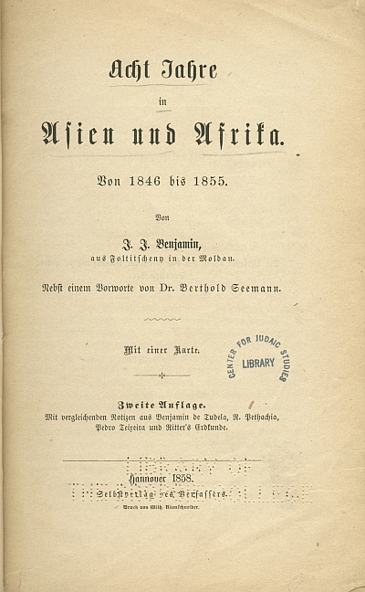

## Introduction

**JEWISH HISTORY AND CULTURE IN EASTERN EUROPE, 1600-2000**

For over three centuries, Eastern Europe was home to the greatest living reservoir of Jewish civilization in the world. From among the ranks of East European Jews emerged many of the key religious, intellectual, artistic, and political currents that shaped Jewish life across the modern period. Over the course of the last two decades, the historic Jewish communities that once covered the broad swathe of territory between the Baltic and the Black Seas have moved to the center of the study of the modern Jewish experience. Fueled by unprecedented access to long-hidden archival riches in the former Soviet bloc, a new generation of scholars has carved out fresh questions and new arenas of inquiry.

This year's CAJS seminar explored a wide range of issues relating to the history and culture of East European Jewry. We studied the relationship between the elite and the popular, the Jewish and the Slavic, the literary and the historical. We scrutinized representations of the Jewish past and the Jewish self as well as the genealogy of our own enterprise, the rich legacy of reflection on Jewish Eastern Europe from the early modern to the post-Holocaust periods.

The documents presented in the exhibit that follows faithfully reproduce the breadth of curiosity of this year's fellows. We hope you enjoy it.

**Benjamin Nathans, University of Pennsylvania**

## Exhibit

### Rabbis or Noblemen? The Transformation of the Polish Rabbinate in the Early Modern Period

Adam Teller

כי בעו"ה הנסמכים מרובים והיודעים מועטים ונזוחי הדעת נתרבו. שאין אחד מכיר מקומו. ומיד כשהוא נסמך מתחיל להשתרר ולקבץ בחורים בהון עתק כדרך השרים ששוכרים עבדים לרוץ לפניהם׃   
ים של שלמה, פרק ח נ"ח

> ("Because, for our sins, the ordained are many but the learned few, and the ignorant are growing numerous; not one of them knows his place and as soon as he is ordained he begins to act like a lord and collect students at great expense, as do the noble officials who hire servants to run ahead of them." Yam shel Shlomo 8:58)

This is a section from the massive Halakhic compendium, _Yam shel Shlomo_, composed in the 16th century by the leading Polish rabbi, Shlomo Luria (c.1510-1573). In this part, which deals with the laws concerning what to do with those who fail to honor rabbis, Luria gives his opinion of the rabbinate in his day. Though its critical tone may be an expression of his well-known intellectual elitism, it draws an interesting comparison between the status of the rabbi in Jewish society and that of the nobleman in Polish society. In these years, Jewish society in Poland was refashioning the Ashkenazic rabbinate along Polish lines. The role played by the rabbis on behalf of the non-Jewish authorities in the administration of the Jewish communities led to the rabbinate taking on something of the character of the semi-honorific administrative posts like the _Wojewoda_ or the _Starosta_, held by members of the high Polish nobility. This process of deprofessionalizing the rabbinate, whose early stages are here criticized by Luria, would eventually lead to a steep decline in the status of the rabbi in Polish Jewish life at the end of the 18th century.

### Who is Obligated to Wear Tzitzit

Moshe Rosman

Section 17 of the Shulhan Arukh, Orah Haim is entitled: "Who is Obligated \[to Wear\] Tzitzit?" The second paragraph, written by Joseph Karo in Safed in the mid-sixteenth century, reads: "Women and slaves are exempt because it is a time-conditioned positive commandment." On this ruling, R. Moses Isserles (in Cracow ca. 1570) glossed: 

> "In any case, if they want to wear \[a _tallit_ \] and make the blessing over it, they may as with all other time-conditioned positive commandments; however, it appears to be arrogance \[_yohara_ \] (see Tosefot, Ro"sh and Ra"n on chapter two of TB Rosh ha-Shana and chapter one of TB Kiddushin), and therefore they should not wear tzitzit, since \[in any case\] it is not a personal obligation \[_hovat gavra_ \] (see Agur section 27)".

Like all known societies, traditional Jewish society in Poland assigned differential tasks, manners and responsibilities to the two sexes. Just how essential this [gender definition](/web/20200125182338/https://www.library.upenn.edu/collections/online-exhibits/tradition-and-its-discontents?tab=bibliography) was held to be is evident in the comment of Rabbi Moses Isserles (Cracow, 16c.), cited above, with regard to the permissibility of Jewish women ritually donning a garment with _tzitzit_ (i.e. a _tallit_ ). In this passage R. Isserles noted that wearing of _tzitzit_ by women was permissible by technical halakhic standards. Despite this technical permissibility, however, echoing earlier authorities he ruled that women should not wear _tzitzit_ because it betrayed _yohara_ (arrogance) on their part.

Comparison of the use of the term _yohara_ in other sixteenth century texts (e.g. J. Karo, Bet Yosef, Orah Haim 3:1, 24:2, 34:3, 90:24-25, quoting earlier sources), demonstrates that the term, as used here, probably connotes a person's aspiring to an inappropriate status. R. Isserles' appears to be saying that women who wear _tzitzit_ are trying to attain the status of men, a status that does not properly accrue to them. They are violating the gender boundary, a prohibition so basic, so taken for granted (and perhaps therefore unstated in classic rabbinic literature), that it overrides the technical permissibility of female _tzitzit_ wearing.

R. Isserles was implying that _tzitzit_ were an important symbol of maleness and must remain so. Living in a society where reality made gender definition somewhat unstable, particularly in the economic sphere, this keeper of culture insisted that symbolic gender boundary markers remain firmly in place.

### Jewish political culture between East and West: Isaak Ruelf and the Transformations of intercession (_shtadlanut_) in the 19th century

François Guesnet

Dr. Isaak Ruelf (1830-1902), the rabbi of Memel, a town on the Prussian-Russian border, shown an illustration for the Warsaw based journal _Kneset Israel_ (vol. I, 1886, ill. 1), edited by the pioneer of Hibat Tsion, Shaul Pinhas Rabinovitch (SheFeR), photographed shortly before Ruelf's death for _Die Welt_ in Vienna (ill. 2). Ruelf gained an international reputation as a helper of Russian Jews beginning with his relief actions in the late 1860s. Thereafter, he strove to establish himself as expert on Eastern European Jewry and as a spokesman and intercessor (_shtadlan_) on their behalf. He used the press and public opinion as leverage for this activity, the most important change during the 19th century in the tactics of intercession. Following the anti-jewish violence in 1881/82 in Russia, he conceived of Palestine as the location for a future Jewish state that would be one of the safe havens of Russian Jewry. He thus was one of the precursors of political Zionism. As such, he was honored with one of the first portraits to be published in the (_Kneset Israel_). It is evident that the illustrator tended to 'orientalise' this Prussian rabbi. In contrast, he appears in his photograph dressed very much like a typical (_dajtsh_ (or German). As Ruelf himself took advantage in his writings of stereotypes about Jews and Gentiles in Eastern Europe, he saw himself stereotyped for the needs of early Zionism in Eastern Europe.

### Pale of Settlement and Movement

Benjamin Nathans

An internal Russian passport dating from the 1880s, with the imprimatur of tsar Alexander III, granting permission for 26-year-old Shlomo Khaiklein to travel for six months throughout the Russian Empire. A native of Volozhin (Vilna guberniia), Khaiklein qualified for this privilege as a member of an artisan guild.

The vast majority of Russia's Jews were confined by law to the Pale of Settlement, a territory roughly the size of France, at the western periphery of the Russian Empire. State-sponsored restrictions on Jewish residence, a technique common to early modern European countries, persisted in Russia until the revolution of February 1917. By the 1880s, however, a series of laws made it possible for substantial numbers of Jews whom the government regarded as "useful" - veterans of Nicholas I's army, merchants of the first guild, certain kinds of artisans, graduates of institutions of higher education - to live and work outside the Pale on a permanent basis. By the end of the 19th century, more than 300,000 such Jews lived legally outside the Pale.

Whether Shlomo Khaiklein sought temporary residence outside the Pale, or permanent settlement in the Russian interior, he was one of hundreds of thousands of Russian Jews on the move during the second half of the nineteenth century. The stereotype of backwardness and immobility of the shtetl is belied by the reality of massive Jewish migration both within the Pale, typically to urban centers such as Bialystok and Odessa, and beyond it - to Russia proper, to Palestine, and to North America. 

### "Don't spit in the well you drink from!"

John D. Klier

This illustration first appeared in the Russian-language illustrated magazine _Gusli_ (_The Lyre_), published in Tiflis (Tbilisi) in 1881. It refers to anti-Jewish pogroms in Russia that had recently broken-out From this set of events comes the now well-established historiographical concept of the "crisis of 1881-2", and its role as the "turning point in modern Jewish history".

The cartoon illustrates the theme, much discussed at the time, of the responsibility of the Russian press for provoking the pogroms. There was, in fact, no sustained press campaign accusing the Jews of having "murdered the tsar." Few newspapers focused on Gesia Gel'fman, the sole Jewish member of the terrorist group of "The People's Will" who assassinated Emperor Alexander II on 1 March 1881 (Old Style).

On the other hand, a number of newspapers had been very energetic in attacking Russian Jewry for a long catalogue of sins, the most important of which was that of "exploiting the peasantry." Thus, when the pogroms broke out, it was easy to make the connection, as the artist does here. Many contemporary Jewish spokesmen would also have applauded his choice of papers, since these were the very ones that they had denounced to the authorities for stirring up popular passions against the Jews.

The cartoon, captioned with the Russian proverb, "Don't spit in the well you drink from!" reads from left to right. In the first scene, two well-known Russian publishers are driving two bemused Jews out of Russia. The publisher on the left is Ivan Aksakov, who carries a stick with a copy of his newspaper, _Rus'_, which was the name of the ancient Russia state. Aksakov, and his family, were associated with a movement known as the Slavophiles. The movement viewed with skepticism plans to westernize Russia, seeing the virtues of the country to lie in its old traditions. One of the symbols of westernization was Jewish emancipation, and Aksakov was well-known for opposing the grant of full rights to Russian Jews. _Rus'_, published in Moscow, had a very small circulation, and was almost entirely written by Aksakov himself, in a high-toned, intellectual style. It was a paper that few people bought, but everybody talked about.

Next to Aksakov is A. S. Suvorin, one of the publishing geniuses of late imperial Russia. Suvorin took a small, liberal newspaper, _Novoe vremia_ (New Times) and took it "downmarket" to create one of the most popular newspapers in the Empire. It was the antithesis of _Rus'_ : filled with gossip, scandal and racy reporting. (The paper's reputation was established by its on-the-scene reporting of the Russo-Turkish War of 1877-8.) The paper published many of Russia's greatest writers (including Anton Chekov, who didn't much care for Suvorin's Jew-baiting.) Suvorin quickly discovered that blaming the Jews for Russia's problems (such as difficulties with the supply of the Russian army in 1877 by Jewish contractors) was popular with his readers. _Novoe vremia_ attacked the Jews in a jocular, sarcastic tone, very unlike the rather pompous pronouncements of Aksakov. _Novoe vremia_, published in St Petersburg, was circulated throughout the Empire, so its Judeophobia was well-known and appreciated. Cheering on Aksakov and Suvorin are a group of Russian merchants (identifiable by their very distinctive garb). They clearly believe that, with the Jews driven out of Russia, their business will benefit.

Scene two shows a very different outcome. Masses of Jews are leaving the country, clutching their meager possessions left after the riots, and heading for Palestine or America. In the background a gigantic figure looms, marked "Trade-Commercial Crisis". The merchants, in great distress, try to restrain the departing Jews. The drawing takes note of the fall in Russian securities on world financial markets as a result of the pogroms, as well as the collapse of the regional economy in Ukraine, where the annual trade fairs, filled with Jews importing goods from Moscow, were cancelled or postponed.

Quite appropriately the drawing is sub-titled "A Tragi-Comedy in Two Pictures." The drawing is especially interesting because there are very few cartoons devoted to the impact of the pogroms (except for the topic of emigration, which was very popular with cartoonists).

### Ojczyzna

Rachel Manekin

The cover of the first pro-Polish Jewish newspapers in Galicia. The papers appeared bi-monthly as a joint venture but under two separate editorial boards. The Hebrew paper, המזכיר אהבה לארץ מולדת ("The Recorder of Love for One's Homeland"), appeared between 1881 and 1886, and the Polish paper, _Ojczyzna_ ("Fatherland") between 1881 and 1892. In 1882 both papers became the organs of the Agudas Achim society.

The newspapers adopted as their symbol an eagle, the emblem of Poland, with a star of David drawn across its chest, to show the close connection between the two nations. Inside the Star of David one can see the letters 'W'W, short for the Polish King Kazimierz the Great, who was considered by Jews as their protector.

Under the title appeared in Hebrew and in Polish the famous verse from Jeremiah _Seek the peace of the city to which I have exiled you. And pray on its behalf to the Lord. For in its peace shall you have peace_ (29:7). Both newspapers are rare and the only place where all the volumes can be found is the University of L'viv in the Ukraine.

### The Ritual Murder Trial in Modern Jewish History: What is New?

Hillel J. Kieval

MAJOR RITUAL MURDER TRIALS, 1879-1913

*   Kutaisi, Russian Empire (Georgia), 1879. Nine Hasidic Jews accused of the murder of a young girl. Accused were all acquitted.
    
*   Tiszaeszlár, Austria-Hungary (Hungary), 1882-83. Salomon Schwarz, Jozsef Scharf, and as many as 13 other Jewish defendants stood trial for the murder of 14 year old Eszter Solymosi. Trial lasted from 19 June to 3 August (6B= wks) and resulted in the acquittal of all accused.
    
*   Xanten, Germany (Prussian Rhineland), 1891-92. Adolf Buschhoff (Jewish stonecutter and butcher) accused of the ritual murder of 5 year old Johann Hegmann. Acquitted at end of 10 day trial in 1892.
    
*   Polná, Austria-Hungary (Bohemia), 1899-1900. Leopold Hilsner accused of the aggravated ritual murder of 19 year old Anežka Hrůzová. Convicted and sentenced to death in 1899; at retrial in PC-sek in 1900, convicted a second time (this time for two murders) and again sentenced to death. Death sentence commuted by the Emperor to life imprisonment.
    
*   Konitz (Chojnice), Germany (West Prussia; Poland), 1900-01. Involved the murder and dismemberment of an 18 year old gymnasium student, Ernst Winter. Rumors were rampant that he had been the victim of a ritual murder. Moritz Lewy, a Jewish butcher, went on trial in February 1901 and was convicted, not of murder, but of perjury.
    
*   Beilis, Russia (Kiev, Ukraine), 1911-13. Mendel Beilis accused of ritually murdering a local boy, Andrei Iushchinskii. Beilis was acquitted, but, in issuing the verdict, the jury allowed for the possibility that a ritual murder had taken place.
    

The success of the "ritual murder" trials against Jews in modern East Central Europe depended, not on their divergence from modern rationality (and even modern scientific discourses), but by virtue of their intersection with them. The story of the modern "ritual murder" trial, then, is not only one of the lasting power of myth and traditional wisdom but, more crucially, a tale of the momentary alliance of high culture and scientific authority with a certain perception of collective Jewish criminality.

### S. An-sky (Shloyme-Zanvl Rapoport 1863-1920

Gabriella Safran

These illustrations appear in a book that has had a complex fate. S. An-sky, born Shloyme-Zanvl Rapoport (1863-1920), was a Russian-Jewish writer, a pioneering ethnographer, and a dedicated revolutionary; he is known best today as the author of the play _The Dybbuk_. He spent much of 1918 preparing an edition of images that he had gathered during the ethnographic expeditions that he led to the Jewish communities of Volhynia and Podolia during the summers of 1912-1914. But as a Socialist Revolutionary who had been part of the Constituent Assembly elected after the February Revolution of 1917, An-sky feared for his safety under the Bolsheviks, the victors of the October Revolution. In the fall of 1918, he fled to Vilna, leaving most of his papers behind. The proofs of the "Album of Jewish Artistic Artifacts" were believed lost until, like many of his other manuscripts, they turned up in the 1990s in formerly Soviet archives. _The Jewish Artistic Heritage Album by Semyon An-sky_, published in Moscow in 2001 in Russian and English, includes all the plates that were found at the Vernadsky National Library of Ukraine, along with two essays based on these and other recently rediscovered archival materials.

These two pictures reveal the man and his work. The photo shows him at 56 or 57, in the last year of his life, ill with diabetes and heart disease but retaining his famed energy for community work and writing. The colored image, one of the plates from the album, is a "lubok" or folk print that was produced in the second half of the nineteenth century in what is today Ukraine. The writing on the picture, in a mix of Yiddish and Hebrew, identifies the scene: "How Rebecca gives the camels drink and Eliezer, the servant of Abraham, kneels and honors God, Blessed be He (Vi Rivke poit di gamolim un Eliezer eved Avrom knit un loybt tsu got borukh ha-shem)." In his own edition, An-sky had intended to publish this image with a discussion of the Yiddish word used for Rebecca's action, "poit," which is obviously of Eastern Slavic origin; the same word is used in Russian to this day to mean "to give to drink." The attention he gives to this linguistic detail illustrates An-sky's sensitivity to the interaction both between languages and between nations or ethnic groups. Even though we associate him with the play he set in an exclusively Jewish world, all of An-sky's texts - including, as recent scholarship and new archival evidence shows, _The Dybbuk_ - emerged from a vision of Jewish folk culture and Jews themselves as existing in a state of constant, dynamic exchange with other peoples and other cultures. 

### Between Austria and Galicia: Jewish Nationalism and Diversity

Joshua Shanes

In 1907, Austria held its first parliamentary elections based on universal manhood suffrage. Jewish nationalists, electrified by the prospect of winning parliamentary mandates, decided to enter the electoral campaign full-force. Jewish nationalists nominated candidates in nearly every district with significant Jewish settlement, even if they had no realistic chance of winning. Although they certainly hoped to win election in districts with large Jewish majorities, their primary purpose was to use the electoral campaign as a means of engaging Galician Jews in the political process. Jewish nationalists held hundreds of rallies in large and small communities throughout the entire province at which their best orators tried to convince Jews that they too constituted a nationality to which national minority rights were due.

Aside from the actual content of the speeches, the rallies themselves served as a critical agent in forging a common sense of national community among Galician Jews. Rallies attracted Jews from all classes, men and women, young and old, religious and secular. All stood together and often intermixed (by all of those criteria) as they listened to speeches calling for Jewish solidarity and national struggle. [This photograph of a mass rally in Buczacz](/web/20200125182338/https://www.library.upenn.edu/collections/online-exhibits/tradition-and-its-discontents/between-austria-and-galicia-jewish?item=0) for the Jewish nationalist candidate Nathan Birnbaum (standing in front row center), for example, shows men and women of clearly middle-class dress, women with uncovered hair and shaved men with "German"-style hats, standing and sitting together with Jews of an obviously much lower social class, many of whom covered their hair (among the women) or wore long beards. Where else would such Jews stand together? Where else would women with children stand among men, as many do in this picture?

The Jewish National Party succeeded in winning four seats to parliament in 1907, and as promised they constituted the first Jewish nationalist parliamentary faction in Austrian history. The more important result of the election, however, was its contribution towards the transformation of Jewish identity, which by 1914 had become decidedly nationalist among Galician Jews, despite the relatively small size of the Zionist party itself. 

### The Recognition of the Yiddish language in Lithuania during the First World War

Marcos Silber

The entering of the German army to the territories brought about the elimination of Russian as societal language and culture. The German authorities published its announcements in some of the local vernaculars, including Yiddish. Official translations of regulations and regulatory texts were produced in several vernaculars, including Yiddish. This bureaucratic measure was interpreted as a great victory of the Jewish national movement and a sign of the integration of the Jews as individuals as well as collective equals in the public arena.

However, this translation was not authoritative since only the German version was recognized as authentic. The vernaculars were not recognized as a means used to apply to the authorities. The fallacy of this measure was given away when it was impossible to avail oneself of the protection of the vernacular version during a legal proceeding.

The bureaucratic documentation necessary to control the native population was printed in the different vernaculars b for the easier understanding of the natives. Official forms, personal ID, and so on appeared in Yiddish as in Polish or Lithuanian. When Rachmilewitsch, Rosenbaum and Rubinstein, the most outstanding pro-German Jewish leaders in Vilnius complained in 1917 that the Ost-mark bill felt Yiddish translation and asked for it, the authorities tended to accept the request. Their answer is very revealing and is paradigmatic concerning the German formal recognition of the minorities during the first two years of occupation: "doubtlessly we could promise the implementation of national demands lacking importance, like printing Hebrew letters on the \[ostmark\] notes". After such an answer it is not surprising that these leaders never asked again for such symbolic signs. Over and over again, it became clear that the pattern established was that of constituting a unidirectional way of communication, from up down, between the government and the subject.

The politics regarding the recognition of the different minorities was in the best case, formal. It lacked any operative meaning. The importance of the minority rights didn't mean in the case presented here protection of the minority cultures; on the contrary, the recognition of the local vernaculars was a tool to disempower the minorities, a mean to achieve German hegemony and dominance over these lands.

But, this formal recognition had its own dynamics. In Jewish political circles the German policy generated meticulous examination of the practical aspects of topics, whether social or economic, considered cardinal to the Jewish minority, when this leadership negotiated with the Lithuanian leadership in the eve of the establishment of Lithuania as an independent State. 

### El Lissitzky

Kenneth Moss

In the years between 1917 and 1921, as Eastern Europe was wracked by war and transformed by national and social revolution, elements of the East European Jewish intelligentsia sought to carry out ambitious and competing programs of ideological, institutional, and aesthetic revolution in the Jewish cultural sphere and the arts. This striking image stems from that moment: it is a cover page by the Russian-Jewish modernist artist El Lissitzky to a translation of Hans Christian Andersen's fairy tales by the Yiddish modernist writer Der Nister, published in Kiev in 1919 by the literary publisher the Kiever Farlag under the auspices of the Yiddishist cultural organization the Kultur-Lige. Each of these isolated facts captures one of the most notable features of this endeavor.

**1\. The art itself:** The experimentation and excitement represented by this Constructivist illustration reflects a larger moment in the Jewish visual arts which emerged unexpectedly and just as quickly faded away: a burst of creative, experimental visual modernism by dozens of East European Jewish artists from Lissitzky in Moscow and Kiev to Natan Alt'man in Moscow to Marc Chagall in Vitebsk to Yosef Tshaikov in Kiev to Henryk Berlewi in Lodz and Warsaw. Pursuing their own individual and shifting aesthetic visions, these artists self-consciously engaged in a collective effort to work out a Jewish mode within European modernism and even a distinct Jewish modernist aesthetics.

**2\. Lissitzky and the fact of his involvement in this book project:** Artists of Jewish origin had long been part of Europe's metropolitan art scenes, including the Russian and Polish art academies. Some had explored Jewish themes and their own Jewish identities, but had done so within the framework of the metropolitan art-world of which they were a part. The revolutionary period saw a dramatically different development: the intensive involvement and identification of such artists in a larger effort by Jewish nationalist intellectuals and cultural producers to create a full-fledged Jewish aesthetic culture centering around Yiddish or Hebrew but encompassing all the arts. Producing illustrations for the flood of Yiddish and Hebrew books, journals, and children's books like this one was one of the key expressions of this involvement; these artists also produced extraordinary set designs for Hebrew and Yiddish modernist theaters springing up in Moscow, Kiev, and elsewhere, and many also exhibited at specially organized exhibitions of Jewish art and involve themselves in specially organized Jewish art studios, especially in Kiev. For many artists like Lissitzky, this identification was short-lived, lasting not more than two or three years. The brevity of their involvement demonstrates the difficulty and perhaps impossibilities of creating a full-fledged Jewish secular national culture in the diaspora; the depth and intensity of their involvement demonstrates the power and attractiveness of the idea at this historical juncture.

**3\. The text being illustrated, the significance of the choice of this text, and the nature of the translation:**   
Historians of modern Jewish culture tend to lay heavy emphasis on the way in which modern cultural producers reinterpreted "authentically Jewish" sources ranging from the Bible to the aggadah to East European Jewish folklore. We can see these strategies in Lissitzky's illustration, which adapts formal motifs from Jewish folk art and, as the historian Chimen Abramsky notes, signs his initials (bottom right) "in a manner taken directly from medieval Ashkenazi Hebrew manuscripts." However, when it comes to the book itself, it is a different story. Especially in the period in question and especially with regard to literary texts like this one, these emphases miss the point in some important respects. The choice by Der Nister, a leading Yiddish symbolist, to translate the quite bun-Jewish' Hans Christian Andersen for Jewish children was not a fluke or an idiosyncratic decision, but represents rather a strategy of Jewish cultural development no less important for the nationalist intelligentsia in this period than that of adapting internal Jewish sources. Many Yiddishists and Hebraists regarded the proper translation and incorporation of the entirety of human literary creativity as necessary to the development of a worthwhile, unparochial modern Jewish culture. Part and parcel of this attitude was the approach to translation itself: Der Nister's translation makes no effort to Judaize or de-Christianize Andersen, thus breaking with one of the most definitive tendencies of Jewish cultural translation in the diaspora. This insistence on not Judaizing a text and on bringing core texts of other literatures and cultures into Jewish culture through neutral, artful translation was normative for the Jewish literary sphere of the time, and dozens if not hundreds of Hebrew and Yiddish writers undertook translations in this spirit.

**4\. The publisher of the book:** The Kiever Farlag was one of dozens of publishing houses created in this period with a specific commitment to promoting the creation of a new secular Jewish aesthetic culture. Kiev was a key center of this undertaking in these years, as were Moscow, Vilna, Warsaw, and Odessa; unlike the last three, Kiev and Moscow had never played such a central role in the modern Jewish cultural sphere until the disruptions and dramatic new opportunities of this era.

**5\. The distributor of the book:** By 1919, all of the Kiever Farlag publications, as well as those of nearly a dozen other Yiddishist publishing houses in Kiev and Odessa, were distributed exclusively by the Central Bookstore of the Ukrainian Kultur Lige (League for Culture). Created in Kiev in 1918 by left-wing but also independent and non-socialist Yiddishists, the Kultur Lige hoped to organize all Yiddishist cultural activity under one umbrella organization, from the hundreds of Yiddishist secular schools which emerged in this period to the most rarified art, music, theatrical, and literary experimentation. In this, it was not alone: it joined and competed directly with a similar Hebraist organization created in Moscow in 1917, the Tarbut (Culture) organization. Tarbut and the Kultur Lige spurred the creation of sister organizations allover Eastern Europe.

### Russian Poet - Jewish Muse

Hamutal Bar-Yosef

Presented is a photo from the late 1910's of the Russian writer Leonid Andreev (1871-1919), along with a pencil drawing of L. E. Chirikova, a young Jewish woman with whom Andreev was in love. They are included in the book S. O. S. : Diaries (1914-1919), Letters (1917-1919), Essay and an Interview (1919), Memoirs of His Contemporanies (in Russian), edited by Richard Davies and Ben Hellman (1994). The title echoes Andreev's booklet from 1919, which was written when Andreev was already in exile in Finland, calling for the intervention of the West against the Bolshevik regime.

During the first quarter of the 20th century Andreev's prose writings were widely translated into Yiddish, both in Eastern Europe and in the USA, and his dramas were included in the repertoire of the Yiddish theatre. His criticism of Christian society together with his declared philo-Semitism is among the reasons for his popularity in Yiddish. Andreev, together with M. Gorky and F. Sologub, was active for the civil rights of the Jews from 1914 until his death. Andreev was much less popular in Hebrew than in Yiddish. The difference between the enthusiastic reception of his writings in Yiddish culture, while neglected by the Hebrew, sheds an interesting light on the differences between these two Jews sub-cultures: while Yiddish was becoming an urban bourgeois culture, Hebrew was keeping artistically elite norms. 

### Women Yiddish Poets in Poland: the 1920s

Kathryn Hellerstein

Four of the five images here are taken from an anthology of women Yiddish poets published in Chicago in 1928, _Yidishe dikhterins: antologye_ (Yiddish Women Poets: Anthology), edited by Ezra Korman (Chicago: Farlag L. M. Stein, 1928). This anthology - the only such collection ever published - presented to the Yiddish literary community the works of 70 women poets, including four who published in the 16th through the 18th centuries, and 66 whose works appeared in print between 1888 and 1927. Modeled on an earlier anthology of Yiddish poetry, M. Bassin's _Finf hundert yor yidishe poezye_ (Five Hundred Years of Yiddish Poetry) (New York: 1917), Korman's anthology established the significance of women poets in the newly acknowledged modern Yiddish literary tradition. Korman supplemented the poems that he had selected from newspapers, journals, and books with scholarly apparatus, including a footnoted introductory essay, biographical notes, bibliographies, indexes, and photographs or drawings of many of the poets.

The first photograph, captioned, "_Shar-bleter fun lider-zamlungen_" (Title pages of poetry collections) in this exhibit precedes Korman's bibliography, and depicts a collage of the title pages of 12 books of Yiddish poetry by women - all published in the seven years before Korman's anthology came into print. Included in this collage (2nd from the top, on the right) is one of the first published books of poems by a woman, Miriam Ulinover's _Der bobes oyster_ (My Grandmother's Treasure) (Warsaw: Farlag Akhim Levin-Epshteyn un Shutfim, 1922). Directly below is the title page for _Mayne gezangen_ (My Songs), by Roza Yakubovitsh (Warsaw: 1924). In the center of the top row is the title page of _Kheshvndike nekht_ (Nights of Heshvan) by Kadya Molodowsky (Vilna-Warsaw: Farlag B. Kletskin, 1927). These three works, published in Warsaw and Vilna, differ from the other books of poems depicted in this collage - which came into print in New York, Chicago, Berlin, and Johannesburg, South Africa, as well as in Kovno.

In contrast to the political and/or modernist poetry written by many of their contemporaries--both male and female--the 1920s poems of Ulinover, Yakubovitsh, and Molodowsky contend with the traditional devotional texts that had defined the literacy and lives of their mothers and grandmothers. In the persona of a young woman who grew up in a _shtetele_ or small Jewish town, Ulinover's poems invoke the taytsh-_khumesh_, translations of the Hebrew Bible into Yiddish for girls, women, and uneducated men, printed from the 16th century well into the 19th century, and pay special attention to the characters of the Matriarch Rebecca, as well as to Queen Esther. Yakubovitsh's poems present dramatic monologues in the voices of biblical women, including Rachel, Hagar, Shulamit, and Queen Esther, drawing upon the _Tsenerene_, Yakov ben Yitzchak Ashkenazi's 16thcentury Yiddish translation of and commentary on the weekly Torah portions and Haftorahs, as well as the _tkhines_, the Yiddish supplicatory prayers composed for and sometimes by women. Several of Molodowsky's early poems are called "Prayer," while others invoke imagery from the Hebrew liturgy of the _Siddur_ as well as of the _tkhines_ and the Bible. In the highly politicized, sophisticated, and urban context of Yiddish culture in interwar Warsaw, these three poets struggled in their poems to come to terms with the conflict between traditional Jewish texts and their modern lives. As a Fellow in Spring 2003 at the Center for Advanced Judaic Studies, I have continued my work on Yiddish poetry by women, focusing on its place within the variously defined traditions of modern Yiddish literature and on the relationship between secular and devotional writings.

Alongside the Korman's collage of title pages, I've provided photographs of four women Yiddish poets: Miriam Ulinover, Roza Yakubovitsh, Kadya Molodowsky, and Rokhl Korn, whose first book of poems, _Dorf_ ("Village"), was published in Vilna in 1928. The photographs of Yakubovitsh, Molodowsky, and Korn are taken from Korman's anthology. The photograph of Ulinover, the only existing photograph of this poet, was taken from her identification papers in the Lodz Ghetto, where she lived from 1939 until her death in Auschwitz in 1944. Yakubovitsh also spent the war years in the Lodz Ghetto and probably also died in Auschwitz. Molodowsky immigrated to the United States in 1935. Korn survived the war in the Soviet Union and came to Canada in 1948.

### YIVO, oder Yidisher visnshaftlekher institut

Cecile Kuznitz

In 1925, a group of Jewish intellectuals and educators founded an institution devoted to scholarship in Yiddish and on the history and culture of Yiddish-speaking Jewry. This institution, the _Yidisher visnshaftlekher institut_ \[Yiddish Scientific Institute\], known by its acronym YIVO, carries on its work today as the YIVO Institute for Jewish Research. YIVO's founders came from the ranks of Diaspora Nationalists, who advocated rights for Jews as a national minority within the countries of Eastern Europe and a national culture based in the Yiddish language. The institute's work, therefore, was intimately connected to the _folk_, the masses of ordinary Yiddish-speaking Jews. YIVO's scholars felt compelled to address contemporary issues of concern to a broad audience even as they shied away from direct involvement in the political debates of interwar Eastern Europe, which they feared would compromise the quality of their research.

While the original plan for YIVO came from a group of Russian Jewish intellectuals living in Berlin and headed by Nokhem Shtif, the institute established its headquarters in Vilna (then Wilno, Poland and today Vilnius, Lithuania). There, under the leadership of Max Weinreich, Zalman Reisen, and later Zelig Kalmanovitch, YIVO developed in close contact with the Yiddish cultural scene and secular school system that flourished in the interwar years. YIVO eventually built its headquarters in Vilna, an up-to-date, freestanding structure in a newly-developed neighborhood of broad streets and grassy plots. \[see image #1\] The building's appearance and location emphasized YIVO's distance, ideologically as well as physically, from the more traditional institutions of the revered but decrepit Jewish quarter.

To finance the construction of the headquarters, as well as most of its other projects, YIVO turned to thousands of dedicated supporters in Eastern Europe and throughout the world-wide Yiddish-speaking Diaspora. Contributors to YIVO's _boy-fund_ \[building fund\] received colorful receipts designed by the artist Uma Olkienicka. \[see image #2\] The strikingly avant-garde design of these receipts, like the headquarters itself, speaks to YIVO's desire to help East European Jewry create a new type of secular Yiddish culture that would be both fully Jewish and thoroughly modern.

### Salo Baron, of Tarnow

David Engel

Salo Baron (1895-1989), a seminal figure in Jewish historiography, is generally identified with the United States, where he taught and wrote for more than six decades. However, he grew up in the west Galician town of Tarnow and began his historical studies at the Jagiellonian University in Krakow. At age 17 he began publishing political commentary in the Krakow Hebrew weekly Hamicpe, including a five-part series responding to Polish nationalist leader Roman Dmowski's call for Poles to boycott Jewish businesses. Baron's experiences in Poland and as Polish a refugee in Vienna during and after the First World War shaped much of his later historiographical outlook, including his famous revision of "the lachrymose theory of pre-Revolutionary woe." 

### A Multi-Lingual Diary from Ghetto Lodz

Batsheva Ben-Amos

When Abraham Bankel returned from Auschwitz on July 1945 he went to his old home in Ghetto Lodz. In the dwelling next door he found an anonymous diary, written on the margins of a French novel, in four languages, Polish, Hebrew, Yiddish and English, with occasional sentences in German and a few words in Latin. This document is now among the holdings of Yad-Vashem.

Diary writing by Jewish people during the war in Ghettos, camps and hiding all over Europe was an obsession. Emmanuel Ringelblum, a historian in Ghetto Warswa who organized the underground archive of "Oneg Shabat" in the ghetto, wrote in 1943:

> "The terror increased \[and\]... Jews started to write. Everybody wrote: journalists, writers, teachers, public people, teenagers and even children. most wrote diaries, describing the events of the day through the prism of personal experiences. Much has been written but most of it was lost in the expulsion and destruction of the Jews..."

While most diaries were written in one language, the anonymous Lodz diary is uniqe in its multi-lingual aspect. This must be seen in the context of the use of multiple languages in Jewish Polish society in the interwar years. The writer alternate use of Polish, Yiddish and Hebrew languages in the diary is consistent with the linguistic fabric of the Jewish culture which existed in Poland between the two world wars. The use of English is idiosyncratic and is not a part of the multi-lingual system in Poland among the Jews. Such a system developed through Jewish education, tradition, speech at home, and in contact with the local population and the governments.

In his diary, the writer deals with moral dilemas, his relationship with his sister, conflicts related to his Jewish identity, his hunger and anguish and his desire to survive. At the end the Russians halted their advance and the Nazis liquidated the Ghetto, transporting its residents, among them probably also the diarist and his 12 years old sister, to Auschwitz, where they perished.

### Di Goldene Keyt (1949-1995)

Marcus Moseley

In 1949, through the initiative of the Vilna poet Avrom Sutzkever, Di Goldene keyt was founded, published by the Histadrut/"General Federations of Jewsish Labour in Israel". That a Zionist organization in Israel should undertake the publication of a Yiddish literary periodical, given the background of intense and bitter rivalry between Hebraists and Yiddishists, marked a groundbreaking historical event in and of itself.

In a programmatic article, "Between Hebrew and Yiddish", in the first volume the Hebrew and Yiddish poet and literary critic Ya'aqov Fichman writes: "It is a disgrace and an incomprehensibility that Hebrew poets know so little of their Yiddish fellow-writers ... that the Hebrew press provides so few appraisals of Yiddish creativity (giving so much place for general literature) ... The task of the Goldene keyt must be first and foremost to combat the mutual alienation between Hebrew and Yiddish creativity. Hebrew and Yiddish poets must help each other, and above all else, **know** each other and exert mutual influence upon each other."

The proclamation in bold type at the end of this essay reads:

> **Not only the Jews did our mortal enemy determine to annihilate and to turn into soap, but also their language, and the golden chain. But the language outlived the enemy. And the chain, through ghettos, forests and insurrections, extended underground, wounded, agonized, saturated with the tears in the throes of death of those who forged it, sanctified by the martyrdom of those closest to us ... and it fastened its links more tightly, tunneled its way through the various cities and broke into the light of day in Israel ... the land of generations-long Jewish yearning, whence the surviving remnant of the people now stream; the land which heals our blood-stained yesterday with the blood of our great today.**

The first volume of the Goldene Keyt, constituting no less than 240 pages held true to its aims. Here we may find, inter alia: previously unpublished Yiddish texts of Bialik; a Yiddish translation of a poem by Tshernikhovsky by Aaron Tseitlin; a children's play by Sholem Aleichem published for the first time; an essay by Berl Shtok (later Dov Sadan) on Agnon; a poem by Melekh Ravitsch "With a Diary from the Warsaw Ghetto"; an essay "The Yiddish and the Hebrew Folksong"; a poem "The Ethical Will of Nissim Laniado, by Avrom Sutzkever; translations to Yiddish of poems of Natan Alterman.

  

## Selected Bibliography

*   **Assaf, Simha. "**Lekorot harabanut be-Ashkenaz, Polania ve-Lita," in _Reshumot 2_ (1922): 5-46
    
*   **An-Ski, S.** _The Dybbuk and Other Writings.,_ Edited and with an introduction by David G. Roskies; with translations by Golda Werman (New York: Schocken Books, 1992)
    
*   **Babel', I. (Isaak).** _1920 Diary.,_ Edited and with an introduction and notes by Carol J. Avins; translated by H.T. Willetts (New Haven: Yale University Press, 1995)
    
*   **Bacon, Gershon C.** _The politics of tradition: Agudat Yisrael in Poland, 1916-1939.,_ Studies of the Center for Research on the History and Culture of Polish Jews, the Hebrew University of Jerusalem (Jerusalem: Magnes Press, Hebrew University, 1996)
    
*   **Balaban, Majer.** _Le-toldot ha-tenu\`ah ha-Frankit_. (Tel-Aviv: Dvir, 1934-35)
    
*   **Balin, Carole B.** T_o reveal our hearts: Jewish women writers in Tsarist Russia.,_ Monographs of the Hebrew Union College; no. 24 (Cincinnati: Hebrew Union College Press; Detroit, MI: Distributed by Wayne State University Press, 2000)
    
*   **Bar-Yosef, Hamutal.** _Magaʻim shel deḳadens: Byaliḳ, Berdits'evski, Brener_. (Israel: Hotsaʾat ha-sefarim shel Universitat Ben-Guryon Ba-Negev, c1997)
    
*   **Barnay, Y.** _Shabta'ut: hebetim hevratiyim_. (Yerushalayim: Merkaz Zalman Shazar le-toldot Yi´sra'el, 2000)
    
*   **Bartal, Yi´sra'el.** _Me-"umah" li-"le'om": Yehude Mizrah-Eropah, 1772-1881_. (Israel: Miśrad ha-biṭaḥon, ha-hotsaʾah le-or, 2002)
    
*   **Bartal, Yi´sra'el, ed.** _Focusing on Galicia: Jews, Poles, and Ukrainians, 1772-1918.,_ Edited by Israel Bartal and Antony Polonsky (London; Portland, Or.: Littman Library of Jewish Civilization, 1999)
    
*   **Bartal, Yi´sra'el, ed.** _Ke-minhag Ashkenaz ve-Polin: sefer yovel le-Hana Shmeruk: kovets mehkarim be-tarbut Yehudit (Studies in Jewish culture in honour of Chone Shmeruk)_. (Yerushalayim: Merkaz Zalman Shazar le-Toldot Yi´sra'el, 1993)
    
*   **Bartal, Yi´sra'el, ed.** _Kiyum va-shever: Yehude Polin le-dorotehem_. (Yerushalayim: Merkaz Zalman Shazar le-toldot Yi´sra'el, 1997)
    
*   **Bartal, Yi´sra'el, ed.** _Le-zikhro shel Hone Shmeruk: devarim she-ne'emeru bi-melot sheloshim le-moto_. (Yerushalayim: Ha-akademyah ha-le'umit ha-Yi´sre'elit le-mada\`im, 758 \[1998\])
    
*   **Bartal, Yi´sra'el, ed.** _Poles, Jews, Socialist: the Failure of an Ideal.,_ Edited by Antony Polonsky, Israel Bartal, Gershon Hundert, Magdalena Opalski and Jerzy Tomaszewski (London: Littman Library of Jewish Civilization, 1996; London: Littman Library of Jewish Civilization, 1996)
    
*   **Bartal, Yi´sra'el, ed.** _Tsadiḳim ṿe-anshe maʻaśeh: meḥḳarim ba-Ḥasidut Polin_. (Yerushalayim: Mosad Byaliḳ: ha-Merkaz le-ḥeḳer toldot Yehude Polin ṿe-tarbutam, ha-Universiṭah ha-ʻIvrit bi-Yerushalayim, 1994)
    
*   **Bartal, Yi´sra'el and Magdalena Opalski.** _Poles and Jews: a Failed Brotherhood.,_ The Tauber Institute for the Study of European Jewry series; 13 (Hanover: University Press of New England, 1992)
    
*   **Ben-Amos, Dan ed.** _In praise of the Baal Shem Tov (Shivhe ha-Besht), the earliest collection of legends about the founder of Hasidism.,_ Translated and edited by Dan Ben-Amos and Jerome R. Mintz (Northvale, N.J.: Jason Aronson, 1993)
    
*   **Council of Four Lands.** _Pinḳas ṿaʻad arbaʻ aratsot: liḳuṭe taḳanot, ketavim u-reshumot_. (Yerushalayim : Mosad Byaliḳ, 750 \[1990\])
    
*   **Deich, G. M and Ben Nathans.** _Arkhivnye dokumenty po istorii evreev v Rossii v XIX-nachale XX vv_. (Moskva: Izd-vo "Blagovest"; Pittsburgh, PA: Distributed exclusively by the Russian Publications Project, Center for Russian and East European Studies, University of Pittsburgh, 1994)
    
*   **Engel, David.** _Facing a holocaust: the Polish Government-in-Exile and the Jews, 1943-1945_. (Chapel Hill: University of North Carolina Press, 1993)
    
*   **Engel, David.** _The Holocaust: the Third Reich and the Jews_. (Harlow, England; New York : Longman, 2000)
    
*   **Frankel, Jonathan.** _The Damascus Affair: "Ritual Murder," Politics, and the Jews in 1840_. (Cambridge, UK; New York: Cambridge University Press, 1997)
    
*   **Frankel, Jonathan.** _Jewish politics and the Russian Revolution of 1905.,_ Spiegel lectures in European Jewish history; 4 (Tel-Aviv: Tel Aviv University, 1982)
    
*   **Frankel, Jonathan.** _Prophecy and Politics: Socialism, Nationalism, and the Russian Jews, 1862-1917_. (Cambridge, UK; New York: Cambridge University Press, 1981)
    
*   **Frankel, Jonathan, Edith Rogovin Frankel and Baruch Knei-Paz, eds.** _Revolution in Russia : Reassessments of 1917_. (Cambridge, UK; New York: Cambridge University Press, 1992)
    
*   **Goldberg, Jacob.** _Jewish Privileges in the Polish Commonwealth: Charters of Rights Granted to Jewish Communities in Poland-Lithuania in the Sixteenth to Eighteenth Centuries : Critical Edition of Original Latin and Polish Documents with English Introductions and Notes_. (Jerusalem: Israel Academy of Sciences and Humanities, 1985)
    
*   **Gitelman, Zvi Y, Musya Glants and Marshall I. Goldman, eds.** _Jewish life after the USSR_. (Bloomington: Indiana University Press, 2003)
    
*   **Guesnet, Francois.** _Polnische Juden im 19. Jahrhundert: Lebensbedingungen, Rechtsnormen und Organisation im Wandel.,_ Lebenswelten osteuropäischer Juden; Bd. 3 (Köln: Böhlau, 1998)
    
*   **Hellerstein, Kathryn, ed.** _Paper Bridges: Selected Poems of Kadya Molodowsky_. (Detroit: Wayne State University Press, 1999)
    
*   **Hundert, Gershon David, ed.** _Essential Papers on Hasidism: Origins to Present.,_ Essential Papers on Jewish Studies (New York: New York University Press, 1991)
    
*   **Hundert, Gershon David.** _The Jews in a Polish Private Town: the Case of Opatów in the Eighteenth Century_. Johns Hopkins Jewish Studies (Baltimore: Johns Hopkins University Press, 1992)
    
*   **Hundert, Gershon David.** _New Perspectives on the Beginnings of Hasidism.,_ Occasional Papers in Jewish History and Thought (Hunter College. Jewish Social Studies Program); no. 17 (New York: Hunter College of the City University of New York, 2002)
    
*   **Hundert, Gershon David and Gershon C. Bacon.** _The Jews in Poland and Russia: Bibliographical Essays_. (Bloomington: Indiana University Press, 1984)
    
*   **Kassow, Samuel D.** _Students, Professors, and the State in Tsarist Russia.,_ Studies on the History of Society and Culture (Berkeley: University of California Press, 1989)
    
*   **Kassow, Samuel D., Edith W. Clowes and James L. West, eds.** _Between Tsar and People : Educated Society and the Quest for Public Identity in Late Imperial Russia_. (Princeton, N.J. : Princeton University Press, 1991)
    
*   **Katz, Jacob.** _Tradition and Crisis: Jewish Society at the End of the Middle Ages.,_ Translated by Bernard Dov Cooperman (Syracuse, NY : Syracuse University Press, 2000)
    
*   **Kieval, Hillel J.** _Languages of Community: the Jewish Experience in the Czech Lands_. (Berkeley: University of California Press, 2000)
    
*   **Klier, John D.** _Imperial Russia’s Jewish Question, 1855-1881_. (Cambridge, UK: Cambridge University Press, 1996)
    
*   **Klier, John D. "**The Russian Press and the Anti-Jewish Pogroms of 1881," in _Canadian-American Slavic Studies_, _XVII, 1(1983):199-221_
    
*   **Korn, Rokhl.** _Paper Roses: Selected Poems of Rokhl Korn.,_ Translated by Seymour Levitan (Toronto: Aya Press, 1985)
    
*   **Kugelmass, Jack and Jonathan Boyarin, eds.** _From a Ruined Garden: the Memorial Books of Polish Jewry_. (Bloomington: Indiana University Press, 1998)
    
*   **Mintz, Alan L.** _Hurban: Responses to Catastrophe in Hebrew Literature.,_ Judaic Traditions in Literature, Music, and Art (Syracuse, N.Y.: Syracuse University Press, 1996)
    
*   **Miron, Dan.** _The Image of the Shtetl and Other Studies of Modern Jewish Literary Imagination.,_ Judaic Traditions in Literature, Music, and Art (Syracuse, N.Y.: Syracuse University Press, 2000)
    
*   **Miron, Dan and Ken Frieden, eds.** _Tales of Mendele the Book Peddler: Fishke the Lame and Benjamin the Third_. (New York: Schocken Books, 1996)
    
*   **Miron, Dan.** _A Traveler Disguised; a Study in the Rise of Modern Yiddish Fiction in the Nineteenth Century_. (New York: Schocken Books, 1973)
    
*   **Nathans, Benjamin.** _Beyond the Pale: the Jewish Encounter with Late Imperial Russia.,_ Studies on the history of society and culture; 45; The S. Mark Taper Foundation Imprint in Jewish Studies (Berkeley: University of California Press, 2002)
    
*   **Peretz, Isaac Leib.** _The I. L. Peretz Reader.,_ Edited by Ruth R. Wisse (New Haven: Yale University Press, 2002)
    
*   **Rapoport-Albert, Ada, ed.** _Hasidism Reappraised: Proceedings of the International Conference of the Institute of Jewish Studies in memory of Joseph G. Weiss, University College London, 21-23 June 1988_. (London; Portland, Or.: Vallentine Mitchell, 1996)
    
*   **Rapoport-Albert, Ada and Steven J. Zipperstein, eds.** _Jewish History : Essays in Honour of Chimen Abramsky_. (London: P. Halban, 1988)
    
*   **Rosaldo, Michelle Zimbalist.** _Women, Culture and Society: A Theoretical Overview Woman, culture, and society.,_ Edited by Michelle Zimbalist Rosaldo and Louise Lamphere (Stanford, Calif.: Stanford University Press, 1974)
    
*   **Roskies, David G.** _Against the Apocalypse: Responses to Catastrophe in Modern Jewish Culture.,_ Judaic Traditions in Literature, Music, and Art (Syracuse, N.Y.: Syracuse University Press, 1999)
    
*   **Roskies, David G.** _A Bridge of Longing: the Lost Art of Yiddish Storytelling_. (Cambridge, Mass.: Harvard University Press, 1995)
    
*   **Roskies, David G. and Diane K. Roshkies, eds.** _The Shtetl Book_. (New York: Ktav Pub. House, 1975)
    
*   **Rosman, Moshe.** _Founder of Hasidism: a Quest for the Historical Ba'al Shem Tov.,_ Contraversions; 5 (Berkeley: University of California Press, 1996)
    
*   **Rosman, Moshe.** _The Lords' Jews: Magnate-Jewish Relations in the Polish-Lithuanian Commonwealth during the Eighteenth Century.,_ Center for Jewish Studies, Harvard Judaic Texts and Studies; 7; Harvard Ukrainian Research Institute, Monograph Series (Cambridge, Mass.: Harvard University Press for the Center for Jewish Studies, Harvard University and the Harvard Ukrainian Research Institute, 1990)
    
*   **Safran, Gabriella.** _Rewriting the Jew: Assimilation Narratives in the Russian Empire.,_ Contraversions: Jews and Other Differences (Stanford, Calif.: Stanford University Press, 2000)
    
*   **Shandler, Jeffrey, ed.** _Awakening Lives: Autobiographies of Jewish Youth in Poland before the Holocaust_. (New Haven: Yale University Press, 2002)
    
*   **Shapiro, Robert Moses, ed.** _Holocaust Chronicles: Individualizing the Holocaust through Diaries and Other Contemporaneous Personal Accounts_. (Hoboken, NJ: Ktav, 1999)
    
*   **Slezkine, Yuri and Sheila Fitzpatrick, eds.** _In the Shadow of Revolution: Life Stories of Russian Women from 1917 to the Second World War_. (Princeton, NJ: Princeton University Press, 2000)
    
*   **Stanislawski, Michael.** _For Whom do I Toil?: Judah Leib Gordon and the Crisis of Russian Jewry.,_ Studies in Jewish History (New York: Oxford University Press, 1988)
    
*   **Stanislawski, Michael.** _Tsar Nicholas I and the Jews: the Transformation of Jewish Society in Russia, 1825-1855_. (Philadelphia: Jewish Publication Society of America, 1983)
    
*   **Steinlauf, Michael.** _Bondage to the Dead: Poland and the Memory of the Holocaust_. (Syracuse, N.Y.: Syracuse University Press, 1997)
    
*   **Teller, Adam. "**The Laicization of Early Modern Jewish Society: The Development of the Polish Communal Rabbinate in the 16th Century," in _Schöpferische Momente des europäischen Judentums in der frühen Neuzeit,_ Edited by Michael Graetz (Heidelberg: C. Winter, 2000)
    
*   **Teller, Adam, ed.** _Studies in the History of the Jews in Old Poland: in Honor of Jacob Goldberg.,_ Scripta Hierosolymitana; v. 38 (Jerusalem: Magnes Press, Hebrew University: Center for Research on the History and Culture of Polish Jews, 1998)
    
*   **Tussman, Malka Heifetz.** _With Teeth in the Earth: Selected Poems of Malka Heifetz Tussman.,_ Translated by Marcia Falk (Detroit: Wayne State University Press, 1992)
    
*   **Zimmerman, Joshua D., ed.** _Contested Memories: Poles and Jews during the Holocaust and its Aftermath_. (New Brunswick, N.J.: Rutgers University Press, 2003)
    
*   **Zipperstein, Steven J.** _Imagining Russian Jewry: Memory, History, Identity_ Samuel and Althea Stroum lectures in Jewish studies (Seattle: University of Washington Press, 1999)
    
*   **Zipperstein, Steven J.** _The Jews of Odessa: a Cultural History, 1794-1881_. (Stanford, Calif.: Stanford University Press, 1985)
    

## Contributors

*   Hamutal Bar-Yosef - Ben-Gurion University/CAJS 2003
    
*   Batsheva Ben-Amos - University of Pennsylvania/CAJS 2003
    
*   David Engel - New York University/CAJS 2003
    
*   François Guesnet - Leipzig University/CAJS 2003
    
*   Kathryn Hellerstein - University of Pennsylvania/CAJS 2003
    
*   Hillel J. Kieval - Washington University in St. Louis/CAJS 2003
    
*   John D. Klier - University College London/CAJS 2003
    
*   Cecile Kuznitz - Georgetown University/CAJS 2003
    
*   Rachel Manekin - Hebrew University/CAJS 2003
    
*   Marcus Moseley - Harvard University/CAJS 2003
    
*   Kenneth Moss - Johns Hopkins University/CAJS 2003
    
*   Benjamin Nathans - University of Pennsylvania/CAJS 2003
    
*   Moshe Rosman - Bar Ilan University/CAJS 2003
    
*   Gabriella Safran - Stanford University/CAJS 2003
    
*   Joshua Shanes - University of Wisconsin/CAJS 2003
    
*   Marcos Silber - Tel-Aviv University/CAJS 2003
    
*   Adam Teller - University of Haifa/CAJS 2003
    

### Special thanks

to **Etty Lassman**, CAJS Administrative Assistant to the Fellows, for providing scanned images, and to **Arthur Kiron** for his assistance in organizing this virtual exhibit.